# Desenvolvimento Web Avançado 2022 com PHP, Laravel e Vue.JS

https://www.udemy.com/course/curso-completo-do-desenvolvedor-laravel/

## <a name="indice">Índice</a>

1. [Introdução](#parte1)     
2. [[WINDOWS] - Preparando-se para o desenvolvimento](#parte2)     
3. [[LINUX] - Preparando-se para o desenvolvimento](#parte3)     
4. [[OSX] - Preparando-se para o desenvolvimento](#parte4)     
5. [Introdução as Rotas, Controllers e Views](#parte5)     
6. [Avançando com Rotas (Routes)](#parte6)     
7. [Avançando com Controladores (Controllers) e Visualizações (Views)](#parte7)     
8. [Models, Migrations, Seeders, Factories, Banco de Dados, Tinker e Eloquent ORM](#parte8)     
9. [Trabalhando com formulários](#parte9)     
10. [Middlewares](#parte10)     
11. [Autenticação de usuários (revisando e praticando os assuntos abordados)](#parte11)     
12. [Finalizando o projeto Super Gestão](#parte12)     
13. [Autenticação WEB (Session) e Bootstrap (CSS)](#parte13)     
14. [Implementando o envio de e-mails e a exportação de arquivos XLSX, CSV e PDF](#parte14)     
15. [Adaptação para o próximo nível no domínio do Framework Laravel](#parte15)     
16. [Vue.JS para iniciantes](#parte16)     
17. [APIs, WebServices e Rest](#parte17)     
18. [Autenticação API - Autorização JWT (JSON Web Token)](#parte18)     
19. [Aplicação Full Stack Back-end API Laravel com Front-end Vue.JS](#parte19)     
20. [Armazenamento em memória com Redis (Laravel Cache)](#parte20)     
---


## <a name="parte1">1 - Introdução</a>


[Voltar ao Índice](#indice)

---


## <a name="parte2">2 - [WINDOWS] - Preparando-se para o desenvolvimento</a>

7. Iniciando um projeto Laravel (Via Composer)

```
$ composer config -g repo.packagists composer https://packagist.org

$ composer config -g github-protocols https ssh

$ composer global require laravel/installer
```

[Voltar ao Índice](#indice)

---


## <a name="parte3">3 - [LINUX] - Preparando-se para o desenvolvimento</a>


[Voltar ao Índice](#indice)

---


## <a name="parte4">4 - [OSX] - Preparando-se para o desenvolvimento</a>


[Voltar ao Índice](#indice)

---


## <a name="parte5">5 - Introdução as Rotas, Controllers e Views</a>

- 23 Iniciando o projeto

```
 composer create-project --prefer-dist laravel/laravel:^7.0 app_super_gestao

```

- 24 Produtividade com Artisan Console
- 25 Rotas (Routes) - Introdução
- 26 Super Gestão - Implementando as rotas principal, sobre-nos e contato
- 27 Controladores (Controllers) - Introdução
- 28 Super Gestão - Implementando os controladores principal, sobre-nos e contato
- 29 Visualizações (Views) - Introdução
- 30 Super Gestão - Implementando as visualizações principal, sobre-nos e contato

[Voltar ao Índice](#indice)

---


## <a name="parte6">6 - Avançando com Rotas (Routes)</a>

- 31 Enviando parâmetros
- 32 Parâmetros opcionais e valores padrões
- 33 Tratando parâmetros de rotas com expressões regulares

```php
Route::get(
    '/contato/{nome}/{categoria_id}',
    function (
        string $nome = 'Desconhecido',
        int    $categoria_id = 1 // 1- 'informação'
    ) {
        echo "Nome: " . $nome . ' Categoria = ' . $categoria_id;
    })
        ->where('categoria_id', '[0-9+]')
        ->where('nome', '[A-Za-z]+');

```

- 34 Super Gestão - Criando o menu de navegação

```
$ php artisan route:list
+--------+----------+-------------------------------+------+----------------------------------------------------+------------+
| Domain | Method   | URI                           | Name | Action                                             | Middleware |
+--------+----------+-------------------------------+------+----------------------------------------------------+------------+
|        | GET|HEAD | /                             |      | App\Http\Controllers\PrincipalController@principal | web        |
|        | GET|HEAD | api/user                      |      | Closure                                            | api        |
|        |          |                               |      |                                                    | auth:api   |
|        | GET|HEAD | contato                       |      | App\Http\Controllers\ContatoController@contato     | web        |
|        | GET|HEAD | contato/{nome}/{categoria_id} |      | Closure                                            | web        |
|        | GET|HEAD | sobre-nos                     |      | App\Http\Controllers\SobrenosController@sobrenos   | web        |
+--------+----------+-------------------------------+------+----------------------------------------------------+------------+


```

- 35 Super Gestão - Implementando as rotas login, clientes, fornecedores e produtos
- 36 Agrupando rotas

```php
Route::prefix('/app')->group(function () {
    Route::get('/clientes', function (){return 'Clientes';});
    Route::get('/fornecedores',  function (){return 'Fornecedores';});
    Route::get('/produtos',  function (){return 'Produtos';});

});
```

- 37 Nomeando rotas

```php
Route::get('/', 'PrincipalController@principal')->name('site.index');
Route::get('/sobre-nos', 'SobrenosController@sobrenos')->name('site.sobrenos');
Route::get('/contato', 'ContatoController@contato')->name('site.contato');

Route::get('/login', 'ContatoController@contato')->name('site.login');

Route::prefix('/app')->group(function () {
    Route::get('/clientes', function (){return 'Clientes';})->name('app.clientes');
    Route::get('/fornecedores',  function (){return 'Fornecedores';})->name('app.fornecedores');
    Route::get('/produtos',  function (){return 'Produtos';})->name('app.produtos');
});
```

```php
<ul>
    <li>
        <a href="{{route('site.index')}}">Principal</a>
    </li>
    <li>
        <a href="{{route('site.sobrenos')}}">Sobre Nós</a>
    </li>
    <li>
        <a href="{{route('site.contato')}}">Contato</a>
    </li>
</ul>

```

- 38 Redirecionamento de rotas

```php
Route::get('/rota1', function (){
    echo 'ROTA 1';
})->name('site.rota1');

//Route::get('/rota2', function (){
//    echo 'ROTA 2;
//})->name('site.rota2');
Route::redirect('/rota2', '/rota1');
```

```php
Route::get('/rota1', function (){
    echo 'ROTA 1';
})->name('site.rota1');

Route::get('/rota2', function (){
    return redirect()->route('site.rota1');
})->name('site.rota2');
```

- 39 Rota de contingência (fallback)

```
Route::fallback(function () {
    echo 'A Rota não existe - <a href="'. route('site.index') .'">Voltar</a>';
});

```


[Voltar ao Índice](#indice)

---


## <a name="parte7">7 - Avançando com Controladores (Controllers) e Visualizações (Views)</a>

- 40 Encaminhando parâmetros da rota para o controlador

```php
Route::get('/teste/{p1}/{p2}', 'TesteController@teste')->name('teste');
```

```php
class TesteController extends Controller
{
    public function teste(int $p1,int  $p2)
    {
        echo "A Soma de $p1 + $p2 é: " . ($p1 + $p2);
    }
}
```

- 41 Encaminhando parâmetros do controlador para visualização

```php
class TesteController extends Controller
{
    public function teste(int $p1, int $p2)
    {
        // return view('site.teste', ['x'=>$p1, 'y' => $p2]);
        // return view('site.teste', compact('p1', 'p2'));
        return view('site.teste')
            ->with('p1', $p1)
            ->with('p2', $p2);
    }
}
```

```php
<p>Calculo</p>
<p>P1 = {{$p1}}</p>
<p>P2 = {{$p2}}</p>
<p>SOMA = {{$p1 + $p2}}</p>
```


- 42 Sintaxe Blade
- 43 Blade - Incluíndo comentários e blocos PHP puros

```php

<h3>FORNECEDOR</h3>

{{-- COMENTARIOS.... --}}

{{ 'Texto de teste' }}

<?= 'Testo de teste igual ao de cima'?>

@php
    // comentario vário
    echo 'Texto dentro do PHP
    '
@endphp

``` 

- 44 Extra - Adicionando a extensão VSCode Laravel-Blade
- 45 Blade - @if/@else

```php
@if(count($fornecedores) > 0 && count($fornecedores) < 10)
    <h3>Existe alguns fornecedores cadastrados</h3>
@elseif(count($fornecedores)> 10)
    <h3>Existem varios fornecedores cadastrados</h3>
@else
    <h3>Nenhum fornecedor Cadastrados</h3>
@endif
``` 
 
- 46 Blade - @unless

```php
<p>Fornecedor: {{$fornecedores[0]['nome']}}</p>
<p>Status: {{$fornecedores[0]['status']}}</p>

@if(!($fornecedores[0]['status'] == 'S') )
    <p>Fornecedor Inativo</p>
@endif
@unless($fornecedores[0]['status'] == 'S') {{--Se o retorno da condição for false--}}
    <p>Fornecedor Inativo UNLESS</p>
@endunless

```

- 47 Blade - @isset

```php
class FornecedorController extends Controller
{
    public function index()
    {
        //$fornecedores = ['Fornecedor 1'];
        $fornecedores = [
            0 => [
                'nome' => 'Fornecedor 1',
                'status' => 'N',
                'cnpj' => '00.000.000/000-00'
            ],
            1 => [
                'nome' => 'Fornecedor 2',
                'status' => 'N'
            ]
        ];
        return view('app.fornecedor.index', compact('fornecedores'));
    }
}
```

```php
@isset($fornecedores)
<p>Fornecedor: {{$fornecedores[1]['nome']}}</p>
<p>Status: {{$fornecedores[1]['status']}}</p>

@isset($fornecedores[1]['cnpj'])
    <p>CNPJ: {{$fornecedores[1]['cnpj']}}</p>
@endisset

@endisset

```


- 48 Blade - @empty

```php
@isset($fornecedores)
<p>Fornecedor: {{$fornecedores[0]['nome']}}</p>
<p>Status: {{$fornecedores[0]['status']}}</p>

@isset($fornecedores[0]['cnpj'])
    CNPJ: {{$fornecedores[0]['cnpj']}}
    @empty($fornecedores[0]['cnpj']) {{-- Vazio = '', 0, 0.0, '0', null, false, array(), $var --}}
         VAZIO (SEM DADOS)
    @endempty
@endisset

@endisset
```

- 49 Extra - Operador condicional ternário

```php
 isset($fornecedores[0]['cnpj']) ? 'CNPJ INFORMADO' : 'CNPJ não Informado';
```

- 50 Blade - Operador condicional de valor default (??)

```php
    <p>CNPJ: {{$fornecedores[1]['cnpj'] ?? 'Dado não preenchido' }}</p>
<!--
    $variavel testada não estiver definida (isset)
    ou
    $variavel testada não possuir o valor null
 -->
```

- 51 Blade - @switch/case

```php
    <p>Telefones: {{$fornecedores[1]['ddd'] ?? ''}} {{$fornecedores[1]['telefone'] ?? ''}}</p>
    <p>
    @switch($fornecedores[1]['ddd'])
        @case('11')
            São Paulo - SP
        @break
        @case('32')
            Juis de Fora - MG
            @break
        @case('91')
            Belém - PA
            @break
        @default
        Estado não identificado
    @endswitch
    </p>

```

- 52 Blade - @for

```php
    @for($i = 0; isset($fornecedores[$i]); $i++)
    <p>Fornecedor: {{$fornecedores[$i]['nome']}}</p>
    <p>Status: {{$fornecedores[$i]['status']}}</p>
    <p>CNPJ: {{$fornecedores[$i]['cnpj'] ?? 'Dado não preenchido' }}</p>
    <p>Telefones: {{$fornecedores[$i]['ddd'] ?? ''}} {{$fornecedores[$i]['telefone'] ?? ''}}</p>
    <hr>
    @endfor
```

- 53 Blade - @while

```php
 @php $i = 0 @endphp
    @while(isset($fornecedores[$i]))
        <p>Fornecedor: {{$fornecedores[$i]['nome']}}</p>
        <p>Status: {{$fornecedores[$i]['status']}}</p>
        <p>CNPJ: {{$fornecedores[$i]['cnpj'] ?? 'Dado não preenchido' }}</p>
        <p>Telefones: {{$fornecedores[$i]['ddd'] ?? ''}} {{$fornecedores[$i]['telefone'] ?? ''}}</p>
        <hr>
        @php $i++ @endphp
    @endwhile
```

- 54 Blade - @foreach

```php
    @foreach($fornecedores as $indice => $fornecedor)
        <p>Fornecedor: {{$fornecedor['nome']}}</p>
        <p>Status: {{$fornecedor['status']}}</p>
        <p>CNPJ: {{$fornecedor['cnpj'] ?? 'Dado não preenchido' }}</p>
        <p>Telefones: {{$fornecedor['ddd'] ?? ''}} {{$fornecedor['telefone'] ?? ''}}</p>
        <hr>
    @endforeach
```

- 55 Blade - @forelse

```php
    @forelse($fornecedores as $indice => $fornecedor)
        <p>Fornecedor: {{$fornecedor['nome']}}</p>
        <p>Status: {{$fornecedor['status']}}</p>
        <p>CNPJ: {{$fornecedor['cnpj'] ?? 'Dado não preenchido' }}</p>
        <p>Telefones: {{$fornecedor['ddd'] ?? ''}} {{$fornecedor['telefone'] ?? ''}}</p>
        <hr>
    @empty
        <p>Não existe fornecedores Cadastrados!!!!</p>
    @endforelse
```

- 56 Blade - Escapando a tag de impressão do Blade

```php
     <p>Fornecedor: @{{$fornecedor['nome']}}</p>
```

- 57 Blade - Variável loop

```bash
{#280 ▼
  +"iteration": 1
  +"index": 0
  +"remaining": 2
  +"count": 3
  +"first": true
  +"last": false
  +"odd": true
  +"even": false
  +"depth": 1
  +"parent": null
}
```

```php
@forelse($fornecedores as $indice => $fornecedor)
        <strong>Total de Interação {{$loop->count}}</strong>
        <br>
        <strong>Interação Atual: {{$loop->iteration}}</strong>

        <p>Fornecedor: {{$fornecedor['nome']}}</p>
        <p>Status: {{$fornecedor['status']}}</p>
        <p>CNPJ: {{$fornecedor['cnpj'] ?? 'Dado não preenchido' }}</p>
        <p>Telefones: {{$fornecedor['ddd'] ?? ''}} {{$fornecedor['telefone'] ?? ''}}</p>

        @if($loop->first)
            Primeira interação do LOOP
        @endif
        @if($loop->last)
            Ultima interação do loop
        @endif
        <hr>
    @empty
        <p>Não existe fornecedores Cadastrados!!!!</p>
    @endforelse
```

- 58 Super Gestão - Melhorando o visual
- 59 O que são assets?
- 60 Adicionando assets as views (helper asset)
- 61 Adicionando arquivos CSS externos as páginas web
- 62 Blade - Template com @extends, @section e @yield parte 1
- 63 Blade - Template com @extends, @section e @yield parte 2
- 64 Blade - Realizando include de views (@include)
- 65 Super Gestão - Enviando o formulário de contato
- 66 Enviando o formulário de contato via POST
- 67 Entendendo o token @csrf
- 68 Blade - Componentes (@component)
- 69 Blade - Enviando parâmetros para componentes

```php
{{$slot}}
<form action="{{route('site.contato')}}" method="post">
    @csrf
    <input name="nome" type="text" placeholder="Nome" class="{{ $classe }}">
    <br>
    <input name="telefone" type="text" placeholder="Telefone" class="{{ $classe }}">
    <br>
    <input name="email" type="text" placeholder="E-mail" class="{{ $classe }}">
    <br>
    <select name="motivo_contato" class="{{ $classe }}">
        <option value="">Qual o motivo do contato?</option>
        <option value="1">Dúvida</option>
        <option value="2">Elogio</option>
        <option value="3">Reclamação</option>
    </select>
    <br>
    <textarea name="mensagem" class="{{ $classe }}">Preencha aqui a sua mensagem</textarea>
    <br>
    <button type="submit" class="{{ $classe }}">ENVIAR</button>
</form>

```

```php
            <div class="contato-principal">
                @component('site.layout._component.form_contato', ['classe' => 'borda-preta'])
                    <p>A nossa equipe vai analisar sua mensagem</p>
                    <p>Tempo de resposta 48h</p>
                @endcomponent
            </div>
```

```php
    @component('site.layout._component.form_contato', ['classe' => 'borda-branca'])
    @endcomponent
```

[Voltar ao Índice](#indice)

---


## <a name="parte8">8 - Models, Migrations, Seeders, Factories, Banco de Dados, Tinker e Eloquent ORM</a>

- 70 Criando o Model SiteContato

```
$ php artisan make:model SiteContato -m
Model created successfully.
Created Migration: 2022_07_07_131143_create_site_contatos_table

```

- 71 Implementando a migration SiteContato

```php
class CreateSiteContatosTable extends Migration
{
    public function up()
    {
        Schema::create('site_contatos', function (Blueprint $table) {
            $table->id();
            $table->timestamps();
            $table->string('nome', 50);
            $table->string('telefone', 20);
            $table->string('email', 80);
            $table->integer('motivo_contato');
            $table->text('mensagem');
        });
    }
```

- 72 Dica - Resolvendo problema do php artisan migrate

```
Dica importante para próxima aula enviada pelo João Vitor Moraski. A dica se aplica a você caso você esteja utilizando o sistema operacional Linux na distro Ubuntu 20.04:

Tive um problema onde sempre que tentava executar a migrate aparecia algo do tipo could not find drive (SQL: PRAGMA foreign_keys = on;).

Algumas pessoas conseguem resolver o erro tirando o ";" de trás da escrita 'extension:pdo_sqlite' no php.ini. O arquivo php ini pode ser localizado por meio do comando php -i | grep 'php.ini' ou pelo comando php --ini (os comandos devem ser executado na linha de comando do sistema operacional).

Porém, se o procedimento acima não funcionar, tente realizar a instalação da extensão em seu sistema operacional. No meu caso, na versão 20.04 do Ubuntu, ocorreu que a extensão não estava instalada por padrão. O comando utilizado na linha de comando do sistema operacional para instalar a extensão é:

sudo apt install php7.4-sqlite3 <- comando para instalar a extensão certa

Vlw João Moraski.
```

- 73 Configurando o BD SQLite e executando as migrations

```env
DB_CONNECTION=mysql
DB_HOST=127.0.0.1
DB_PORT=3306
DB_DATABASE=laravelcursolaravel2022
DB_USERNAME=root
DB_PASSWORD=
```

```bash
$ php artisan migrate
Migration table created successfully.
Migrating: 2014_10_12_000000_create_users_table
Migrated:  2014_10_12_000000_create_users_table (0.03 seconds)
Migrating: 2014_10_12_100000_create_password_resets_table
Migrated:  2014_10_12_100000_create_password_resets_table (0.03 seconds)
Migrating: 2019_08_19_000000_create_failed_jobs_table
Migrated:  2019_08_19_000000_create_failed_jobs_table (0.02 seconds)
Migrating: 2022_07_07_131143_create_site_contatos_table
Migrated:  2022_07_07_131143_create_site_contatos_table (0.02 seconds)

```

- 74 [WINDOWS] SGBD MySQL - Download e Instalação
- 75 [LINUX] SGBD MySQL - Download e Instalação
- 76 [OSX] SGBD MySQL - Download e Instalação
- 77 Conectando-se ao SGBD MySQL via MySQL Workbench
- 78 Criando a base de dados da aplicação e configurando a conexão (.env)
- 79 Migration - Executando as migrações
- 80 Migration - Criando e executando a migration fornecedores

```bash
$ php artisan make:model Fornecedor 
Model created successfully.
```

```bash
$ php artisan make:migration create_fornecedores_table
Created Migration: 2022_07_07_181055_create_fornecedores_table
```


```php
class CreateFornecedoresTable extends Migration
{
    public function up()
    {
        Schema::create('fornecedores', function (Blueprint $table) {
            $table->id();
            $table->string('nome', 50);
            $table->timestamps();
        });
    }
```

```bash
$ php artisan migrate
Migrating: 2022_07_07_181055_create_fornecedores_table
Migrated:  2022_07_07_181055_create_fornecedores_table (0.02 seconds)
```

- 81 Migration - Adicionando campos a uma tabela

```php
class AlterFornecedoresNovasColunas extends Migration
{
    public function up()
    {
        Schema::table('fornecedores', function (Blueprint $table) {
            $table->string('uf', 2);
            $table->string('email', 150);
        });
    }
```

```
$ php artisan migrate
Migrating: 2022_07_07_181950_alter_fornecedores_novas_colunas
Migrated:  2022_07_07_181950_alter_fornecedores_novas_colunas (0.03 seconds)

```


- 82 Migration - Métodos up e down

```
Up   - php artisan migrade - Mais antiga para a mais atual
DOWN - php artisan migrade:rollback - da mais atual para a mais antiga
```

```
$ php artisan migrate:rollback
Rolling back: 2022_07_07_181950_alter_fornecedores_novas_colunas
```

````
$ php artisan migrate:rollback --step=2
Rolling back: 2022_07_07_181950_alter_fornecedores_novas_colunas
Rolled back:  2022_07_07_181950_alter_fornecedores_novas_colunas (0.01 seconds)
Rolling back: 2022_07_07_181055_create_fornecedores_table
Rolled back:  2022_07_07_181055_create_fornecedores_table (0.01 seconds)

````

- 83 Migration - Modificadores Nullable e Default

```
$ php artisan make:migration create_produtos_table
Created Migration: 2022_07_07_185435_create_produtos_table

```

```php
class CreateProdutosTable extends Migration
{
    public function up()
    {
        Schema::create('produtos', function (Blueprint $table) {
            $table->id();

            $table->string('nome', 100);
            $table->text('descricao')->nullable();
            $table->integer('peso')->nullable();
            $table->float('preco_venda', 8,2)->default(0.01);
            $table->integer('estoque_minimo')->default(1);
            $table->integer('estoque_maximo')->default(1);

            $table->timestamps();
        });
    }
```


- 84 Migration - Adicionando chaves estrangeiras (Relacionamento um para um)

```
$ php artisan make:migration create_produto_detalhes_table
Created Migration: 2022_07_07_190957_create_produto_detalhes_table

```

```php
class CreateProdutoDetalhesTable extends Migration
{
    public function up()
    {
        Schema::create('produto_detalhes', function (Blueprint $table) {

            //COLUNAS
            $table->id();
            $table->unsignedBigInteger('produto_id');
            $table->float('comprimento', 8,2);
            $table->float('largura', 8,2);
            $table->float('altura', 8,2);
            $table->timestamps();

            //CONSTRAINT
            $table->foreign('produto_id')->references('id')->on('produtos');
            $table->unique('produto_id');

        });
    }
```

```
$ php artisan migrate
Migrating: 2022_07_07_190957_create_produto_detalhes_table
Migrated:  2022_07_07_190957_create_produto_detalhes_table (0.06 seconds)

```

- 85 Migration - Adicionando chaves estrangeiras (Relacionamento um para muitos)

```php
class CreateUnidadesTable extends Migration
{
    public function up()
    {
        Schema::create('unidades', function (Blueprint $table) {
            $table->id();
            $table->string('unidade', 5); // cm, mm, kg
            $table->string('descricao', 30);
            $table->timestamps();
        });

        // ADICIONAR o relacionamento com a tabela produtos
        Schema::table('produtos', function (Blueprint $table) {
            $table->unsignedBigInteger('unidade_id');
            $table->foreign('unidade_id')->references('id')->on('unidades');
        });

        // Adicionar o relacionamento com a tabela produto_detalhes
        Schema::table('produto_detalhes', function (Blueprint $table) {
            $table->unsignedBigInteger('unidade_id');
            $table->foreign('unidade_id')->references('id')->on('unidades');
        });
    }
    public function down()
    {
        // REMOVER o relacionamento com a tabela produto_detalhes
        Schema::table('produto_detalhes', function (Blueprint $table) {
            // remover a FK
            $table->dropForeign('produto_detalhes_unidade_id_foreign');// [table]_[coluna]_foreign
            //remover a coluna unidade_id
            $table->dropColumn('unidade_id');
        });

        // REMOVER o relacionamento com a tabela produtos
        Schema::table('produtos', function (Blueprint $table) {
            // remover a FK
            $table->dropForeign('produtos_unidade_id_foreign');// [table]_[coluna]_foreign
            //remover a coluna unidade_id
            $table->dropColumn('unidade_id');
        });

        Schema::dropIfExists('unidades');
    }
```

- 86 Migration - Adicionando chaves estrangeiras (Relacionamento muitos para muitos)

```
$ php artisan make:migration ajuste_produtos_filiais
Created Migration: 2022_07_08_144404_ajuste_produtos_filiais

```

```php
class AjusteProdutosFiliais extends Migration
{
    public function up()
    {
        // CRIANDO tabela filiais
        Schema::create('filiais', function (Blueprint $table) {
            $table->id();
            $table->string('filial', 30);
            $table->timestamps();
        });

        // TABELA PRODUTO_FILIAIS
        Schema::create('produto_filiais', function (Blueprint $table) {
            $table->id();

            $table->unsignedBigInteger('filial_id');
            $table->unsignedBigInteger('produto_id');
            $table->decimal('preco_venda', 8, 2);
            $table->integer('estoque_minimo');
            $table->integer('estoque_maximo');

            $table->timestamps();

            // foreignKey (constraints)
            $table->foreign('filial_id')->references('id')->on('filiais');
            $table->foreign('produto_id')->references('id')->on('produtos');

        });

        // REMOVENDO colunas da tabela Produtos
        Schema::table('produtos', function (Blueprint $table) {
            $table->dropColumn(['preco_venda', 'estoque_minimo', 'estoque_maximo']);
        });

    }
    public function down()
    {
        Schema::table('protudos', function (Blueprint $table) {
            $table->decimal('preco_venda', 8, 2);
            $table->integer('estoque_minimo');
            $table->integer('estoque_maximo');
        });

        Schema::dropIfExists('produto_filiais');
        Schema::dropIfExists('filiais');
    }
}
```

- 87 Migration - Modificador After

```
$ php artisan make:migration after_fornecedores_nova_coluna_site_com_after
Created Migration: 2022_07_08_193649_after_fornecedores_nova_coluna_site_com_after

```

```php
class AfterFornecedoresNovaColunaSiteComAfter extends Migration
{
    public function up()
    {
        Schema::table('fornecedores', function (Blueprint $table) {
            $table->string('site', 150)->after('nome')->nullable()->default('#');
        });
    }

    public function down()
    {
        Schema::table('fornecedores', function (Blueprint $table) {
            $table->dropColumn('site');
        });
    }
}
```

```
$ php artisan migrate
Migrating: 2022_07_08_193649_after_fornecedores_nova_coluna_site_com_after
Migrated:  2022_07_08_193649_after_fornecedores_nova_coluna_site_com_after (0.04 seconds)

```

- 88 Migration - Comandos Status, Reset, Refresh e Fresh

```
$ php artisan migrate:status
+------+-----------------------------------------------------------------+-------+
| Ran? | Migration                                                       | Batch |
+------+-----------------------------------------------------------------+-------+
| Yes  | 2014_10_12_000000_create_users_table                            | 1     |
| Yes  | 2014_10_12_100000_create_password_resets_table                  | 1     |
| Yes  | 2019_08_19_000000_create_failed_jobs_table                      | 1     |
| Yes  | 2022_07_07_131143_create_site_contatos_table                    | 1     |
| Yes  | 2022_07_07_181055_create_fornecedores_table                     | 2     |
| Yes  | 2022_07_07_181950_alter_fornecedores_novas_colunas              | 2     |
| Yes  | 2022_07_07_185435_create_produtos_table                         | 3     |
| Yes  | 2022_07_07_190957_create_produto_detalhes_table                 | 4     |
| Yes  | 2022_07_07_194454_create_unidades_table                         | 4     |
| Yes  | 2022_07_08_144404_ajuste_produtos_filiais                       | 4     |
| Yes  | 2022_07_08_193649_after_fornecedores_nova_coluna_site_com_after | 5     |
+------+-----------------------------------------------------------------+-------+

```

Comamando que apaga todo o banco, rollback de todas as migrações:

```
$ php artisan migrate:reset
```

Comando faz roolback e em seguida migrate. Recriar 
```
$ php artisan migrate:refresh

```

Faz o DROP de todos os objetos do DB + o migrate para recriar os objetos
```
$ php artisan migrate:fresh

```

- 89 Entendendo o Eloquent ORM
- 90 Tinker - Introdução
- 91 Eloquent - Inserindo registros

```
>>> $contato = new \App\SiteContato();                                                                                                                                                                                  
=> App\SiteContato {#3420}

>>> $contato->nome = 'Jose';                                                                                                                                                                                            
=> "Jose"

>>> $contato->telefone = '(91) 0000-1111';                                                                                                                                                                              
=> "(91) 0000-1111"

>>> $contato->email = 'jose@josemalcher.net';                                                                                                                                                                           
=> "jose@josemalcher.net"

>>> $contato->motivo_contato = 1;                                                                                                                                                                                       
=> 1

>>> $contato->mensagem = 'Gostaria de mais informações';                                                                                                                                                                
=> "Gostaria de mais informações"

>>> print_r($contato->getAttributes());                                                                                                                                                                                 
Array
(
    [nome] => Jose
    [telefone] => (91) 0000-1111
    [email] => jose@josemalcher.net
    [motivo_contato] => 1
    [mensagem] => Gostaria de mais informações
)
=> true

>>> $contato->save();                                                                                                                                                                                                   
=> true

```

- 92 Eloquent - Ajustando o nome da tabela no Model para um correto ORM

```php
// fornecedors
// fornecedores
class Fornecedor extends Model
{
    protected $table = 'fornecedores';
}
```

```
>>> $f2 = new \App\Fornecedor();                                                                                                                                                                                        
=> App\Fornecedor {#4209}

>>> $f2->nome = 'Fornecedor teste1';                                                                                                                                                                                    
=> "Fornecedor teste1"

>>> $f2->site= 'www.fornecedor.com';                                                                                                                                                                                    
=> "www.fornecedor.com"

>>> $f2->uf = 'PA';                                                                                                                                                                                                     
=> "PA"

>>> $f2->email = 'contato@fornecedor.com';                                                                                                                                                                              
=> "contato@fornecedor.com"

>>> print_r($f2->getattributes())                                                                                                                                                                                       
Array
(
    [nome] => Fornecedor teste1
    [site] => www.fornecedor.com
    [uf] => PA
    [email] => contato@fornecedor.com
)
=> true

>>> $f2->save()                                                                                                                                                                                                         
=> true

```


- 93 Eloquent - Inserindo registros com Create e Fillable

```php
class Fornecedor extends Model
{
    protected $table = 'fornecedores';

    protected $fillable = ['nome', 'site', 'uf', 'email'];
}

```

```
>>> \App\Fornecedor::create(['nome'=>'Fornecedor Fill', 'site'=> 'www.teste.com', 'uf'=> 'SP', 'email'=> 'teste@teste.com']);                                                                                           
=> App\Fornecedor {#3425
     nome: "Fornecedor Fill",
     site: "www.teste.com",
     uf: "SP",
     email: "teste@teste.com",
     updated_at: "2022-07-08 21:16:28",
     created_at: "2022-07-08 21:16:28",
     id: 2,
   }


```

- 94 Eloquent - Selecionando registros com all()

```
>>> use \App\Fornecedor;                                                                                                                                                                                                
>>> $fornecedores = Fornecedor::all();                                                                                                                                                                                  
=> Illuminate\Database\Eloquent\Collection {#3433
     all: [
       App\Fornecedor {#3421
         id: 1,
         nome: "Fornecedor teste1",
         site: "www.fornecedor.com",
         created_at: "2022-07-08 21:10:52",
         updated_at: "2022-07-08 21:10:52",
         uf: "PA",
         email: "contato@fornecedor.com",
       },
       App\Fornecedor {#3420
         id: 2,
         nome: "Fornecedor Fill",
         site: "www.teste.com",
         created_at: "2022-07-08 21:16:28",
         updated_at: "2022-07-08 21:16:28",
         uf: "SP",
         email: "teste@teste.com",
       },
     ],
   }

```

```
>>> print_r($fornecedores->toArray());                                                                                                                                                                                  
Array
(
    [0] => Array
        (
            [id] => 1
            [nome] => Fornecedor teste1
            [site] => www.fornecedor.com
            [created_at] => 2022-07-08T21:10:52.000000Z
            [updated_at] => 2022-07-08T21:10:52.000000Z
            [uf] => PA
            [email] => contato@fornecedor.com
        )

    [1] => Array
        (
            [id] => 2
            [nome] => Fornecedor Fill
            [site] => www.teste.com
            [created_at] => 2022-07-08T21:16:28.000000Z
            [updated_at] => 2022-07-08T21:16:28.000000Z
            [uf] => SP
            [email] => teste@teste.com
        )

)
=> true

```

- 95 Eloquent - Selecionando registros com find()

```
>>> use \App\Fornecedor;                                                                                                                                                                                                
>>> $fornecedores2 = Fornecedor::find(2);                                                                                                                                                                               
=> App\Fornecedor {#3423
     id: 2,
     nome: "Fornecedor Fill",
     site: "www.teste.com",
     created_at: "2022-07-08 21:16:28",
     updated_at: "2022-07-08 21:16:28",
     uf: "SP",
     email: "teste@teste.com",
   }

>>> $fornecedores2 = Fornecedor::find([1,2]);                                                                                                                                                                           
=> Illuminate\Database\Eloquent\Collection {#3449
     all: [
       App\Fornecedor {#3417
         id: 1,
         nome: "Fornecedor teste1",
         site: "www.fornecedor.com",
         created_at: "2022-07-08 21:10:52",
         updated_at: "2022-07-08 21:10:52",
         uf: "PA",
         email: "contato@fornecedor.com",
       },
       App\Fornecedor {#3444
         id: 2,
         nome: "Fornecedor Fill",
         site: "www.teste.com",
         created_at: "2022-07-08 21:16:28",
         updated_at: "2022-07-08 21:16:28",
         uf: "SP",
         email: "teste@teste.com",
       },
     ],
   }


```

- 96 Eloquent - Selecionando registros com where()

```
>>> use \App\SiteContato;                                                                                                                                                                                               
>>> $contatos = SiteContato::where('id', '>', 1);                                                                                                                                                                       
=> Illuminate\Database\Eloquent\Builder {#3458}

>>> $contatos = SiteContato::where('id', '>', 1)->get();                                                                                                                                                                
=> Illuminate\Database\Eloquent\Collection {#3764
     all: [],
   }

>>> $contatos = SiteContato::where('id', '>=', 1)->get();                                                                                                                                                               
=> Illuminate\Database\Eloquent\Collection {#4236
     all: [
       App\SiteContato {#3460
         id: 1,
         created_at: "2022-07-08 21:01:42",
         updated_at: "2022-07-08 21:01:42",
         nome: "Jose",
         telefone: "(91) 0000-1111",
         email: "jose@josemalcher.net",
         motivo_contato: 1,
         mensagem: "Gostaria de mais informações",
       },
     ],
   }

>>> $contatos = SiteContato::where('nome', 'Jose')->get();                                                                                                                                                              
=> Illuminate\Database\Eloquent\Collection {#4325
     all: [
       App\SiteContato {#4132
         id: 1,
         created_at: "2022-07-08 21:01:42",
         updated_at: "2022-07-08 21:01:42",
         nome: "Jose",
         telefone: "(91) 0000-1111",
         email: "jose@josemalcher.net",
         motivo_contato: 1,
         mensagem: "Gostaria de mais informações",
       },
     ],
   }

>>> $contatos = SiteContato::where('mensagem','like', '%informações%')->get();                                                                                                                                          
=> Illuminate\Database\Eloquent\Collection {#4327
     all: [
       App\SiteContato {#4384
         id: 1,
         created_at: "2022-07-08 21:01:42",
         updated_at: "2022-07-08 21:01:42",
         nome: "Jose",
         telefone: "(91) 0000-1111",
         email: "jose@josemalcher.net",
         motivo_contato: 1,
         mensagem: "Gostaria de mais informações",
       },
     ],
   }


```

- 97 Eloquent - Selecionando registros com whereIn() e whereNotIn()

```
>>> use \App\SiteContato;                                                                                                                                                                                               
>>> $contatos = SiteContato::whereIn('motivo_contato', [1,3]);                                                                                                                                                          
=> Illuminate\Database\Eloquent\Builder {#4237}

>>> $contatos = SiteContato::whereIn('motivo_contato', [1,3])->get();                                                                                                                                                   
=> Illuminate\Database\Eloquent\Collection {#4386
     all: [
       App\SiteContato {#4327
         id: 1,
         created_at: "2022-07-08 21:01:42",
         updated_at: "2022-07-08 21:01:42",
         nome: "Jose",
         telefone: "(91) 0000-1111",
         email: "jose@josemalcher.net",
         motivo_contato: 1,
         mensagem: "Gostaria de mais informações",
       },
// ...
```

```
>>> $contatos = SiteContato::whereNotIn('motivo_contato', [1,3])->get();                                                                                                                                                
=> Illuminate\Database\Eloquent\Collection {#4389
     all: [
       App\SiteContato {#4382
         id: 5,
         created_at: null,
         updated_at: null,
         nome: "André",
         telefone: "(88) 95555-6666",
         email: "andre@contato.com.br",
         motivo_contato: 2,
         mensagem: "Parabéns pela ferramenta, estou obtendo ótimos resultados!",
       },
       App\SiteContato {#4383
         id: 7,
         created_at: null,
         updated_at: null,
         nome: "Helena",
         telefone: "(11) 97777-8888",
         email: "helena@contato.com.br",
         motivo_contato: 2,
         mensagem: "Consigo controlar toda a minha empresa de modo fácil e prático.",
       },
     ],
   }


```

- 98 Eloquent - Selecionando registros com whereBetween() e whereNotBetween()

```
>>> use \App\SiteContato;                                                                                                                                                                                               
>>> $contatos = SiteContato::whereBetween('id', [3,6])->get();                                                                                                                                                          
=> Illuminate\Database\Eloquent\Collection {#4385
     all: [
       App\SiteContato {#4132
         id: 3,
         created_at: null,
         updated_at: null,
         nome: "Rosa",
         telefone: "(33) 92222-3333",
         email: "rosa@contato.com.br",
         motivo_contato: 1,
         mensagem: "Quando custa essa aplicação?",
       },
//.....
```

```
>>> $contatos = SiteContato::whereNotBetween('id', [3,6])->get();                                                                                                                                                       
=> Illuminate\Database\Eloquent\Collection {#4390
     all: [
       App\SiteContato {#4384
         id: 1,
         created_at: "2022-07-08 21:01:42",
         updated_at: "2022-07-08 21:01:42",
         nome: "Jose",
         telefone: "(91) 0000-1111",
         email: "jose@josemalcher.net",
         motivo_contato: 1,
         mensagem: "Gostaria de mais informações",
       },

```


- 99 Eloquent - Selecionando registros com dois ou mais Wheres

```
>>> $contatos = SiteContato::where('nome', '<>', 'Fernando')->whereIn('motivo_contato', [1,2])->whereBetween('created_at', ['2022-07-08 00:00:00', '2020-07-08 00:00:00'])->get();                                      
=> Illuminate\Database\Eloquent\Collection {#3447
     all: [],
   }

```

- 100 Eloquent - Selecionando registros com orWhere()

```
>>> $contatos = SiteContato::where('nome', '<>', 'Fernando')->orWhereIn('motivo_contato', [1,2])->orWhereBetween('created_at', ['2022-07-08 00:00:00', '2020-07-08 00:00:00'])->get();                                  
=> Illuminate\Database\Eloquent\Collection {#4385
     all: [
       App\SiteContato {#4390
         id: 1,
         created_at: "2022-07-08 21:01:42",
         updated_at: "2022-07-08 21:01:42",
         nome: "Jose",
         telefone: "(91) 0000-1111",
         email: "jose@josemalcher.net",
         motivo_contato: 1,
         mensagem: "Gostaria de mais informações",
       },
// ....
```

- 101 Eloquent - Selecionando registros com whereNull() e whereNotNull()

```
>>> $contatos = SiteContato::whereNull('updated_at')->get();                                                                                                                                                            
=> Illuminate\Database\Eloquent\Collection {#4408
     all: [
       App\SiteContato {#4382
         id: 2,
         created_at: null,
         updated_at: null,
         nome: "João",
         telefone: "(88) 91111-2222",
         email: "joao@contato.com.br",
         motivo_contato: 3,
         mensagem: "É muito difícil localizar a opção de listar todos os produtos",
       },
// ....
```

```
>>> $contatos = SiteContato::whereNotNull('updated_at')->get();                                                                                                                                                         
=> Illuminate\Database\Eloquent\Collection {#4383
     all: [
       App\SiteContato {#3458
         id: 1,
         created_at: "2022-07-08 21:01:42",
         updated_at: "2022-07-08 21:01:42",
         nome: "Jose",
         telefone: "(91) 0000-1111",
         email: "jose@josemalcher.net",
         motivo_contato: 1,
         mensagem: "Gostaria de mais informações",
       },
     ],
   }


```


- 102 Eloquent - Selecionando registros com base em parâmetros do tipo data e hora

```
>>> $contatos = SiteContato::whereDate('created_at', '2022-07-08')->get()                                                                                                                                               
=> Illuminate\Database\Eloquent\Collection {#4394
     all: [
       App\SiteContato {#4382
         id: 1,
         created_at: "2022-07-08 21:01:42",
         updated_at: "2022-07-08 21:01:42",
         nome: "Jose",
         telefone: "(91) 0000-1111",
         email: "jose@josemalcher.net",
         motivo_contato: 1,
         mensagem: "Gostaria de mais informações",
       },
     ],
   }

```

```
>>> $contatos = SiteContato::whereDay('created_at', '08')->get()                                                                                                                                                        
=> Illuminate\Database\Eloquent\Collection {#4416
     all: [
       App\SiteContato {#3416
         id: 1,
         created_at: "2022-07-08 21:01:42",
         updated_at: "2022-07-08 21:01:42",
         nome: "Jose",
         telefone: "(91) 0000-1111",
         email: "jose@josemalcher.net",
         motivo_contato: 1,
         mensagem: "Gostaria de mais informações",
       },
     ],
   }

```

```
>>> $contatos = SiteContato::whereMonth('created_at', '07')->get()                                                                                                                                                      
=> Illuminate\Database\Eloquent\Collection {#4392
     all: [
       App\SiteContato {#4398
         id: 1,
         created_at: "2022-07-08 21:01:42",
         updated_at: "2022-07-08 21:01:42",
         nome: "Jose",
         telefone: "(91) 0000-1111",
         email: "jose@josemalcher.net",
         motivo_contato: 1,
         mensagem: "Gostaria de mais informações",
       },
     ],
   }

```

```
>>> $contatos = SiteContato::whereYear('created_at', '2022')->get()                                                                                                                                                     
=> Illuminate\Database\Eloquent\Collection {#4387
     all: [
       App\SiteContato {#4404
         id: 1,
         created_at: "2022-07-08 21:01:42",
         updated_at: "2022-07-08 21:01:42",
         nome: "Jose",
         telefone: "(91) 0000-1111",
         email: "jose@josemalcher.net",
         motivo_contato: 1,
         mensagem: "Gostaria de mais informações",
       },
     ],
   }

```

```
>>> $contatos = SiteContato::whereTime('created_at', '=', '21:01:42')->get()                                                                                                                                            
=> Illuminate\Database\Eloquent\Collection {#4395
     all: [
       App\SiteContato {#3458
         id: 1,
         created_at: "2022-07-08 21:01:42",
         updated_at: "2022-07-08 21:01:42",
         nome: "Jose",
         telefone: "(91) 0000-1111",
         email: "jose@josemalcher.net",
         motivo_contato: 1,
         mensagem: "Gostaria de mais informações",
       },
     ],
   }


```


- 103 Eloquent - Selecionando registros com whereColumn()

```
>>> use \App\SiteContato;                                                                                                                                                                                               
>>> $contatos = SiteContato::whereColumn('created_at', 'updated_at')->get()                                                                                                                                             
=> Illuminate\Database\Eloquent\Collection {#4385
     all: [
       App\SiteContato {#4382
         id: 1,
         created_at: "2022-07-08 21:01:42",
         updated_at: "2022-07-08 21:01:42",
         nome: "Jose",
         telefone: "(91) 0000-1111",
         email: "jose@josemalcher.net",
         motivo_contato: 1,
         mensagem: "Gostaria de mais informações",
       },
     ],
   }
b
```

```
>>> $contatos = SiteContato::whereColumn('created_at','<>', 'updated_at')->get()                                                                                                                                        
=> Illuminate\Database\Eloquent\Collection {#4412
     all: [],
   }

```


- 104 Eloquent - Selecionando registros aplicando precedência em operações lógicas

```
>>> $contatos = SiteContato::where(function($query){$query->where('nome', 'Jorge')->orWhere('nome', 'Ana');})
                           ->where(function($query){$query->whereIn('motivo_contato', [1,2])->orWhere('id', [4,6]);})
                           ->get();         
=> Illuminate\Database\Eloquent\Collection {#4402
     all: [],
   }


```

- 105 Eloquent - Ordenando registros

```
>>> use \App\SiteContato;       
>>> $contato = SiteContato::all();                                                                                                                                                                                      
=> Illuminate\Database\Eloquent\Collection {#4358
     all: [
       App\SiteContato {#4359
         id: 1,
         created_at: "2022-07-08 21:01:42",
         updated_at: "2022-07-08 21:01:42",
         nome: "Jose",
         telefone: "(91) 0000-1111",
         email: "jose@josemalcher.net",
         motivo_contato: 1,
         mensagem: "Gostaria de mais informações",
       },
//....
```

```
>>> $contato = SiteContato::orderBy('nome', 'asc')->get();                                                                                                                                                              
=> Illuminate\Database\Eloquent\Collection {#4367
     all: [
       App\SiteContato {#4368
         id: 6,
         created_at: null,
         updated_at: null,
         nome: "Ana",
         telefone: "(33) 96666-7777",
         email: "ana@contato.com.br",
         motivo_contato: 3,
         mensagem: "Não gostei muito das cores, consigo mudar de tema?",
       },
// .....

>>> $contato = SiteContato::orderBy('motivo_contato')->orderBy('nome')->get();                                                                                                                                          
=> Illuminate\Database\Eloquent\Collection {#3739
     all: [
       App\SiteContato {#3418
         id: 4,
         created_at: null,
         updated_at: null,
         nome: "Fernando",
         telefone: "(11) 94444-5555",
         email: "fernando@contato.com.br",
         motivo_contato: 1,
         mensagem: "Como consigo criar multiplos usuários para minha empresa?",
       },
// .....
```

- 106 Eloquent - Introdução as Collections
- 107 Eloquent - Collection first, last e reverse

```
>>> use \App\SiteContato;                                                                                                                                                                                               
>>> $contato = SiteContato::where('id', '>', 3);                                                                                                                                                                        
=> Illuminate\Database\Eloquent\Builder {#4373}

>>> $contato = SiteContato::where('id', '>', 3)->get();                                                                                                                                                                 
=> Illuminate\Database\Eloquent\Collection {#3739
     all: [
       App\SiteContato {#4146
         id: 4,
         created_at: null,
         updated_at: null,
         nome: "Fernando",
         telefone: "(11) 94444-5555",
         email: "fernando@contato.com.br",
         motivo_contato: 1,
         mensagem: "Como consigo criar multiplos usuários para minha empresa?",
       },
// .....
```

```
>>> $contato->first();                                                                                                                                                                                                  
=> App\SiteContato {#4146
     id: 4,
     created_at: null,
     updated_at: null,
     nome: "Fernando",
     telefone: "(11) 94444-5555",
     email: "fernando@contato.com.br",
     motivo_contato: 1,
     mensagem: "Como consigo criar multiplos usuários para minha empresa?",
   }

>>> $contato->last();                                                                                                                                                                                                   
=> App\SiteContato {#4354
     id: 7,
     created_at: null,
     updated_at: null,
     nome: "Helena",
     telefone: "(11) 97777-8888",
     email: "helena@contato.com.br",
     motivo_contato: 2,
     mensagem: "Consigo controlar toda a minha empresa de modo fácil e prático.",
   }

>>> $contato->reverse();                                                                                                                                                                                                
=> Illuminate\Database\Eloquent\Collection {#4366
     all: [
       3 => App\SiteContato {#4354
         id: 7,
         created_at: null,
         updated_at: null,
         nome: "Helena",
         telefone: "(11) 97777-8888",
         email: "helena@contato.com.br",
         motivo_contato: 2,
         mensagem: "Consigo controlar toda a minha empresa de modo fácil e prático.",
       },
// .....
```


- 108 Eloquent - Collection toArray e toJson

```
>>> SiteContato::all()->toArray();                                                                                                                                                                                      
=> [
     [
       "id" => 1,
       "created_at" => "2022-07-08T21:01:42.000000Z",
       "updated_at" => "2022-07-08T21:01:42.000000Z",
       "nome" => "Jose",
       "telefone" => "(91) 0000-1111",
       "email" => "jose@josemalcher.net",
       "motivo_contato" => 1,
       "mensagem" => "Gostaria de mais informações",
     ],
// ......
```

```
>>> SiteContato::all()->toJson();                                                                                                                                                                                       
=> "[{"id":1,"created_at":"2022-07-08T21:01:42.000000Z","updated_at":"2022-07-08T21:01:42.000000Z","nome":"Jose","telefone":"(91) 0000-1111","email":"jose@josemalcher.net","motivo_contato":1,"mensagem":"Gostaria de m
ais informa\u00e7\u00f5es"},{"id":2,"created_at":null,"updated_at":null,"nome":"Jo\u00e3o","telefone":"(88) 91111-2222","email":"joao@contato.com.br","motivo_contato":3,"mensagem":"\u00c9 muito dif\u00edcil localizar
 a op\u00e7\u00e3o de listar todos os produtos"},
 // .....
```


- 109 Eloquent - Collection pluck

```
>>> SiteContato::all()->pluck('email');                                                                                                                                                                                 
=> Illuminate\Support\Collection {#4358
     all: [
       "jose@josemalcher.net",
       "joao@contato.com.br",
       "rosa@contato.com.br",
       "fernando@contato.com.br",
       "andre@contato.com.br",
       "ana@contato.com.br",
       "helena@contato.com.br",
     ],
   }

>>> SiteContato::all()->pluck('email')->toArray();                                                                                                                                                                      
=> [
     "jose@josemalcher.net",
     "joao@contato.com.br",
     "rosa@contato.com.br",
     "fernando@contato.com.br",
     "andre@contato.com.br",
     "ana@contato.com.br",
     "helena@contato.com.br",
   ]

>>> SiteContato::all()->pluck('email','nome');                                                                                                                                                                          
=> Illuminate\Support\Collection {#4364
     all: [
       "Jose" => "jose@josemalcher.net",
       "João" => "joao@contato.com.br",
       "Rosa" => "rosa@contato.com.br",
       "Fernando" => "fernando@contato.com.br",
       "André" => "andre@contato.com.br",
       "Ana" => "ana@contato.com.br",
       "Helena" => "helena@contato.com.br",
     ],
   }


```

- 110 Eloquent - Um pouco mais sobre os métodos nativos dos objetos Collection

    - [https://laravel.com/docs/7.x/collections](https://laravel.com/docs/7.x/collections)

- 111 Eloquent - Atualizando registros (save)

```
>>> use \App\Fornecedor;
                                                                                                                                                                                                
>>> $fornecedor = Fornecedor::find(1);                                                                                                                                                                                  
=> App\Fornecedor {#3416
     id: 1,
     nome: "Fornecedor teste1",
     site: "www.fornecedor.com",
     created_at: "2022-07-08 21:10:52",
     updated_at: "2022-07-08 21:10:52",
     uf: "PA",
     email: "contato@fornecedor.com",
   }

>>> $fornecedor->nome = 'Fornecedor 123';                                                                                                                                                                               
=> "Fornecedor 123"

>>> $fornecedor->site = 'www.fornecedor123.com';                                                                                                                                                                        
=> "www.fornecedor123.com"

>>> $fornecedor->email = 'fornecedor123@fornecedor123.com';                                                                                                                                                             
=> "fornecedor123@fornecedor123.com"

>>> $fornecedor->save();                                                                                                                                                                                                
=> true

>>> $fornecedor = Fornecedor::find(1);                                                                                                                                                                                  
=> App\Fornecedor {#4375
     id: 1,
     nome: "Fornecedor 123",
     site: "www.fornecedor123.com",
     created_at: "2022-07-08 21:10:52",
     updated_at: "2022-07-11 00:55:31",
     uf: "PA",
     email: "fornecedor123@fornecedor123.com",
   }


```

- 112 Eloquent - Atualizando registros (fill e save)

```
>>> $fornecedor2 = Fornecedor::find(2);                                                                                                                                                                                 
=> App\Fornecedor {#4364
     id: 2,
     nome: "Fornecedor Fill",
     site: "www.teste.com",
     created_at: "2022-07-08 21:16:28",
     updated_at: "2022-07-08 21:16:28",
     uf: "SP",
     email: "teste@teste.com",
   }

>>> $fornecedor2->fill(['nome'=> 'FORNECEDOR 321', 'site' => 'www.fornece312.com']);                                                                                                                                    
=> App\Fornecedor {#4364
     id: 2,
     nome: "FORNECEDOR 321",
     site: "www.fornece312.com",
     created_at: "2022-07-08 21:16:28",
     updated_at: "2022-07-08 21:16:28",
     uf: "SP",
     email: "teste@teste.com",
   }

>>> $fornecedor2->save();                                                                                                                                                                                               
=> true

```

```php
class Fornecedor extends Model
{
    protected $table = 'fornecedores';

    protected $fillable = ['nome', 'site', 'uf', 'email'];
}
```


- 113 Eloquent - Atualizando registros (where e update)

```
>>> Fornecedor::whereIn('id', [1,2])->get();                                                                                                                                                                            
=> Illuminate\Database\Eloquent\Collection {#4361
     all: [
       App\Fornecedor {#4390
         id: 1,
         nome: "Fornecedor 123",
         site: "www.fornecedor123.com",
         created_at: "2022-07-08 21:10:52",
         updated_at: "2022-07-11 00:55:31",
         uf: "PA",
         email: "fornecedor123@fornecedor123.com",
       },
       App\Fornecedor {#3416
         id: 2,
         nome: "FORNECEDOR 321",
         site: "www.fornece312.com",
         created_at: "2022-07-08 21:16:28",
         updated_at: "2022-07-11 01:07:26",
         uf: "SP",
         email: "teste@teste.com",
       },
     ],
   }

>>> Fornecedor::whereIn('id', [1,2])->update(['nome'=> 'FORNECEDOR TESTE', 'site'=> 'www.teste.com.br']);                                                                                                               
=> 2

```

- 114 Eloquent - Deletando registros (delete e destroy)

```
>>> use \App\SiteContato;                                                                                                                                                                                               

>>> $contato = SiteContato::find(4);                                                                                                                                                                                    
=> App\SiteContato {#4209
     id: 4,
     created_at: null,
     updated_at: null,
     nome: "Fernando",
     telefone: "(11) 94444-5555",
     email: "fernando@contato.com.br",
     motivo_contato: 1,
     mensagem: "Como consigo criar multiplos usuários para minha empresa?",
   }

>>> $contato->delete();                                                                                                                                                                                                 
=> true

```

```
>>> SiteContato::where('id', 7)->delete();                                                                                                                                                                              
=> 1

```

```
>>> SiteContato::destroy(5);                                                                                                                                                                                            
=> 1

```


- 115 Eloquent - Deletando registros com SoftDelete

```php
<?php

namespace App;

use Illuminate\Database\Eloquent\Model;
use Illuminate\Database\Eloquent\SoftDeletes;

class Fornecedor extends Model
{
    use SoftDeletes;

    protected $table = 'fornecedores';
    protected $fillable = ['nome', 'site', 'uf', 'email'];
}

```

```
$ php artisan make:migration alter_fornecedores_nova_coluna_softdelete
Created Migration: 2022_07_11_145643_alter_fornecedores_nova_coluna_softdelete

```

```php
 public function up()
    {
        Schema::table('fornecedores', function (Blueprint $table) {
            $table->softDeletes();
        });
    }
    public function down()
    {
        Schema::table('fornecedores', function (Blueprint $table) {
            $table->dropSoftDeletes();
        });
    }
```

```
>>> use \App\Fornecedor;                                                                                                                                                                                                
>>> $fornecedor = Fornecedor::find(2)                                                                                                                                                                                   
=> App\Fornecedor {#3442
     id: 2,
     nome: "FORNECEDOR TESTE",
     site: "www.teste.com.br",
     created_at: "2022-07-08 21:16:28",
     updated_at: "2022-07-11 01:11:35",
     uf: "SP",
     email: "teste@teste.com",
     deleted_at: null,
   }

>>> $fornecedor->delete();                                                                                                                                                                                              
=> true

>>> $fornecedor = Fornecedor::find(2)                                                                                                                                                                                   
=> null


```

```
>>> $fornecedor->forceDelete();  // força o delete, apagar o registro
```


- 116 Eloquent - Selecionando e restaurando registros deletados com SoftDelete

```
>>> Fornecedor::withTrashed()->get();                                                                                                                                                                                   
=> Illuminate\Database\Eloquent\Collection {#3448
     all: [
       App\Fornecedor {#3449
         id: 1,
         nome: "FORNECEDOR TESTE",
         site: "www.teste.com.br",
         created_at: "2022-07-08 21:10:52",
         updated_at: "2022-07-11 01:11:35",
         uf: "PA",
         email: "fornecedor123@fornecedor123.com",
         deleted_at: null,
       },
       App\Fornecedor {#3450
         id: 2,
         nome: "FORNECEDOR TESTE",
         site: "www.teste.com.br",
         created_at: "2022-07-08 21:16:28",
         updated_at: "2022-07-11 15:01:20",
         uf: "SP",
         email: "teste@teste.com",
         deleted_at: "2022-07-11 15:01:20",
       },
     ],
   }

```

```
>>> Fornecedor::onlyTrashed()->get();                                                                                                                                                                                   
=> Illuminate\Database\Eloquent\Collection {#3413
     all: [
       App\Fornecedor {#3423
         id: 2,
         nome: "FORNECEDOR TESTE",
         site: "www.teste.com.br",
         created_at: "2022-07-08 21:16:28",
         updated_at: "2022-07-11 15:01:20",
         uf: "SP",
         email: "teste@teste.com",
         deleted_at: "2022-07-11 15:01:20",
       },
     ],
   }

```

```
>>> $fornecedor = Fornecedor::withTrashed()->get();                                                                                                                                                                     
=> Illuminate\Database\Eloquent\Collection {#3430
     all: [
       App\Fornecedor {#3439
         id: 1,
         nome: "FORNECEDOR TESTE",
         site: "www.teste.com.br",
         created_at: "2022-07-08 21:10:52",
         updated_at: "2022-07-11 01:11:35",
         uf: "PA",
         email: "fornecedor123@fornecedor123.com",
         deleted_at: null,
       },
       App\Fornecedor {#3454
         id: 2,
         nome: "FORNECEDOR TESTE",
         site: "www.teste.com.br",
         created_at: "2022-07-08 21:16:28",
         updated_at: "2022-07-11 15:01:20",
         uf: "SP",
         email: "teste@teste.com",
         deleted_at: "2022-07-11 15:01:20",
       },
// .....

>>> $fornecedor[1]->restore();                                                                                                                                                                                          
=> true

>>> $fornecedor = Fornecedor::find(2);                                                                                                                                                                                  
=> App\Fornecedor {#3459
     id: 2,
     nome: "FORNECEDOR TESTE",
     site: "www.teste.com.br",
     created_at: "2022-07-08 21:16:28",
     updated_at: "2022-07-11 15:10:49",
     uf: "SP",
     email: "teste@teste.com",
     deleted_at: null,
   }


```


- 117 Seeders parte 1

```
$ php artisan migrate:fresh
Dropped all tables successfully.
Migration table created successfully.
Migrating: 2014_10_12_000000_create_users_table
Migrated:  2014_10_12_000000_create_users_table (0.03 seconds)
Migrating: 2014_10_12_100000_create_password_resets_table
Migrated:  2014_10_12_100000_create_password_resets_table (0.02 seconds)
Migrating: 2019_08_19_000000_create_failed_jobs_table
Migrated:  2019_08_19_000000_create_failed_jobs_table (0.01 seconds)
Migrating: 2022_07_07_131143_create_site_contatos_table
Migrated:  2022_07_07_131143_create_site_contatos_table (0.01 seconds)
Migrating: 2022_07_07_181055_create_fornecedores_table
Migrated:  2022_07_07_181055_create_fornecedores_table (0.01 seconds)
Migrating: 2022_07_07_181950_alter_fornecedores_novas_colunas
Migrated:  2022_07_07_181950_alter_fornecedores_novas_colunas (0.02 seconds)
Migrating: 2022_07_07_185435_create_produtos_table
Migrated:  2022_07_07_185435_create_produtos_table (0.01 seconds)
Migrating: 2022_07_07_190957_create_produto_detalhes_table
Migrated:  2022_07_07_190957_create_produto_detalhes_table (0.05 seconds)
Migrating: 2022_07_07_194454_create_unidades_table
Migrated:  2022_07_07_194454_create_unidades_table (0.11 seconds)
Migrating: 2022_07_08_144404_ajuste_produtos_filiais
Migrated:  2022_07_08_144404_ajuste_produtos_filiais (0.11 seconds)
Migrating: 2022_07_08_193649_after_fornecedores_nova_coluna_site_com_after
Migrated:  2022_07_08_193649_after_fornecedores_nova_coluna_site_com_after (0.02 seconds)
Migrating: 2022_07_11_145643_alter_fornecedores_nova_coluna_softdelete
Migrated:  2022_07_11_145643_alter_fornecedores_nova_coluna_softdelete (0.02 seconds)
```

```
$ php artisan make:seeder FornecedorSeeder
Seeder created successfully.

```

```php
class FornecedorSeeder extends Seeder
{
    public function run()
    {
        //instanciando o objeto
        $fornecedor = new Fornecedor();
        $fornecedor->nome = 'Fornecedor 100';
        $fornecedor->site = 'fornecedor100.com.br';
        $fornecedor->uf = 'CE';
        $fornecedor->email = 'contato@fornecedor100.com.br';
        $fornecedor->save();

        //o método create (atenção para o atributo fillable da classe)
        Fornecedor::create([
            'nome' => 'Fornecedor 200',
            'site' => 'fornecedor200.com.br',
            'uf' => 'RS',
            'email' => 'contato@fornecedor200.com.br'
        ]);

        //insert (sem tratamento do laravel)
        DB::table('fornecedores')->insert([
            'nome' => 'Fornecedor 300',
            'site' => 'fornecedor300.com.br',
            'uf' => 'SP',
            'email' => 'contato@fornecedor300.com.br'
        ]);   //
    }
}
```

```php
class DatabaseSeeder extends Seeder
{
    public function run()
    {
        // $this->call(UserSeeder::class);
        $this->call(FornecedorSeeder::class);
    }
}
```

```
$ php artisan db:seed
Seeding: FornecedorSeeder
Seeded:  FornecedorSeeder (0.03 seconds)
Database seeding completed successfully.

```

- 118 Seeders parte 2

```
$ php artisan make:seeder SiteContatoSeeder
Seeder created successfully.
```

```php
class SiteContatoSeeder extends Seeder
{
    public function run()
    {
        //
        $contato = new SiteContato();
        $contato->nome = 'Sistema SG';
        $contato->telefone = '(11) 99999-8888';
        $contato->email = 'contato@sg.com.br';
        $contato->motivo_contato = 1;
        $contato->mensagem = 'Seja bem-vindo ao sistema Super Gestão';
        $contato->save();
    }
}
```

```
$ php artisan db:seed --class=SiteContatoSeeder
Database seeding completed successfully.

```

- 119 Factories (semeando tabelas em massa com a dependência Faker)

```
$ php artisan make:factory SiteContatoFactory --model=SiteContato
Factory created successfully.

```

```php
$factory->define(SiteContato::class, function (Faker $faker) {
    return [
        'nome' => $faker->name,
        'telefone' => $faker->tollFreePhoneNumber,
        'email' => $faker->unique()->email,
        'motivo_contato' => $faker->numberBetween(1,3),
        'mensagem' => $faker->text(200)
    ];
});
```

```php
class SiteContatoSeeder extends Seeder
{
    public function run()
    {
        factory(SiteContato::class, 100)->create();
    }
}
```

```
$ php artisan db:seed --class=SiteContatoSeeder
Database seeding completed successfully.

```


[Voltar ao Índice](#indice)

---


## <a name="parte9">9 - Trabalhando com formulários</a>

- 120 Entendendo o objeto Request
- 121 Gravando os dados do formulário no banco de dados

```php
class SiteContato extends Model
{
    protected $fillable = ['nome', 'telefone', 'email', 'motivo_contato', 'mensagem'];
}
```

```php
class ContatoController extends Controller
{
    public function contato(Request $request)
    {
        /*
        echo '<pre>';
        print_r($request->all());
        echo '</pre>';
        echo $request->input('nome');
        echo '<br>';
        echo $request->input('email');
        */
        /*
        $contato = new SiteContato();
        $contato->nome = $request->input('nome');
        $contato->telefone = $request->input('telefone');
        $contato->email = $request->input('email');
        $contato->motivo_contato = $request->input('motivo_contato');
        $contato->mensagem = $request->input('mensagem');

        // print_r($contato->getAttributes());
        $contato->save();
        */

        $contato = new SiteContato();
        $contato->create($request->all());
        // $contato->save();
        // print_r($contato->getAttributes());

        return view('site.contato', ['titulo' => 'Contato (teste)']);
    }
}

```

- 122 Validação de campos obrigatórios (required)
- 123 Validação de quantidades mínimas e máximas de caracteres (min e max)

```php
class ContatoController extends Controller
{
    public function salvar(Request $request)
    {
        //realizar a validação dos dados do formulário recebidos no request
        $request->validate([
            'nome' => 'required|min:3|max:40',
            'telefone' => 'required',
            'email' => 'required',
            'motivo_contato' => 'required',
            'mensagem' => 'required|max:2000'
        ]);
        // SiteContato::create($request->all());
    }
}
```

- 124 Repopulando o formulário (Request Old Input) parte 1
- 125 Repopulando o formulário (Request Old Input) parte 2

```php
{{ $slot }}
<form action={{ route('site.contato') }} method="post">
    @csrf
    <input name="nome" value="{{ old('nome') }}" type="text" placeholder="Nome" class="{{ $classe }}">
    <br>
    <input name="telefone" value="{{ old('telefone') }}" type="text" placeholder="Telefone" class="{{ $classe }}">
    <br>
    <input name="email" value="{{ old('email') }}" type="text" placeholder="E-mail" class="{{ $classe }}">
    <br>

    <select name="motivo_contato" class="{{ $classe }}">
        <option value="">Qual o motivo do contato?</option>

        @foreach($motivo_contatos as $key => $motivo_contato)
            <option value="{{$key}}" {{ old('motivo_contato') == $key ? 'selected' : '' }}>{{$motivo_contato}}</option>
        @endforeach
    </select>
    <br>
    <textarea name="mensagem"
              class="{{ $classe }}">{{ (old('mensagem') != '') ? old('mensagem') : 'Preencha aqui a sua mensagem' }}</textarea>
    <br>
    <button type="submit" class="{{ $classe }}">ENVIAR</button>
</form>

<div style="position:absolute; top:0px; width:100%; background:red">
    <pre>
    {{ print_r($errors) }}
    </pre>
</div>

```

- 126 Ajustando o formulário de contato na rota principal
- 127 Refactoring do projeto Super Gestão parte 1

```
$ php artisan make:model MotivoContato -m
Model created successfully.
Created Migration: 2022_07_12_211142_create_motivo_contatos_table

```

```php
class CreateMotivoContatosTable extends Migration
{
    /**
     * Run the migrations.
     *
     * @return void
     */
    public function up()
    {
        Schema::create('motivo_contatos', function (Blueprint $table) {
            $table->id();
            $table->string('motivo_contato', 20);
            $table->timestamps();
        });
        /*
        MotivoContato::create(['Dúvida']);
        MotivoContato::create(['Elogio']);
        MotivoContato::create(['Reclamação']);
        */
    }

```

```
$php artisan make:seeder MotivoContatoSeeder
Seeder created successfully.
```

```php
class MotivoContatoSeeder extends Seeder
{
    public function run()
    {
        MotivoContato::create(['motivo_contato'=>'Dúvida']);
        MotivoContato::create(['motivo_contato'=>'Elogio']);
        MotivoContato::create(['motivo_contato'=>'Reclamação']);
    }
}
```

```
$ php artisan migrate
Migrating: 2022_07_12_211142_create_motivo_contatos_table
Migrated:  2022_07_12_211142_create_motivo_contatos_table (0.02 seconds)
```

```
$ php artisan db:seed --class=MotivoContatoSeeder
Database seeding completed successfully.

```

```php
class ContatoController extends Controller
{
    public function contato(Request $request)
    {
        /*$motivo_contatos = [
             '1' => 'Dúvida',
             '2' => 'Elogio',
             '3' => 'Reclamação'
         ];*/
        $motivo_contatos = MotivoContato::all();
        return view('site.contato', ['titulo' => 'Contato (teste)', 'motivo_contatos' => $motivo_contatos]);
    }

```

```php
    <select name="motivo_contato" class="{{ $classe }}">
        <option value="">Qual o motivo do contato?</option>

        @foreach($motivo_contatos as $key => $motivo_contato)
            <option value="{{$motivo_contato->id}}" {{ old('motivo_contato') == $motivo_contato->id ? 'selected' : '' }}>{{$motivo_contato->motivo_contato}}</option>
        @endforeach
    </select>
```


- 128 Refactoring do projeto Super Gestão parte 2

```
$ php artisan make:migration alter_table_site_contatos_add_fk_motivo_contatos
Created Migration: 2022_07_12_214547_alter_table_site_contatos_add_fk_motivo_contatos

```

```php
class AlterTableSiteContatosAddFkMotivoContatos extends Migration
{
    public function up()
    {
        // adicionando a coluna motivo_contatos_id
        Schema::table('site_contatos', function (Blueprint $table) {
            $table->unsignedBigInteger('motivo_contatos_id');
        });

        //atribuindo motivo_contato para a nova coluna motivo_contatos_id
        DB::statement('update site_contatos set motivo_contatos_id = motivo_contato');

        // criando a fk e removendo a coluna motivo_contato
        Schema::table('site_contatos', function (Blueprint $table) {
            $table->foreign('motivo_contatos_id')->references('id')->on('motivo_contatos');
            $table->dropColumn('motivo_contato');
        });
    }
    public function down()
    {
        // criar a coluna motivo_contato e removendo a fk
        Schema::table('site_contatos', function (Blueprint $table) {
            $table->integer('motivo_contato');
            $table->dropForeign('site_contatos_motivo_contatos_id_foreign');
        });

        // atribuindo motivo_contatos_id para a coluna motivo_contato
        DB::statement('update site_contatos set motivo_contato = motivo_contatos_id');

        // removendo a coluna motivo_contatos_id
        Schema::table('site_contatos', function (Blueprint $table) {
            $table->dropColumn('motivo_contatos_id');
        });
    }
}
```

```
$ php artisan migrate
Migrating: 2022_07_12_214547_alter_table_site_contatos_add_fk_motivo_contatos
Migrated:  2022_07_12_214547_alter_table_site_contatos_add_fk_motivo_contatos (0.18 seconds)

```

- 129 Validação de campos e-mail
- 130 Persistindo dados e redirecionando a rota
- 131 Validação de campos únicos (unique)

```php
 public function salvar(Request $request)
    {
        //realizar a validação dos dados do formulário recebidos no request
        $request->validate([
            'nome' => 'required|min:3|max:40|unique:site_contatos', // <============
            'telefone' => 'required',
            'email' => 'email',
            'motivo_contatos_id' => 'required',
            'mensagem' => 'required|max:2000'
        ]);
        SiteContato::create($request->all());
        return redirect()->route('site.index');
    }
```

- 132 Customizando a apresentação dos erros de validação parte 1

```php
@if($errors->any())
    <div style="position:absolute; top:0px; width:100%; background:red">
        @foreach($errors->all() as $erro)
            {{$erro}} <br>
        @endforeach
    </div>
@endif
```

- 133 Customizando a apresentação dos erros de validação parte 2

```php
{{ $slot }}
<form action={{ route('site.contato') }} method="post">
    @csrf
    <input name="nome" value="{{ old('nome') }}" type="text" placeholder="Nome" class="{{ $classe }}">
    @if ($errors->has('nome'))
        {{ $errors->first('nome') }}
    @endif
    <br>
    <input name="telefone" value="{{ old('telefone') }}" type="text" placeholder="Telefone" class="{{ $classe }}">
    {{ $errors->has('telefone') ? $errors->first('telefone') : '' }}
    <br>
    <input name="email" value="{{ old('email') }}" type="text" placeholder="E-mail" class="{{ $classe }}">
    {{ $errors->has('email') ? $errors->first('email') : '' }}
    <br>

    <select name="motivo_contatos_id" class="{{ $classe }}">
        <option value="">Qual o motivo do contato?</option>

        @foreach($motivo_contatos as $key => $motivo_contato)
            <option value="{{$motivo_contato->id}}" {{ old('motivo_contatos_id') == $motivo_contato->id ? 'selected' : '' }}>{{$motivo_contato->motivo_contato}}</option>
        @endforeach
    </select>
    {{ $errors->has('motivo_contatos_id') ? $errors->first('motivo_contatos_id') : '' }}
    <br>
    <textarea name="mensagem" class="{{ $classe }}">{{ (old('mensagem') != '') ? old('mensagem') : 'Preencha aqui a sua mensagem' }}</textarea>
    {{ $errors->has('mensagem') ? $errors->first('mensagem') : '' }}
    <br>
    <button type="submit" class="{{ $classe }}">ENVIAR</button>
</form>

@if($errors->any())
    <div style="position:absolute; top:0px; width:100%; background:red">

        @foreach ($errors->all() as $erro)
            {{ $erro }}
            <br >
        @endforeach

    </div>
@endif


```

- 134 Customizando as mensagens de feedback de validação

```php
public function salvar(Request $request)
    {
        //realizar a validação dos dados do formulário recebidos no request
        $regras =             [
            'nome' => 'required|min:3|max:40|unique:site_contatos',
            'telefone' => 'required',
            'email' => 'email',
            'motivo_contatos_id' => 'required',
            'mensagem' => 'required|max:2000'
        ];

        $feedback = [
            'nome.min' => 'O campo nome precisa ter no mínimo 3 caracteres',
            'nome.max' => 'O campo nome deve ter no máximo 40 caracteres',
            'nome.unique' => 'O nome informado já está em uso',

            'email.email' => 'O email informado não é válido',

            'mensagem.max' => 'A mensagem deve ter no máximo 2000 caracteres',

            'required' => 'O campo :attribute deve ser preenchido'
        ];

        $request->validate($regras, $feedback);

        SiteContato::create($request->all());
        return redirect()->route('site.index');
    }
```

[Voltar ao Índice](#indice)

---


## <a name="parte10">10 - Middlewares</a>

- 135 Introdução aos Middlewares
- 136 Criando meu primeiro middleware

```
$ php artisan make:middleware LogAcessMiddleware
Middleware created successfully.

```

```php
Route::middleware(LogAcessMiddleware::class)
    ->get('/', 'PrincipalController@principal')
    ->name('site.index');

```

```php
class LogAcessMiddleware
{
    /**
     * Handle an incoming request.
     *
     * @param  \Illuminate\Http\Request  $request
     * @param  \Closure  $next
     * @return mixed
     */
    public function handle($request, Closure $next)
    {
        // $request - Manipular
        // return $next($request);
        //response - Manipular
        return Response('Middleware e parei nele');
    }
}
```


- 137 Criando o model LogAcesso e sua migration

```
$ php artisan make:model LogAcesso -m
Model created successfully.
Created Migration: 2022_07_14_184449_create_log_acessos_table

```

```php
class CreateLogAcessosTable extends Migration
{
    public function up()
    {
        Schema::create('log_acessos', function (Blueprint $table) {
            $table->id();
            $table->string('log', 200);
            $table->timestamps();
        });
    }
```

```php
class LogAcesso extends Model
{
    protected $fillable = ['log'];
}
```

```php
class LogAcessMiddleware
{
    public function handle($request, Closure $next)
    {
        // $request - Manipular

        // return $next($request);
        //response - Manipular
        // dd($request);
        $ip = $request->server->get('REMOTE_ADDR');
        $rota = $request->getRequestUri();
        LogAcesso::create(['log'=> "IP $ip requisitou a rorta $rota"]);
        return Response($ip);
    }
}
```


- 138 Implementando middlewares no método construtor dos controllers

```php
class SobrenosController extends Controller
{
    public function __construct()
    {
        $this->middleware(LogAcessMiddleware::class);
    }

    public function sobrenos()
    {
        return view('site.sobre-nos');
    }
}

```


- 139 Implementando um middleware para todas as rotas

```php
use Illuminate\Foundation\Http\Kernel as HttpKernel;

class Kernel extends HttpKernel
{
    protected $middlewareGroups = [
        'web' => [
            \App\Http\Middleware\EncryptCookies::class,
            \Illuminate\Cookie\Middleware\AddQueuedCookiesToResponse::class,
            \Illuminate\Session\Middleware\StartSession::class,
            // \Illuminate\Session\Middleware\AuthenticateSession::class,
            \Illuminate\View\Middleware\ShareErrorsFromSession::class,
            \App\Http\Middleware\VerifyCsrfToken::class,
            \Illuminate\Routing\Middleware\SubstituteBindings::class,
            \App\Http\Middleware\LogAcessMiddleware::class // <<<------------------------
        ],

```

- 140 Apelidando middlewares

```php
class Kernel extends HttpKernel
{
    protected $middlewareGroups = [
        'web' => [
            \App\Http\Middleware\EncryptCookies::class,
            \Illuminate\Cookie\Middleware\AddQueuedCookiesToResponse::class,
            \Illuminate\Session\Middleware\StartSession::class,
            // \Illuminate\Session\Middleware\AuthenticateSession::class,
            \Illuminate\View\Middleware\ShareErrorsFromSession::class,
            \App\Http\Middleware\VerifyCsrfToken::class,
            \Illuminate\Routing\Middleware\SubstituteBindings::class,
            // \App\Http\Middleware\LogAcessMiddleware::class // <<<<<-------
        ],

        'api' => [
            'throttle:60,1',
            \Illuminate\Routing\Middleware\SubstituteBindings::class,
        ],
    ];
 
    protected $routeMiddleware = [
        'auth' => \App\Http\Middleware\Authenticate::class,
        'auth.basic' => \Illuminate\Auth\Middleware\AuthenticateWithBasicAuth::class,
        'bindings' => \Illuminate\Routing\Middleware\SubstituteBindings::class,
        'cache.headers' => \Illuminate\Http\Middleware\SetCacheHeaders::class,
        'can' => \Illuminate\Auth\Middleware\Authorize::class,
        'guest' => \App\Http\Middleware\RedirectIfAuthenticated::class,
        'password.confirm' => \Illuminate\Auth\Middleware\RequirePassword::class,
        'signed' => \Illuminate\Routing\Middleware\ValidateSignature::class,
        'throttle' => \Illuminate\Routing\Middleware\ThrottleRequests::class,
        'verified' => \Illuminate\Auth\Middleware\EnsureEmailIsVerified::class,
        'log.acesso'=> \App\Http\Middleware\LogAcessMiddleware::class, // <<<<<-------
    ];
}
```

```php
Route::get('/', 'PrincipalController@principal')
    ->name('site.index')
    ->middleware('log.acesso');

```

```php
class SobrenosController extends Controller
{
    public function __construct()
    {
        $this->middleware('log.acesso');
    }
```


- 141 Encadeamento de middlewares (criando um middleware de autenticação)

```
$ php artisan make:Middleware AutenticacaoMiddleware
Middleware created successfully.
```

```php
class AutenticacaoMiddleware
{
    public function handle($request, Closure $next)
    {
        if (true) {
            return $next($request);
        } else {
            return Response('Acesso negado! Rota existe autenticação');
        }
    }
}
```

```php
    protected $routeMiddleware = [
        'auth' => \App\Http\Middleware\Authenticate::class,
        'auth.basic' => \Illuminate\Auth\Middleware\AuthenticateWithBasicAuth::class,
        'bindings' => \Illuminate\Routing\Middleware\SubstituteBindings::class,
        'cache.headers' => \Illuminate\Http\Middleware\SetCacheHeaders::class,
        'can' => \Illuminate\Auth\Middleware\Authorize::class,
        'guest' => \App\Http\Middleware\RedirectIfAuthenticated::class,
        'password.confirm' => \Illuminate\Auth\Middleware\RequirePassword::class,
        'signed' => \Illuminate\Routing\Middleware\ValidateSignature::class,
        'throttle' => \Illuminate\Routing\Middleware\ThrottleRequests::class,
        'verified' => \Illuminate\Auth\Middleware\EnsureEmailIsVerified::class,
        'log.acesso'=> \App\Http\Middleware\LogAcessMiddleware::class,
        'autenticacao'=> \App\Http\Middleware\AutenticacaoMiddleware::class,
    ];
}
```

```php
use App\Http\Middleware\LogAcessMiddleware;
use App\Http\Middleware\AutenticacaoMiddleware;

Route::prefix('/app')->group(function () {
    Route::middleware('log.acesso', 'autenticacao')
        ->get('/clientes', function () {return 'Clientes';})
        ->name('app.clientes');
    Route::middleware('log.acesso', 'autenticacao')
        ->get('/fornecedores', 'FornecedorController@index')
        ->name('app.fornecedores');
    Route::middleware('log.acesso', 'autenticacao')
        ->get('/produtos', function () {return 'Produtos';})
        ->name('app.produtos');
});

```

```
php artisan route:list
+--------+----------+-----------------------+------------------+----------------------------------------------------+--------------+
| Domain | Method   | URI                   | Name             | Action                                             | Middleware   |
+--------+----------+-----------------------+------------------+----------------------------------------------------+--------------+
|        | GET|HEAD | /                     | site.index       | App\Http\Controllers\PrincipalController@principal | web          |
|        |          |                       |                  |                                                    | log.acesso   |
|        | GET|HEAD | api/user              |                  | Closure                                            | api          |
|        |          |                       |                  |                                                    | auth:api     |
|        | GET|HEAD | app/clientes          | app.clientes     | Closure                                            | web          |
|        |          |                       |                  |                                                    | log.acesso   |
|        |          |                       |                  |                                                    | autenticacao |
|        | GET|HEAD | app/fornecedores      | app.fornecedores | App\Http\Controllers\FornecedorController@index    | web          |
|        |          |                       |                  |                                                    | log.acesso   |
|        |          |                       |                  |                                                    | autenticacao |
|        | GET|HEAD | app/produtos          | app.produtos     | Closure                                            | web          |
|        |          |                       |                  |                                                    | log.acesso   |
|        |          |                       |                  |                                                    | autenticacao |
|        | GET|HEAD | contato               | site.contato     | App\Http\Controllers\ContatoController@contato     | web          |
|        | POST     | contato               | site.contato     | App\Http\Controllers\ContatoController@salvar      | web          |
|        | GET|HEAD | login                 | site.login       | App\Http\Controllers\ContatoController@contato     | web          |
|        | GET|HEAD | sobre-nos             | site.sobrenos    | App\Http\Controllers\SobrenosController@sobrenos   | web          |
|        |          |                       |                  |                                                    | log.acesso   |
|        | GET|HEAD | teste/{p1}/{p2}       | teste            | App\Http\Controllers\TesteController@teste         | web          |
|        | GET|HEAD | {fallbackPlaceholder} |                  | Closure                                            | web          |
+--------+----------+-----------------------+------------------+----------------------------------------------------+--------------+

```

```php
    protected $middlewareGroups = [
        'web' => [
            \App\Http\Middleware\EncryptCookies::class,
            \Illuminate\Cookie\Middleware\AddQueuedCookiesToResponse::class,
            \Illuminate\Session\Middleware\StartSession::class,
            // \Illuminate\Session\Middleware\AuthenticateSession::class,
            \Illuminate\View\Middleware\ShareErrorsFromSession::class,
            \App\Http\Middleware\VerifyCsrfToken::class,
            \Illuminate\Routing\Middleware\SubstituteBindings::class,
            \App\Http\Middleware\LogAcessMiddleware::class
        ],
```

```php
Route::prefix('/app')->group(function () {
    Route::middleware( 'autenticacao')
        ->get('/clientes', function () {return 'Clientes';})
        ->name('app.clientes');
    Route::middleware( 'autenticacao')
        ->get('/fornecedores', 'FornecedorController@index')
        ->name('app.fornecedores');
    Route::middleware( 'autenticacao')
        ->get('/produtos', function () {return 'Produtos';})
        ->name('app.produtos');
});
```

```
php artisan route:list
+--------+----------+-----------------------+------------------+----------------------------------------------------+--------------+
| Domain | Method   | URI                   | Name             | Action                                             | Middleware   |
+--------+----------+-----------------------+------------------+----------------------------------------------------+--------------+
|        | GET|HEAD | /                     | site.index       | App\Http\Controllers\PrincipalController@principal | web          |
|        |          |                       |                  |                                                    | log.acesso   |
|        | GET|HEAD | api/user              |                  | Closure                                            | api          |
|        |          |                       |                  |                                                    | auth:api     |
|        | GET|HEAD | app/clientes          | app.clientes     | Closure                                            | web          |
|        |          |                       |                  |                                                    | autenticacao |
|        | GET|HEAD | app/fornecedores      | app.fornecedores | App\Http\Controllers\FornecedorController@index    | web          |
|        |          |                       |                  |                                                    | autenticacao |
|        | GET|HEAD | app/produtos          | app.produtos     | Closure                                            | web          |
|        |          |                       |                  |                                                    | autenticacao |
|        | GET|HEAD | contato               | site.contato     | App\Http\Controllers\ContatoController@contato     | web          |
|        | POST     | contato               | site.contato     | App\Http\Controllers\ContatoController@salvar      | web          |
|        | GET|HEAD | login                 | site.login       | App\Http\Controllers\ContatoController@contato     | web          |
|        | GET|HEAD | sobre-nos             | site.sobrenos    | App\Http\Controllers\SobrenosController@sobrenos   | web          |
|        |          |                       |                  |                                                    | log.acesso   |
|        | GET|HEAD | teste/{p1}/{p2}       | teste            | App\Http\Controllers\TesteController@teste         | web          |
|        | GET|HEAD | {fallbackPlaceholder} |                  | Closure                                            | web          |
+--------+----------+-----------------------+------------------+----------------------------------------------------+--------------+
```

- 142 Adicionando middlewares a um grupo de rotas

```php
Route::middleware( 'autenticacao')->prefix('/app')->group(function () {
    Route::get('/clientes', function () {return 'Clientes';})->name('app.clientes');
    Route::get('/fornecedores', 'FornecedorController@index')->name('app.fornecedores');
    Route::get('/produtos', function () {return 'Produtos';})->name('app.produtos');
});
```

- 143 Passando parâmetros para o middleware

```
Route::middleware( 'autenticacao:padrao,visitante')
  ->prefix('/app')->group(function () {
    Route::get('/clientes', function () {return 'Clientes';})->name('app.clientes');
    Route::get('/fornecedores', 'FornecedorController@index')->name('app.fornecedores');
    Route::get('/produtos', function () {return 'Produtos';})->name('app.produtos');
});
```

```php
class AutenticacaoMiddleware
{
    public function handle($request, Closure $next, $metodo_autenticacao, $perfil)
    {

        echo $metodo_autenticacao . ' - ' . $perfil . '<br>';

        if ($metodo_autenticacao == 'padrao') {
            echo 'verificar o usuário e senha no banco <br>';
        }
        if ($metodo_autenticacao == 'ldap') {
            echo 'verificar se o usuário e senha no AD <br>';
        }

        if (false) {
            return $next($request);
        } else {
            return Response('Acesso negado! Rota existe autenticação');
        }
    }
}
```


- 144 Manipulando a resposta de uma requisição via middleware

```php
class LogAcessMiddleware
{
    public function handle($request, Closure $next)
    {
        $ip = $request->server->get('REMOTE_ADDR');
        $rota = $request->getRequestUri();
        LogAcesso::create(['log'=> "IP $ip requisitou a rorta $rota"]);
        // return Response($ip);

        $resposta = $next($request);
        $resposta->setStatusCode(201, 'O status da resposata e o texto da resposta foram modificados!!');
        // dd($resposta);
    }
```

```
  #version: "1.1"
  #statusCode: 201
  #statusText: "O status da resposata e o texto da resposta foram modificados!!"
  #charset: null
  +original: Illuminate\View\View {#278 ▶}
  +exception: null
```

[Voltar ao Índice](#indice)

---


## <a name="parte11">11 - Autenticação de usuários (revisando e praticando os assuntos abordados)</a>

- 145 Implementando o formulário de Login

```php
    Route::get('/login',  'LoginController@index')       ->name('site.login');
    Route::post('/login', 'LoginController@autenticar') ->name('site.login');

```

```
$ php artisan make:controller LoginController
Controller created successfully.

```


- 146 Recebendo os parâmetros de usuário e senha
- 147 Validando a existência do usuário e senha no Banco de Dados

```php
class LoginController extends Controller
{
    public function index()
    {
        $titulo = 'Login do Usuário';

        return view('site.login', compact('titulo'));
    }

    public function autenticar(Request $request)
    {
        // regras de validação
        $regras = [
            'usuario' => 'email',
            'senha' => 'required'
        ];
        // as mensagens de feedback de validação
        $feedback = [
            'usuario.email' => 'O campo email é obrigatório',
            'senha.required' => 'O campo senha é obrigatório'
        ];

        $request->validate($regras, $feedback);

        // recuperando dados do form
        $email = $request->get('usuario');
        $password = $request->get('senha');

        $user = new User();

        $usuario = $user
                    ->where('email', $email)
                    ->where('password', $password)
                    ->get()
                    ->first();
        if (isset($usuario->name)) {
            echo 'Usuário Existe';
        }else{
            echo "Usuário NÃO existe";
        }
/*        echo '<pre>';
        print_r($usuario);
        echo '</pre>';*/
    }
}
```

- 148 Redirect com envio de parâmetros - Apresentando mensagem de erro de login

```php
class LoginController extends Controller
{
    public function index(Request $request)
    {
        $titulo = 'Login do Usuário';

        $erro = '';

        if ($request->get('erro') == 1) {
            $erro = 'Usuário e/ou senha não existe';
        }

        return view('site.login', ['titulo'=> $titulo, 'erro'=>$erro]);
    }

    public function autenticar(Request $request)
    {
        // regras de validação
        $regras = [
            'usuario' => 'email',
            'senha' => 'required'
        ];
        // as mensagens de feedback de validação
        $feedback = [
            'usuario.email' => 'O campo email é obrigatório',
            'senha.required' => 'O campo senha é obrigatório'
        ];

        $request->validate($regras, $feedback);

        // recuperando dados do form
        $email = $request->get('usuario');
        $password = $request->get('senha');

        $user = new User();

        $usuario = $user
            ->where('email', $email)
            ->where('password', $password)
            ->get()
            ->first();
        if (isset($usuario->name)) {
            echo 'Usuário Existe';
        } else {
            return redirect()->route('site.login', ['erro'=> 1]);
        }
        /*        echo '<pre>';
                print_r($usuario);
                echo '</pre>';*/
    }
```

- 149 Iniciando a Superglobal Session e validando o acesso a rotas protegidas

```php
class AutenticacaoMiddleware
{
    public function handle($request, Closure $next, $metodo_autenticacao, $perfil)
    {
        session_start();
        if (isset($_SESSION['email']) && $_SESSION['email'] != '') {
            return $next($request);
        }else{
            return redirect()->route('site.login', ['erro'=> 2]);
        }
    }
}
```

```php
class LoginController extends Controller
{
    public function index(Request $request)
    {
        $titulo = 'Login do Usuário';

        $erro = '';

        if ($request->get('erro') == 1) {
            $erro = 'Usuário e/ou senha não existe';
        }
        if ($request->get('erro') == 2) {
            $erro = 'É necessário Fazer o LOGIN...Acesso Negado';
        }

        return view('site.login', ['titulo'=> $titulo, 'erro'=>$erro]);
    }

    public function autenticar(Request $request)
    {
        // regras de validação
        $regras = [
            'usuario' => 'email',
            'senha' => 'required'
        ];
        // as mensagens de feedback de validação
        $feedback = [
            'usuario.email' => 'O campo email é obrigatório',
            'senha.required' => 'O campo senha é obrigatório'
        ];

        $request->validate($regras, $feedback);

        // recuperando dados do form
        $email = $request->get('usuario');
        $password = $request->get('senha');

        $user = new User();

        $usuario = $user
            ->where('email', $email)
            ->where('password', $password)
            ->get()
            ->first();
        if (isset($usuario->name)) {
            session_start();
            $_SESSION['nome'] = $usuario->name;
            $_SESSION['email'] = $usuario->email;
            // dd($_SESSION);

            return redirect()->route('app.clientes');

        } else {
            return redirect()->route('site.login', ['erro'=> 1]);
        }
    }
}
```


- 150 Implementando o menu de opções da área protegida da aplicação

```
$ php artisan make:controller HomeController
Controller created successfully.

$ php artisan make:controller ClienteController
Controller created successfully.

$ php artisan make:controller ProdutoController
Controller created successfully.

```

- 151 Adicionando a função logout

[Voltar ao Índice](#indice)

---


## <a name="parte12">12 - Finalizando o projeto Super Gestão</a>

- 152 Implementando o cadastro de fornecedores parte 1
- 153 Implementando o cadastro de fornecedores parte 2 (inclusão de registros)

```php
public function adicionar(Request $request)
    {
        $msg = '';
        if ($request->input('_token')) {
            //validacao
            $regras = [
                'nome' => 'required|min:3|max:40',
                'site' => 'required',
                'uf' => 'required|min:2|max:2',
                'email' => 'email'
            ];
            $feedback = [
                'required' => 'O campo :attribute deve ser preenchido',
                'nome.min' => 'O campo NOME deve ter no mínimo 3 caracteres',
                'nome.max' => 'O campo NOME deve ter no maximo 40 caracteres',
                'uf.min' => 'O campo UF deve ter no mínimo 2 caracteres',
                'uf.max' => 'O campo UF deve ter no maximo 2 caracteres',
                'email.email' => 'Email não é válido',
            ];
            $request->validate($regras, $feedback);

            $fornecedor = new Fornecedor();
            $fornecedor->create($request->all());

            // dados retorno
            $msg = 'Cadastro Realizado com sucesso';
        }

        return view('app.fornecedor.adicionar', ['msg'=>$msg]);
    }
```

```php
@extends('app.layouts.basico')

@section('titulo', 'Fornecedor - Adicionar')

@section('conteudo')

    <div class="conteudo-pagina">
        <div class="titulo-pagina-2">
            <p>Fornecedor - Adicioniar</p>
        </div>
        <div class="menu">
            <ul>
                <li><a href="{{ route('app.fornecedor.adicionar') }}">Novo</a></li>
                <li><a href="{{ route('app.fornecedor') }}">Consulta</a></li>
            </ul>
        </div>
        <div class="informacao-pagina">
            {{ $msg  }}
            <div style="width: 30%; margin-left: auto; margin-right: auto;" >
                <form action="{{ route('app.fornecedor.adicionar') }}" method="post">
                    @csrf
                    <input value="{{ old('nome') }}" type="text" name="nome" placeholder="Nome" class="borda-preta">
                    {{ $errors->has('nome') ? $errors->first('nome') : '' }}

                    <input value="{{ old('site') }}" type="text" name="site" placeholder="Site" class="borda-preta">
                    {{ $errors->has('site') ? $errors->first('site') : '' }}

                    <input value="{{ old('uf') }}" type="text" name="uf" placeholder="UF" class="borda-preta">
                    {{ $errors->has('uf') ? $errors->first('uf') : '' }}

                    <input value="{{ old('email') }}" type="text" name="email" placeholder="EMail" class="borda-preta">
                    {{ $errors->has('email') ? $errors->first('email') : '' }}
                    <button type="submit" class="borda-preta">Cadastrar</button>
                </form>
            </div>
        </div>
    </div>

@endsection

```

- 154 Implementando o cadastro de fornecedores parte 3 (pesquisa de registros)

```
 public function listar(Request $request)
    {
        $fornecedores = Fornecedor::
              where('nome', 'like', '%'. $request->input('nome').'%')
            ->where('site', 'like', '%'. $request->input('site').'%')
            ->where('uf', 'like', '%'. $request->input('uf').'%')
            ->where('email', 'like', '%'. $request->input('email').'%')
            ->get();
        // dd($fornecedores);
        return view('app.fornecedor.listar', ['fornecedores' => $fornecedores]);
    }
```

```php
                <table border="1" width="100%">
                    <thead>
                    <tr>
                        <th>Nome</th>
                        <th>Site</th>
                        <th>UF</th>
                        <th>E-Mail</th>
                        <th></th>
                        <th></th>
                    </tr>
                    </thead>
                    <tbody>
                    @foreach($fornecedores as $fornecedor)
                    <tr>
                        <td> {{ $fornecedor->nome }}</td>
                        <td> {{ $fornecedor->site }}</td>
                        <td> {{ $fornecedor->uf }}</td>
                        <td> {{ $fornecedor->email }}</td>
                        <td>Editar</td>
                        <td>Excluir</td>
                    </tr>
                    @endforeach
                    </tbody>
                </table>
```

- 155 Implementando o cadastro de fornecedores parte 4 (atualização de registros)
- 156 Paginação de registros
- 157 Paginação de registros - Métodos count(), total(), firstItem() e lastItem()

```
  {{ $fornecedores->appends($request)->links() }}
  {{--
  <br>
  {{ $fornecedores->count() }} - Total de registros por página
  <br>
  {{ $fornecedores->total() }} - Total de registros da COnsulta
  <br>
  {{ $fornecedores->firstItem() }} - Número do primeiro registro da página
  <br>
  {{ $fornecedores->lastItem() }} - Número do ultimo registro da página--}}
  <br>
  Exibindo {{ $fornecedores->count() }} fornecedores de {{$fornecedores->total()}} de ({{ $fornecedores->firstItem() }} / {{ $fornecedores->lastItem() }})
```

- 158 Implementando o cadastro de fornecedores parte 5 (remoção de registros)
- 159 Controladores com resources

```php
$ php artisan make:controller --resource ProdutoController --model=Produto

 A App\Produto model does not exist. Do you want to generate it? (yes/no) [yes]:
 > yes

Model created successfully.
Controller created successfully.

```

- 160 Criando rotas associadas aos resources de um controlador


```php
Route::resource('produto', 'ProdutoController');
```

```
|        | GET|HEAD  | app/produto                       | produto.index            | App\Http\Controllers\ProdutoController@index        | web                           |
|        |           |                                   |                          |                                                     | autenticacao:padrao,visitante |
|        | POST      | app/produto                       | produto.store            | App\Http\Controllers\ProdutoController@store        | web                           |
|        |           |                                   |                          |                                                     | autenticacao:padrao,visitante |
|        | GET|HEAD  | app/produto/create                | produto.create           | App\Http\Controllers\ProdutoController@create       | web                           |
|        |           |                                   |                          |                                                     | autenticacao:padrao,visitante |
|        | GET|HEAD  | app/produto/{produto}             | produto.show             | App\Http\Controllers\ProdutoController@show         | web                           |
|        |           |                                   |                          |                                                     | autenticacao:padrao,visitante |
|        | PUT|PATCH | app/produto/{produto}             | produto.update           | App\Http\Controllers\ProdutoController@update       | web                           |
|        |           |                                   |                          |                                                     | autenticacao:padrao,visitante |
|        | DELETE    | app/produto/{produto}             | produto.destroy          | App\Http\Controllers\ProdutoController@destroy      | web                           |
|        |           |                                   |                          |                                                     | autenticacao:padrao,visitante |
|        | GET|HEAD  | app/produto/{produto}/edit        | produto.edit             | App\Http\Controllers\ProdutoController@edit         | web                           |
|        |           |                                   |                          |                                                     | autenticacao:padrao,visitante |

```

- 161 Entendo os métodos HTTP Get, Post, Delete, Put e Patch
- 162 Implementando o cadastro de produtos parte 1 (index)

```
$ php artisan make:model Unidade
Model created successfully.

```

```
>>> use App\Unidade;                                                                                                                                                                                                                
>>> Unidade::create(['unidade'=> 'UN', 'descricao'=> 'Unidade']);                                                                                                                                                                   
=> App\Unidade {#4353
     unidade: "UN",
     descricao: "Unidade",
     updated_at: "2022-07-19 00:04:00",
     created_at: "2022-07-19 00:04:00",
     id: 1,
   }
   
>>> use App\Produto;                                                                                                                                                                                                                
>>> Produto::create(['nome'=> 'Geladeira', 'descricao'=> 'Geladeira/refrigeradir...tal tal tal ', 'peso'=>60, 'unidade_id'=> 1]);                                                                                                   
=> App\Produto {#4370
     nome: "Geladeira",
     descricao: "Geladeira/refrigeradir...tal tal tal ",
     peso: 60,
     unidade_id: 1,
     updated_at: "2022-07-19 00:06:25",
     created_at: "2022-07-19 00:06:25",
     id: 1,
   }


```


- 163 Implementando o cadastro de produtos parte 2 (create)

```php
    public function create()
    {
        $unidades = Unidade::all();

        return view('app.produto.create', ['unidades'=> $unidades]);
    }
```

```php

  <select name="unidade_id" id="unidade_id">
      <option> -- SELECIONE a UNIDADE de MEDIDA</option>

      @foreach($unidades as $unidade)
          <option value="{{ $unidade->id }}">{{ $unidade->descricao }}</option>
      @endforeach

  </select>
```

- 164 Implementando o cadastro de produtos parte 3 (store)

```php
    public function store(Request $request)
    {
        Produto::create($request->all());

        return redirect()->route('produto.index');
    }
```

- 165 Implementando o cadastro de produtos parte 4 (validando dados)

```php
public function store(Request $request)
    {
        $regras = [
            'nome' => 'required|min:3|max:40',
            'descricao' => 'required|min:3|max:2000',
            'peso' => 'required|integer',
            'unidade_id' => 'exists:unidades,id',
        ];

        $feedbacks = [
            'required' => 'O campo :attribute deve ser preenchido',
            'nome.min' => 'O campo nome deve ter no mínimo 3 caracteres',
            'nome.max' => 'O campo nome deve ter no máximo 40 caracteres',
            'descricao.min' => 'O campo descrição deve ter no mínimo 3 caracteres',
            'descricao.max' => 'O campo descrição deve ter no máximo 2000 caracteres',
            'peso.integer' => 'O campo peso deve ser um número inteiro',
            'unidade_id.exists' => 'A unidade de medida informada não existe'
        ];

        $request->validate($regras, $feedbacks);


        Produto::create($request->all());

        return redirect()->route('produto.index');
    }
```

```php
<div class="informacao-pagina">
            {{ $msg ?? '' }}
            <div style="width: 30%; margin-left: auto; margin-right: auto;" >
                <form action="{{ route('produto.store') }}" method="post">
                    @csrf
                    <input type="text" name="nome" value="{{ old('nome') }}" placeholder="Nome" class="borda-preta">
                    {{ $errors->has('nome') ? $errors->first('nome') : '' }}

                    <input type="text" name="descricao" value="{{ old('descricao') }}" placeholder="Descrição" class="borda-preta">
                    {{ $errors->has('descricao') ? $errors->first('descricao') : '' }}

                    <input type="text" name="peso" value="{{ old('peso') }}" placeholder="peso" class="borda-preta">
                    {{ $errors->has('peso') ? $errors->first('peso') : '' }}

                    <select name="unidade_id">
                        <option>-- Selecione a Unidade de Medida --</option>

                        @foreach ($unidades as $unidade)
                            <option value="{{ $unidade->id }} {{ old('unidade_id') == $unidade->id ? 'selected' : '' }}">{{ $unidade->descricao }}</option>
                        @endforeach
                    </select>
                    {{ $errors->has('unidade_id') ? $errors->first('unidade_id') : '' }}

                    <button type="submit" class="borda-preta">Cadastrar</button>
                </form>
            </div>
        </div>
```

- 166 Implementando o cadastro de produtos parte 5 (show)

```php
    public function show(Produto $produto)
    {
        return view('app.produto.show', ['produto'=> $produto]);
    }
```

- 167 Implementando o cadastro de produtos parte 6 (edit)

```php
public function edit(Produto $produto)
{
    $unidades = Unidade::all();
    return view('app.produto.edit', ['produto'=> $produto, 'unidades'=> $unidades]);
}
```

```php
<div class="informacao-pagina">
  <div style="width: 30%; margin-left: auto; margin-right: auto;">
      <form method="post" action="">
          @csrf
          <input type="text" name="nome" value="{{ $produto->nome ?? old('nome') }}" placeholder="Nome" class="borda-preta">
          {{ $errors->has('nome') ? $errors->first('nome') : '' }}

          <input type="text" name="descricao" value="{{ $produto->descricao ?? old('descricao') }}" placeholder="Descrição" class="borda-preta">
          {{ $errors->has('descricao') ? $errors->first('descricao') : '' }}

          <input type="text" name="peso" value="{{ $produto->peso ?? old('peso') }}" placeholder="peso" class="borda-preta">
          {{ $errors->has('peso') ? $errors->first('peso') : '' }}

          <select name="unidade_id">
              <option>-- Selecione a Unidade de Medida --</option>

              @foreach ($unidades as $unidade)
                  <option value="{{ $unidade->id }}" {{ ( $produto->unidade_id ?? old('unidade_id') ) == $unidade->id ? 'selected' : '' }} >{{ $unidade->descricao }}</option>
              @endforeach
          </select>
          {{ $errors->has('unidade_id') ? $errors->first('unidade_id') : '' }}

          <button type="submit" class="borda-preta">Cadastrar</button>
      </form>
  </div>
</div>
```

- 168 Implementando o cadastro de produtos parte 7 (update)

```php
    public function update(Request $request, Produto $produto)
    {
        $produto->update($request->all());

        return redirect()->route('produto.show', ['produto'=> $produto->id]);
    }
```

```php
<div class="informacao-pagina">
            <div style="width: 30%; margin-left: auto; margin-right: auto;">
                <form method="post" action="{{ route('produto.update', ['produto'=>$produto->id]) }}">
                    @csrf
                    @method('PUT')
```

- 169 Implementando o cadastro de produtos parte 8 (delete)

```php
    public function destroy(Produto $produto)
    {
        $produto->delete();
        return redirect()->route('produto.index');
    }
```

```php
<td>
    <form id="form_{{$produto->id}}" method="post" action="{{ route('produto.destroy', ['produto'=>$produto->id]) }}">
        @csrf
        @method('DELETE')
<!--                                    <button type="submit">Excluir</button>-->
        <a href="#" onclick="document.getElementById('form_{{$produto->id}}').submit()">Excluir</a>
    </form>
</td>
```


- 170 Modificando a forma de edição de registros parte 1

```php
    public function edit(Produto $produto)
    {
        $unidades = Unidade::all();
        // return view('app.produto.edit', ['produto'=> $produto, 'unidades'=> $unidades]);
        return view('app.produto.create', ['produto'=> $produto, 'unidades'=> $unidades]);
    }
```

```php
<div class="titulo-pagina-2">
            @if(isset($produto->id))
                <p>Editar Produto</p>
            @else
                <p>Adicionar Produto</p>
            @endif
        </div>

        <div class="menu">
            <ul>
                <li><a href="{{ route('produto.index') }}">Voltar</a></li>
                <li><a href="">Consulta</a></li>
            </ul>
        </div>

        <div class="informacao-pagina">
            <div style="width: 30%; margin-left: auto; margin-right: auto;">

                @if(isset($produto->id))
                    <form method="post" action="{{ route('produto.update', ['produto' => $produto->id]) }}">
                        @csrf
                        @method('PUT')
                        @else
                            <form method="post" action="{{ route('produto.store') }}">
                                @csrf
                                @endif
                                <input type="text" name="nome" value="{{ $produto->nome ?? old('nome') }}"
                                       placeholder="Nome" class="borda-preta">
                                {{ $errors->has('nome') ? $errors->first('nome') : '' }}

                                <input type="text" name="descricao"
                                       value="{{ $produto->descricao ?? old('descricao') }}" placeholder="Descrição"
                                       class="borda-preta">
                                {{ $errors->has('descricao') ? $errors->first('descricao') : '' }}

                                <input type="text" name="peso" value="{{ $produto->peso ?? old('peso') }}"
                                       placeholder="peso" class="borda-preta">
                                {{ $errors->has('peso') ? $errors->first('peso') : '' }}

                                <select name="unidade_id">
                                    <option>-- Selecione a Unidade de Medida --</option>

                                    @foreach($unidades as $unidade)
                                        <option
                                            value="{{ $unidade->id }}" {{ ($produto->unidade_id ?? old('unidade_id')) == $unidade->id ? 'selected' : '' }} >{{ $unidade->descricao }}</option>
                                    @endforeach
                                </select>
                                {{ $errors->has('unidade_id') ? $errors->first('unidade_id') : '' }}

                                <button type="submit" class="borda-preta">Cadastrar</button>
                                <form>
            </div>
        </div>
```

- 171 Modificando a forma de edição de registros parte 2


```php
    public function edit(Produto $produto)
    {
        $unidades = Unidade::all();
        return view('app.produto.edit', ['produto'=> $produto, 'unidades'=> $unidades]);
        // return view('app.produto.create', ['produto'=> $produto, 'unidades'=> $unidades]);
    }
```

[app_super_gestao/resources/views/app/produto/_components/form_create_edit.blade.php](app_super_gestao/resources/views/app/produto/_components/form_create_edit.blade.php)

```php
  <div class="informacao-pagina">
      <div style="width: 30%; margin-left: auto; margin-right: auto;">
          @component('app.produto._components.form_create_edit', ['unidades'=> $unidades])
          @endcomponent
      </div>
  </div>
```

```
  // --- EDIÇÃO
  <div class="informacao-pagina">
            <div style="width: 30%; margin-left: auto; margin-right: auto;">
                @component('app.produto._components.form_create_edit', ['produto'=> $produto, 'unidades'=> $unidades])
                @endcomponent
                </form>
            </div>
        </div>
```

- 172 Relacionamentos 1x1, 1xN e NxN com Eloquent ORM
- 173 Eloquent ORM 1 para 1 - Implementando produto detalhes parte 1

```
$ php artisan make:model ProdutoDetalhe
Model created successfully.

$ php artisan make:controller --resource ProdutoDetalheController
Controller created successfully.
```

```php
    Route::resource('produto-detalhe', 'ProdutoDetalheController');
```

- 174 Eloquent ORM 1 para 1 - Implementando produto detalhes parte 2
- 175 Eloquent ORM 1 para 1 - Implementando produto detalhes parte 3
- 176 Eloquent ORM 1 para 1 - Exibindo os detalhes do produto

```php
    public function index(Request $request)
    {
        $produtos = Produto::paginate(10);

        foreach ($produtos as $key => $produto) {
//            echo "$key -";
//            print_r($produto->getAttributes());
//            echo '<br><br>';

            $produDetalhe = ProdutoDetalhe::where('produto_id', $produto->id)->first();

            if (isset($produDetalhe)) {
                // print_r($produDetalhe->getAttributes());

                $produtos[$key]['comprimento'] = $produDetalhe->comprimento;
                $produtos[$key]['largura'] = $produDetalhe->largura;
                $produtos[$key]['altura'] = $produDetalhe->altura;
            }
            // echo '<hr>';
        }


        return view('app.produto.index', ['produtos' => $produtos, 'request'=> $request->all()]);
    }
```

```php
                <tbody>
                @foreach($produtos as $produto)
                    <tr>
                        <td> {{ $produto->nome }}</td>
                        <td> {{ $produto->descricao }}</td>
                        <td> {{ $produto->peso }}</td>
                        <td> {{ $produto->unidade_id }}</td>
                        <td> {{ $produto->comprimento ?? ''}}</td>
                        <td> {{ $produto->altura  ?? ''}}</td>
                        <td> {{ $produto->largura  ?? ''}}</td>
                        <td><a href="{{ route('produto.show', ['produto'=> $produto->id]) }}">Visualizar</a></td>
                        <td><a href="{{ route('produto.edit', ['produto'=> $produto->id]) }}">Editar</a></td>
                        <td>
                            <form id="form_{{$produto->id}}" method="post" action="{{ route('produto.destroy', ['produto'=>$produto->id]) }}">
                                @csrf
                                @method('DELETE')
<!--                                    <button type="submit">Excluir</button>-->
                                <a href="#" onclick="document.getElementById('form_{{$produto->id}}').submit()">Excluir</a>
                            </form>
                        </td>
                    </tr>
                @endforeach
                </tbody>
```

- 177 Eloquent ORM 1 para 1 - Estabelecendo relacionamento 1x1 (hasOne)

```php
class Produto extends Model
{
    protected $fillable = ['nome', 'descricao', 'peso', 'unidade_id'];

    public function produtoDetalhe()
    {
        return $this->hasOne('App\ProdutoDetalhe');

        // Produto tem 1 produto detalhe

        // 1 registro relacionado em produto_detalhe (fk) -> produto_id
        // produtos (pk) -> id
    }
}
```

```php
public function index(Request $request)
    {
        $produtos = Produto::paginate(10);
        return view('app.produto.index', ['produtos' => $produtos, 'request'=> $request->all()]);
    }
```

```php
    @foreach($produtos as $produto)
        <tr>
            <td> {{ $produto->nome }}</td>
            <td> {{ $produto->descricao }}</td>
            <td> {{ $produto->peso }}</td>
            <td> {{ $produto->unidade_id }}</td>
            <td> {{ $produto->produtoDetalhe->comprimento ?? ''}}</td>
            <td> {{ $produto->produtoDetalhe->altura  ?? ''}}</td>
            <td> {{ $produto->produtoDetalhe->largura  ?? ''}}</td>
            <td><a href="{{ route('produto.show', ['produto'=> $produto->id]) }}">Visualizar</a></td>
            <td><a href="{{ route('produto.edit', ['produto'=> $produto->id]) }}">Editar</a></td>
            <td>
                <form id="form_{{$produto->id}}" method="post" action="{{ route('produto.destroy', ['produto'=>$produto->id]) }}">
                    @csrf
                    @method('DELETE')
                    <!--<button type="submit">Excluir</button>-->
                    <a href="#" onclick="document.getElementById('form_{{$produto->id}}').submit()">Excluir</a>
                </form>
            </td>
        </tr>
    @endforeach
```


- 178 Eloquent ORM 1 para 1 - Exibindo informações do produto (belongsTo)

```php
class ProdutoDetalhe extends Model
{
    protected $fillable = ['produto_id', 'comprimento', 'largura', 'altura', 'unidade_id'];

    public function produto()
    {
        return $this->belongsTo('App\Produto');
    }
}
```

```php
    <div class="informacao-pagina">

        <h4>Produto</h4>
        <div>Nome: {{ $produto_detalhe->produto->nome }}</div>
        <br>
        <div>Descrição: {{ $produto_detalhe->produto->descricao }}</div>
        <br>

        <div style="width: 30%; margin-left: auto; margin-right: auto;">
            @component('app.produto_detalhe._components.form_create_edit', ['produto_detalhe'=> $produto_detalhe, 'unidades'=> $unidades])
            @endcomponent
            </form>
        </div>
    </div>
```

- 179 Eloquent ORM 1 para 1 - Utilizando hasOne e belongsTo com nomes não padronizados

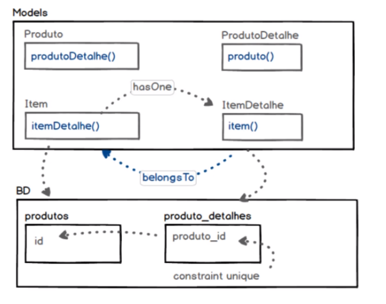

```
$ php artisan make:model Item
Model created successfully.

$ php artisan make:model ItemDetalhe
Model created successfully.
```

```php
class Item extends Model
{
    protected $table = 'produtos'; // Nome da tabela no banco

    protected $fillable = ['nome', 'descricao', 'peso', 'unidade_id'];

    public function itemDetalhe()
    {
        return $this->hasOne('App\ItemDetalhe', 'produto_id', 'id');
    }
}
```

```php
class ItemDetalhe extends Model
{
    protected $table = 'produto_detalhes';

    protected $fillable = ['produto_id', 'comprimento', 'largura', 'altura', 'unidade_id'];

    public function itemDetalhe()
    {
        return $this->belongsTo('App\Item','produto_id', 'id');
    }
}
```

```php
class ProdutoController extends Controller
{
    /**
     * Display a listing of the resource.
     *
     * @return \Illuminate\Http\Response
     */
    public function index(Request $request)
    {
        $produtos = Item::paginate(10);
        return view('app.produto.index', ['produtos' => $produtos, 'request'=> $request->all()]);
    }
```

```php
@foreach($produtos as $produto)
  <tr>
      <td> {{ $produto->nome }}</td>
      <td> {{ $produto->descricao }}</td>
      <td> {{ $produto->peso }}</td>
      <td> {{ $produto->unidade_id }}</td>
      <td> {{ $produto->itemdetalhe->comprimento ?? ''}}</td>
      <td> {{ $produto->itemdetalhe->altura  ?? ''}}</td>
      <td> {{ $produto->itemdetalhe->largura  ?? ''}}</td>
      <td><a href="{{ route('produto.show', ['produto'=> $produto->id]) }}">Visualizar</a></td>
      <td><a href="{{ route('produto.edit', ['produto'=> $produto->id]) }}">Editar</a></td>
      <td>
          <form id="form_{{$produto->id}}" method="post" action="{{ route('produto.destroy', ['produto'=>$produto->id]) }}">
              @csrf
              @method('DELETE')
              <!--<button type="submit">Excluir</button>-->
              <a href="#" onclick="document.getElementById('form_{{$produto->id}}').submit()">Excluir</a>
          </form>
      </td>
  </tr>
@endforeach
```

```php
class ProdutoDetalheController extends Controller
{
    // public function edit(ProdutoDetalhe $produtoDetalhe)
    public function edit($id)
    {
        $produtoDetalhe = ItemDetalhe::find($id);

        $unidades = Unidade::all();
        return view('app.produto_detalhe.edit', ['produto_detalhe'=> $produtoDetalhe, 'unidades'=> $unidades]);
    }
```

```php
 <div class="informacao-pagina">

            <h4>Produto</h4>
            <div>Nome: {{ $produto_detalhe->item->nome }}</div>
            <br>
            <div>Descrição: {{ $produto_detalhe->item->descricao }}</div>
            <br>

            <div style="width: 30%; margin-left: auto; margin-right: auto;">
                @component('app.produto_detalhe._components.form_create_edit', ['produto_detalhe'=> $produto_detalhe, 'unidades'=> $unidades])
                @endcomponent
                </form>
            </div>
```

- 180 Extra - Lazy Loading vs Eager Loading parte 1

```php
class ProdutoController extends Controller
{
    public function index(Request $request)
    {
        $produtos = Item::with(['itemDetalhe'])->paginate(10);
        return view('app.produto.index', ['produtos' => $produtos, 'request'=> $request->all()]);
    }
```

- 181 Extra - Lazy Loading vs Eager Loading parte 2

```php
class ProdutoDetalheController extends Controller
{
    // public function edit(ProdutoDetalhe $produtoDetalhe)
    public function edit($id)
    {
        $produtoDetalhe = ItemDetalhe::with(['item'])->find($id);

        $unidades = Unidade::all();
        return view('app.produto_detalhe.edit', ['produto_detalhe'=> $produtoDetalhe, 'unidades'=> $unidades]);
    }
```

- 182 Eloquent ORM 1 para N - Criando o relacionamento entre Fornecedor e Produto

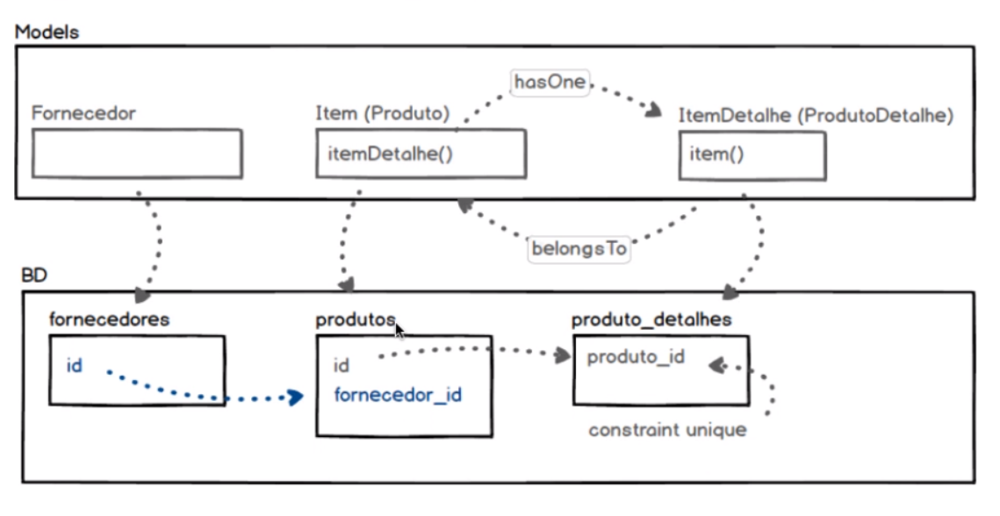

```
$ php artisan make:migration alter_produtos_relacionamento_fornecedores
Created Migration: 2022_07_20_181930_alter_produtos_relacionamento_fornecedores
```

```php
class AlterProdutosRelacionamentoFornecedores extends Migration
{
    public function up()
    {
        Schema::table('produtos', function (Blueprint $table) {

            // insere um registro de fornecedor para estabelecer o relacionamento
            $fornecedor_id = DB::table('fornecedores')->insertGetId([
                'nome' => 'Fornecedor Padrão SG',
                'site' => 'www.fornecedor.com.br',
                'uf' => 'SP',
                'email' => 'contato@fornecedorpadrao.com'
            ]);

            $table->unsignedBigInteger('fornecedor_id')->default($fornecedor_id)->after('id');
            $table->foreign('fornecedor_id')->references('id')->on('fornecedores');
        });
    }
    public function down()
    {
        Schema::table('produtos', function (Blueprint $table) {
            $table->dropForeign('produtos_fornecedor_id_foreing');
            $table->dropColumn('fornecedor_id');
        });
    }
}
```

```
$ php artisan migrate
Migrating: 2022_07_20_181930_alter_produtos_relacionamento_fornecedores
Migrated:  2022_07_20_181930_alter_produtos_relacionamento_fornecedores (0.18 seconds)

```

- 183 Eloquent ORM 1 para N - Exibindo informações do fornecedor (belongsTo)

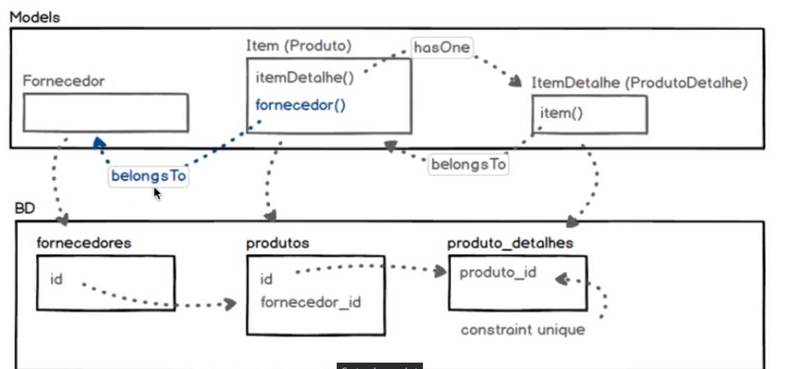

```php
class Item extends Model
{
    protected $table = 'produtos'; // Nome da tabela no banco

    protected $fillable = ['nome', 'descricao', 'peso', 'unidade_id'];

    public function itemDetalhe()
    {
        return $this->hasOne('App\ItemDetalhe', 'produto_id', 'id');
    }

    public function fornecedor()
    {
        return $this->belongsTo('App\Fornecedor');
    }
}
```

```php
@foreach($produtos as $produto)
    <tr>
        <td> {{ $produto->nome }}</td>
        <td> {{ $produto->descricao }}</td>
        <td> {{ $produto->fornecedor->uf }} - {{ $produto->fornecedor->nome }}</td>
        <td> {{ $produto->peso }}</td>
```

- 184 Extra - Exibindo mais informações do fornecedor

```php
class ProdutoController extends Controller
{
    public function index(Request $request)
    {
        $produtos = Item::with(['itemDetalhe', 'fornecedor'])->paginate(10);
        return view('app.produto.index', ['produtos' => $produtos, 'request'=> $request->all()]);
    }

```

- 185 Eloquent ORM 1 para N - Estabelecendo relacionamento 1xN (hasMany)

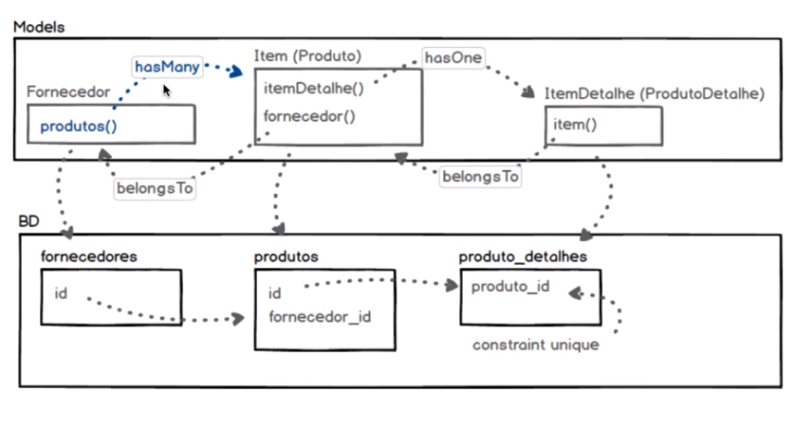

```php
class Fornecedor extends Model
{
    use SoftDeletes;

    protected $table = 'fornecedores';
    protected $fillable = ['nome', 'site', 'uf', 'email'];

    public function produtos()
    {
        // return $this->hasMany('App\Item', 'fornecedor_id', 'id'); / modelo se não estivesse no padrão
        return $this->hasMany('App\Item');
    }
}
```

```php
 @foreach($fornecedores as $fornecedor)
    <tr>
        <td>{{ $fornecedor->nome }}</td>
        <td>{{ $fornecedor->site }}</td>
        <td>{{ $fornecedor->uf }}</td>
        <td>{{ $fornecedor->email }}</td>
        <td><a href="{{ route('app.fornecedor.excluir', $fornecedor->id) }}">Excluir</a></td>
        <td><a href="{{ route('app.fornecedor.editar', $fornecedor->id) }}">Editar</a></td>
    </tr>
    <tr>
        <td colspan="6">
            <p>Lista de produtos</p>
            <table border="1" style="margin:20px">
                <thead>
                <tr>
                    <th>ID</th>
                    <th>Nome</th>
                </tr>
                </thead>
                <tbody>
                @foreach($fornecedor->produtos as $key => $produto)
                    <tr>
                        <td>{{ $produto->id}}</td>
                        <td>{{ $produto->nome}}</td>
                    </tr>
                @endforeach
                </tbody>
            </table>
        </td>
    <tr>
@endforeach
```

- 186 Eloquent ORM 1 para N - Associando fornecedores a produtos (Store e Update)
- 187 Eloquent N para N - Implementando os requisitos para o relacionamento

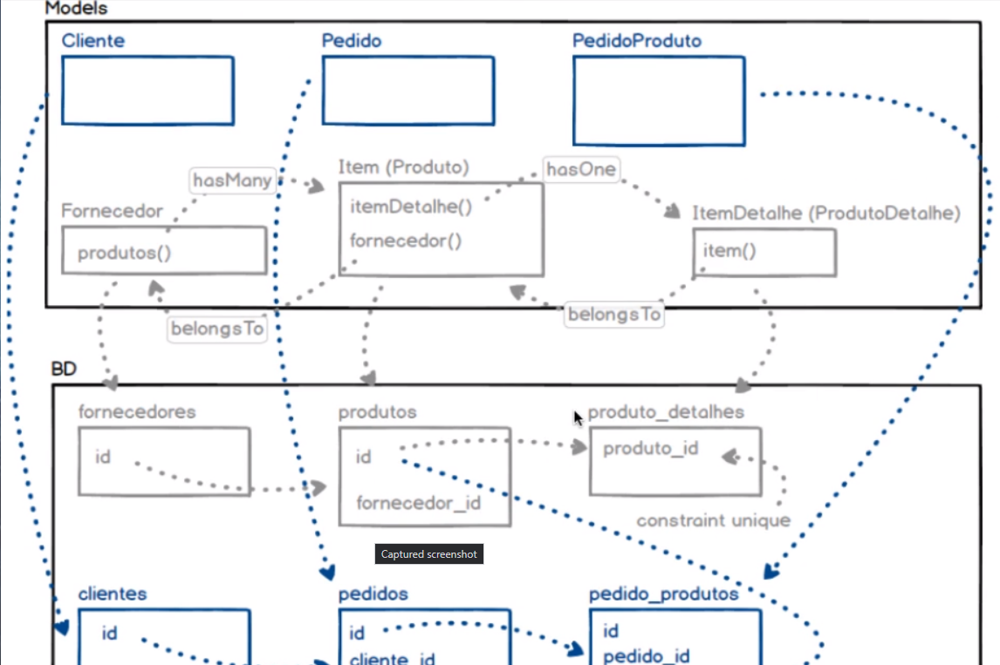

```
$ php artisan make:model Cliente
Model created successfully.

$ php artisan make:model Pedido
Model created successfully.

$ php artisan make:model PedidoProduto
Model created successfully.
```

```
$ php artisan make:migration create_clientes_pedidos_pedidoprocutos
Created Migration: 2022_07_21_000612_create_clientes_pedidos_pedidoprocutos
```

```php
class CreateClientesPedidosPedidoprocutos extends Migration
{
    public function up()
    {
        Schema::create('clientes', function (Blueprint $table) {
            $table->id();
            $table->string('nome', 50);
            $table->timestamps();
        });

        Schema::create('pedidos', function (Blueprint $table) {
            $table->id();
            $table->unsignedBigInteger('cliente_id');
            $table->timestamps();

            $table->foreign('cliente_id')->references('id')->on('clientes');
        });

        Schema::create('pedidos_produtos', function (Blueprint $table) {
            $table->id();
            $table->unsignedBigInteger('pedido_id');
            $table->unsignedBigInteger('produto_id');
            $table->timestamps();

            $table->foreign('pedido_id')->references('id')->on('pedidos');
            $table->foreign('produto_id')->references('id')->on('produtos');
        });
    }
    public function down()
    {
        Schema::disableForeignKeyConstraints();

        Schema::dropIfExists('clientes');
        Schema::dropIfExists('pedidos');
        Schema::dropIfExists('pedidos_produtos');

        Schema::enableForeignKeyConstraints();
    }
}
```

- 188 Criando os controladores e rotas para clientes, pedidos e pedidos produtos

```
$ php artisan make:controller --resource ClienteController
Controller created successfully.

$ php artisan make:controller --resource PedidoController
Controller created successfully.

$ php artisan make:controller --resource PedidoProdudoController
Controller created successfully.

```

```php
    Route::resource('cliente', 'ClienteController');
    Route::resource('pedido', 'PedidoController');
    Route::resource('pedido-produto', 'PedidoProdutoController');
```

- 189 Implementando a tela de listagem de clientes

```php
class ClienteController extends Controller
{
    public function index(Request $request)
    {
        $clientes = Cliente::paginate(10);
        return view('app.cliente.index', ['clientes'=> $clientes, 'request'=> $request->all()]);
    }
```

```php
 @foreach($clientes as $cliente)
                        <tr>
                            <td>{{ $cliente->nome }}</td>
                            <td><a href="{{ route('cliente.show', ['cliente' => $cliente->id ]) }}">Visualizar</a></td>
                            <td>
                                <form id="form_{{$cliente->id}}" method="post" action="{{ route('cliente.destroy', ['cliente' => $cliente->id]) }}">
                                    @method('DELETE')
                                    @csrf
                                    <!--<button type="submit">Excluir</button>-->
                                    <a href="#" onclick="document.getElementById('form_{{$cliente->id}}').submit()">Excluir</a>
                                </form>
                            </td>
                            <td><a href="{{ route('cliente.edit', ['cliente' => $cliente->id ]) }}">Editar</a></td>
                        </tr>
                    @endforeach
                    </tbody>
                </table>

                {{ $clientes->appends($request)->links() }}

                <!--
                <br>
                {{ $clientes->count() }} - Total de registros por página
                <br>
                {{ $clientes->total() }} - Total de registros da consulta
                <br>
                {{ $clientes->firstItem() }} - Número do primeiro registro da página
                <br>
                {{ $clientes->lastItem() }} - Número do último registro da página

                -->
                <br>
                Exibindo {{ $clientes->count() }} clientes de {{ $clientes->total() }} (de {{ $clientes->firstItem() }} a {{ $clientes->lastItem() }})
            </div>
```


- 190 Implementando a tela de cadastro de clientes

```php
class ClienteController extends Controller
{
    public function create()
    {
        return view('app.cliente.create');
    }

    public function store(Request $request)
    {
        $regras = [
            'nome' => 'required|min:3|max:40'
        ];

        $feedback = [
            'required' => 'O campo :attribute deve ser preenchido',
            'nome.min' => 'O campo nome de ter no mínimo 3 caracteres',
            'nome.max' => 'O campo nome de ter no máximo 40 caracteres',
        ];

        $request->validate($regras, $feedback);

        $cliente = new Cliente();
        $cliente->nome = $request->get('nome');
        $cliente->save();

        return redirect()->route('cliente.index');
    }

```

- 191 Implementando a tela de listagem de pedidos

```php
    public function index(Request $request)
    {
        $pedidos = Pedido::paginate(10);
        return view('app.pedido.index', ['pedidos' => $pedidos, 'request' => $request->all()] );
    }
```

```php
<table border="1" width="100%">
  <thead>
  <tr>
      <th>ID Pedido</th>
      <th>Cliente</th>
      <th></th>
      <th></th>
  </tr>
  </head>

  <tbody>
  @foreach($pedidos as $pedido)
      <tr>
          <td>{{ $pedido->id }}</td>
          <td>{{ $pedido->cliente_id }}</td>
          <td><a href="{{ route('pedido.show', ['pedido' => $pedido->id ]) }}">Visualizar</a></td>
          <td>
              <form id="form_{{$pedido->id}}" method="post" action="{{ route('pedido.destroy', ['pedido' => $pedido->id]) }}">
                  @method('DELETE')
                  @csrf
                  <!--<button type="submit">Excluir</button>-->
                  <a href="#" onclick="document.getElementById('form_{{$pedido->id}}').submit()">Excluir</a>
              </form>
          </td>
          <td><a href="{{ route('pedido.edit', ['pedido' => $pedido->id ]) }}">Editar</a></td>
      </tr>
  @endforeach
  </tbody>
</table>
```

- 192 Implementando a tela de cadastro de pedidos

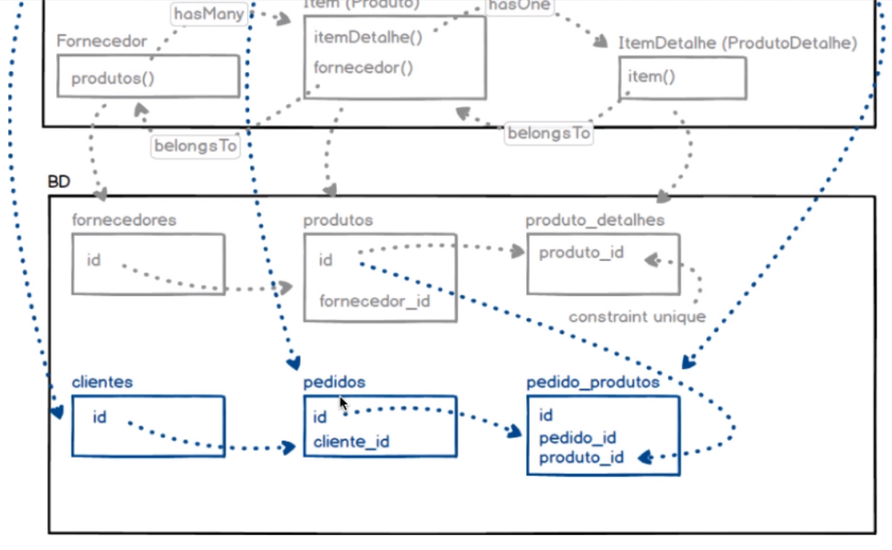

- 193 Implementando a tela de cadastro de produtos para um determinado pedido parte 1

```php
    // Route::resource('pedido-produto', 'PedidoProdutoController');
    Route::get( 'pedido-produto/create/{pedido}', 'PedidoProdudoController@create')->name('pedido-produto.create');
    Route::post('pedido-produto/store/{pedido}',  'PedidoProdudoController@store') ->name('pedido-produto.store');
```

```php
class PedidoProdudoController extends Controller
{
    public function create(Pedido $pedido)
    {
        $produtos = Produto::all();
        return view('app.pedido_produto.create', ['pedido' => $pedido, 'produtos' => $produtos]);
    }

    public function store(Request $request, Pedido $pedido)
    {
        echo '<pre>';
        print_r($pedido);
        echo '</pre>';
        echo '<hr>';
        echo '<pre>';
        print_r($request->all());
        echo '</pre>';
    }

```

- [app_super_gestao/resources/views/app/pedido_produto/create.blade.php]app_super_gestao/resources/views/app/pedido_produto/create.blade.php)

```php
@extends('app.layouts.basico')

@section('titulo', 'Pedido Produto')

@section('conteudo')

    <div class="conteudo-pagina">

        <div class="titulo-pagina-2">
            <p>Adicionar Produtos ao Pedido</p>
        </div>

        <div class="menu">
            <ul>
                <li><a href="{{ route('pedido.index') }}">Voltar</a></li>
                <li><a href="">Consulta</a></li>
            </ul>
        </div>

        <div class="informacao-pagina">
            <h4>Detalhes do pedido</h4>
            <p>ID do pedido: {{ $pedido->id }}</p>
            <p>Cliente: {{ $pedido->cliente_id }}</p>

            <div style="width: 30%; margin-left: auto; margin-right: auto;">
                @component('app.pedido_produto._components.form_create', ['pedido' => $pedido, 'produtos' => $produtos])
                @endcomponent
            </div>
        </div>

    </div>

@endsection
```

- 194 Eloquent ORM N para N - Implementando o relacionamento belongsToMany

```php
class PedidoProdudoController extends Controller
{
    public function create(Pedido $pedido)
    {
        $produtos = Produto::all();
        return view('app.pedido_produto.create', ['pedido' => $pedido, 'produtos' => $produtos]);
    }

    public function store(Request $request, Pedido $pedido)
    {
        $regras = [
            'produto_id' => 'exists:produtos,id'
        ];

        $feedback = [
            'produto_id.exists' => 'O produto informado não existe'
        ];

        $request->validate($regras, $feedback);

        $pedidoProduto = new PedidoProduto();
        $pedidoProduto->pedido_id = $pedido->id;
        $pedidoProduto->produto_id = $request->get('produto_id');
        $pedidoProduto->save();

        return redirect()->route('pedido-produto.create', ['pedido' => $pedido->id]);
    }****
```

```php
class Pedido extends Model
{
    public function produtos()
    {
        // return $this->belongsToMany('App\Produto', 'pedidos_produtos');
        return $this->belongsToMany('App\Item', 'pedidos_produtos', 'pedido_id', 'produto_id');
        /*
            1 - Modelo do relacionamento NxN em relação o Modelo que estamos implementando
            2 - É a tabela auxiliar que armazena os registros de relacionamento
            3 - Representa o nome da FK da tabela mapeada pelo modelo na tabela de relacionamento
            4 - Representa o nome da FK da tabela mapelada pelo model utilizado no relacionamento que estamos implementando
        */
    }
}
```

```
 @foreach($pedido->produtos as $produto)
    <tr>
        <td>{{ $produto->id }}</td>
        <td>{{ $produto->nome }}</td>
    </tr>
@endforeach
```

- 195 Eloquent ORM N para N - Praticando um pouco mais o relacionamento belongsToMany

```php
class Item extends Model
{
    protected $table = 'produtos'; // Nome da tabela no banco

    protected $fillable = ['nome', 'descricao', 'peso', 'unidade_id', 'fornecedor_id'];

    public function itemDetalhe()
    {
        return $this->hasOne('App\ItemDetalhe', 'produto_id', 'id');
    }

    public function fornecedor()
    {
        return $this->belongsTo('App\Fornecedor');
    }

    public function pedidos() {
        return $this->belongsToMany('App\Pedido', 'pedidos_produtos', 'produto_id', 'pedido_id');

        /*
            3 - Representa o nome da FK da tabela mapeada pelo model na tabela de relacionamento
            4 - Representa o nome da FK da tabela mapeada pelo model utilizado no relacionamento que estamos implementando
        */
    }
}
```

- [app_super_gestao/resources/views/app/produto/index.blade.php](app_super_gestao/resources/views/app/produto/index.blade.php)

```php
              <tr>
              <td colspan="12">
                  <p>Pedidos</p>
                  @foreach($produto->pedidos as $pedido)
                      <a href="{{ route('pedido-produto.create', ['pedido' => $pedido->id]) }}">
                          Pedido: {{ $pedido->id }},
                      </a>
                  @endforeach
              </td>
          </tr>
      @endforeach
      </tbody>
  </table>
```


- 196 Relacionamento N para N - Colunas pivô da tabela de relacionamento (Pivot)

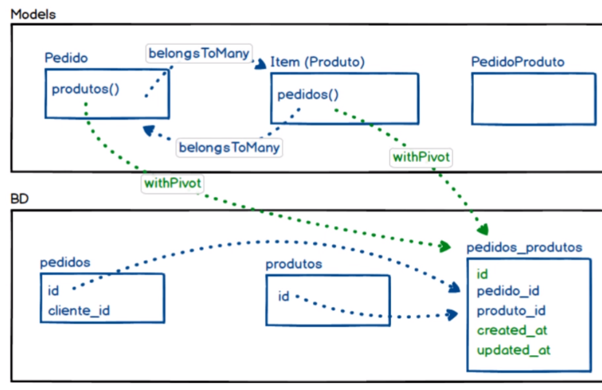

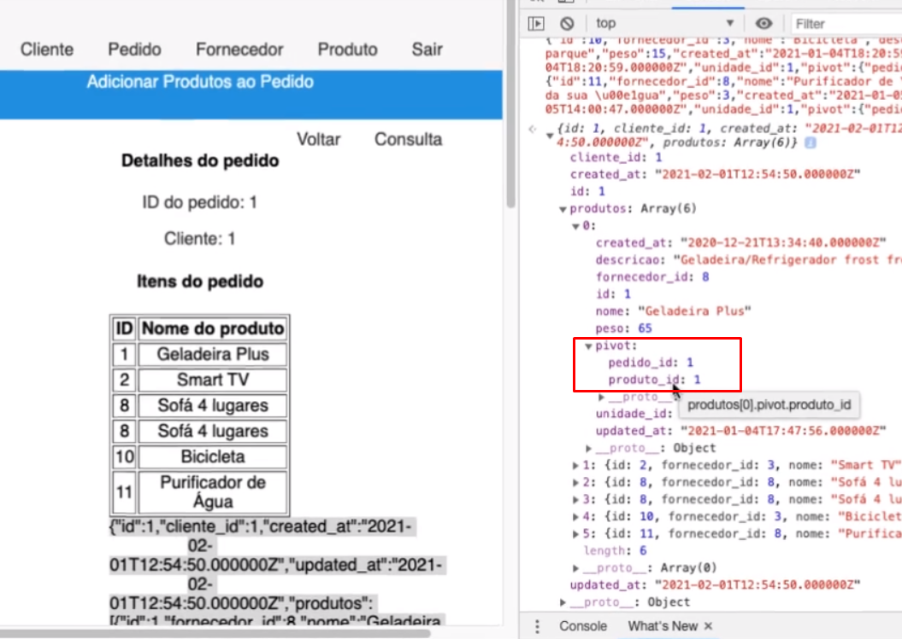

```php
class Pedido extends Model
{
    public function produtos()
    {
        // return $this->belongsToMany('App\Produto', 'pedidos_produtos');
        return $this
            ->belongsToMany('App\Item', 'pedidos_produtos', 'pedido_id', 'produto_id')
            ->withPivot('created_at');
        /*
            1 - Modelo do relacionamento NxN em relação o Modelo que estamos implementando
            2 - É a tabela auxiliar que armazena os registros de relacionamento
            3 - Representa o nome da FK da tabela mapeada pelo modelo na tabela de relacionamento
            4 - Representa o nome da FK da tabela mapelada pelo model utilizado no relacionamento que estamos implementando
        */
    }
}

```

-[app_super_gestao/resources/views/app/pedido_produto/create.blade.php](app_super_gestao/resources/views/app/pedido_produto/create.blade.php)

```php
    @foreach($pedido->produtos as $produto)
        <tr>
            <td>{{ $produto->id }}</td>
            <td>{{ $produto->nome }}</td>
            <td>{{ $produto->pivot->created_at->format('d/m/Y') }}</td>
        </tr>
    @endforeach
```

- 197 Relacionamento N para N - Inserindo registros por meio do relacionamento

```
$ php artisan make:migration alter_pedidos_produtos_add_quantidade
Created Migration: 2022_07_23_010218_alter_pedidos_produtos_add_quantidade

```

```php
class AlterPedidosProdutosAddQuantidade extends Migration
{
    public function up()
    {
        Schema::table('pedidos_produtos', function (Blueprint $table){
            $table->integer('quantidade');
        });
    }
    public function down()
    {
        Schema::table('pedidos_produtos', function (Blueprint $table){
            $table->dropColumn('quantidade');
        });
    }
}
```

```php
class PedidoProdudoController extends Controller
{
    public function store(Request $request, Pedido $pedido)
    {
        $regras = [
            'produto_id' => 'exists:produtos,id',
            'quantidade' => 'required'
        ];

        $feedback = [
            'produto_id.exists' => 'O produto informado não existe',
            'required' => 'O campo :attribute deve possuir um valor válido'
        ];

        $request->validate($regras, $feedback);

        /*
        $pedidoProduto = new PedidoProduto();
        $pedidoProduto->pedido_id = $pedido->id;
        $pedidoProduto->produto_id = $request->get('produto_id');
        $pedidoProduto->quantidade = $request->get('quantidade');
        $pedidoProduto->save();
        */

        //$pedido->produtos //os registros do relacionamento
        /*
        $pedido->produtos()->attach(
            $request->get('produto_id'),
            [
                'quantidade' => $request->get('quantidade'),
                'coluna_1' => '',
                'coluna_2' => '',
            ]
        ); //objeto
        //pedido_id
        */
        // OU ...
        $pedido->produtos()->attach([
            // $request->get('produto_id') => ['coluna_1' => $request->get('coluna_1')], // mais informações
            $request->get('produto_id') => ['quantidade' => $request->get('quantidade')]
        ]);

        return redirect()->route('pedido-produto.create', ['pedido' => $pedido->id]);
    }
```

-[app_super_gestao/resources/views/app/pedido_produto/_components/form_create.blade.php](app_super_gestao/resources/views/app/pedido_produto/_components/form_create.blade.php)

```php

    <input type="number" name="quantidade" value="{{ old('quantidade') ? old('quantidade') : '' }}"
           placeholder="Quantidade" class="borda-preta">
    {{ $errors->has('quantidade') ? $errors->first('quantidade') : '' }}

```


- 198 Relacionamento N para N - Removendo o relacionamento

```php
Route::delete('pedido-produto/destroy/{pedido}/{produto}',  'PedidoProdudoController@destroy') ->name('pedido-produto.destroy');
```

```php
public function destroy(Pedido $pedido, Produto $produto)
    {
        /*
        print_r($pedido->getAttributes());
        echo '<hr>';
        print_r($produto->getAttributes());
        */

        // Convencional
//        PedidoProduto::where(
//            [
//                'pedido_id'=> $pedido->id,
//                'produto_id'=> $produto->id
//            ]
//        )->delete();

        // detach (delete pelo relacionamento)
        $pedido->produtos()->detach($produto->id);


        // por meio do Objeto Produto
        // $produito->pedido()->detach($pedido->id)

        return redirect()->route('pedido-produto.create', ['pedido' => $pedido->id]);
    }
```

```php
                    @foreach($pedido->produtos as $produto)
                        <tr>
                            <td>{{ $produto->id }}</td>
                            <td>{{ $produto->nome }}</td>
                            <td>{{ $produto->pivot->created_at->format('d/m/Y') }}</td>
                            <td>
                                <form id="form_{{$pedido->id}}_{{$produto->id}}" method="post"
                                      action="{{ route('pedido-produto.destroy', ['pedido' => $pedido->id, 'produto' => $produto->id])}}">
                                    @method('DELETE')
                                    @csrf
                                    <a href="#" onclick="document.getElementById('form_{{$pedido->id}}_{{$produto->id}}').submit()">Excluir</a>
                                </form>
                            </td>
                        </tr>
                    @endforeach
```


- 199 Extra - Removendo o relacionamento pela PK de pedidos_produtos

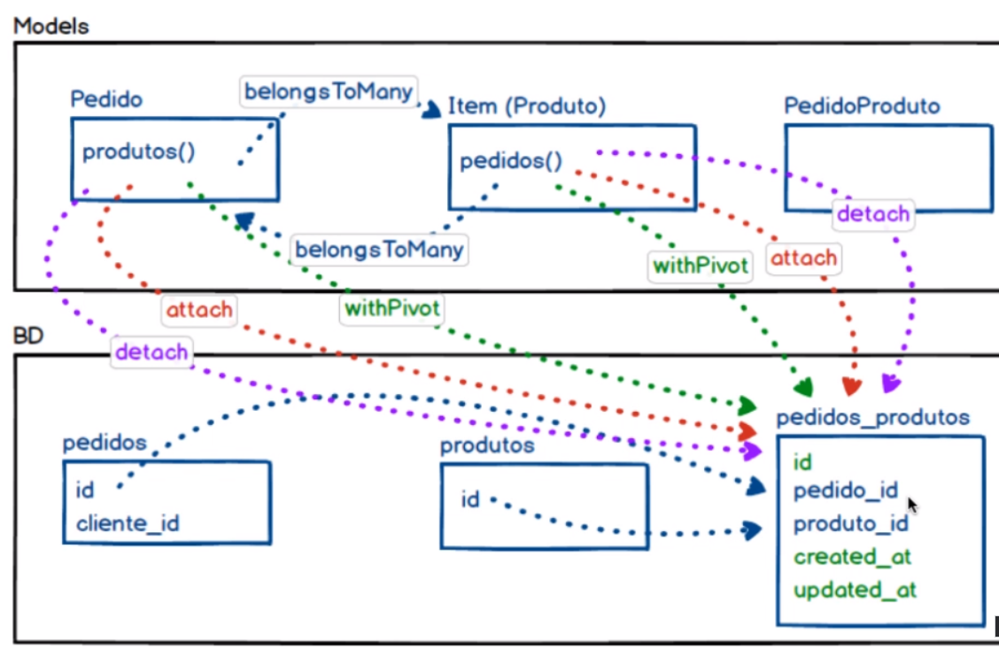

```php
class Pedido extends Model
{
    public function produtos()
    {
        // return $this->belongsToMany('App\Produto', 'pedidos_produtos');
        return $this
            ->belongsToMany('App\Item', 'pedidos_produtos', 'pedido_id', 'produto_id')
            ->withPivot('created_at', 'id'); // add 'id'
        /*
            1 - Modelo do relacionamento NxN em relação o Modelo que estamos implementando
            2 - É a tabela auxiliar que armazena os registros de relacionamento
            3 - Representa o nome da FK da tabela mapeada pelo modelo na tabela de relacionamento
            4 - Representa o nome da FK da tabela mapelada pelo model utilizado no relacionamento que estamos implementando
        */
    }
}
```

```php
                    @foreach($pedido->produtos as $produto)
                        <tr>
                            <td>{{ $produto->id }}</td>
                            <td>{{ $produto->nome }}</td>
                            <td>{{ $produto->pivot->created_at->format('d/m/Y') }}</td>
                            <td>
                                <form id="form_{{$produto->pivot->id}}" method="post"
                                      action="{{ route('pedido-produto.destroy', ['pedidoProduto' => $produto->pivot->id , 'pedido_id'=> $pedido->id ])}}">
                                    @method('DELETE')
                                    @csrf
                                    <a href="#" onclick="document.getElementById('form_{{$produto->pivot->id}}').submit()">Excluir</a>
                                </form>
                            </td>
                        </tr>
                    @endforeach
```

```php
  //Route::delete('pedido-produto/destroy/{pedido}/{produto}',  'PedidoProdudoController@destroy') ->name('pedido-produto.destroy');
    Route::delete('pedido-produto/destroy/{pedidoProduto}/{pedido_id}',  'PedidoProdudoController@destroy') ->name('pedido-produto.destroy');
```

```php
 // public function destroy(Pedido $pedido, Produto $produto)
    public function destroy(PedidoProduto $pedidoProduto, $pedido_id)
    {
        /*
        print_r($pedido->getAttributes());
        echo '<hr>';
        print_r($produto->getAttributes());
        */

        // Convencional
//        PedidoProduto::where(
//            [
//                'pedido_id'=> $pedido->id,
//                'produto_id'=> $produto->id
//            ]
//        )->delete();

        // detach (delete pelo relacionamento)
        // $pedido->produtos()->detach($produto->id); // ultima forma


        // por meio do Objeto Produto
        // $produito->pedido()->detach($pedido->id)

        $pedidoProduto->delete();
        return redirect()->route('pedido-produto.create', ['pedido' => $pedido_id]);
    }
```

[Voltar ao Índice](#indice)

---


## <a name="parte13">13 - Autenticação WEB (Session) e Bootstrap (CSS)</a>

- 200 Iniciando o projeto Controle de Tarefas

```
$ composer create-project --prefer-dist laravel/laravel app_controle_tarefas "8.5.9"

```

- 201 [WINDOWS] Instalando o NodeJS e o NPM
- 202 [LINUX] Instalando o NodeJS e o NPM
- 203 [OSX] Instalando o NodeJS e o NPM
- 204 Instalando o Laravel UI

```
$ composer require laravel/ui:^3.2

```

```
$ php artisan list


 ui
  ui:auth               Scaffold basic login and registration views and routes
  ui:controllers        Scaffold the authentication controllers
```

- 205 Entendendo o pacote UI e iniciando a autenticação WEB nativa do Laravel

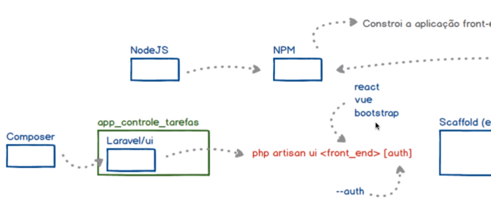

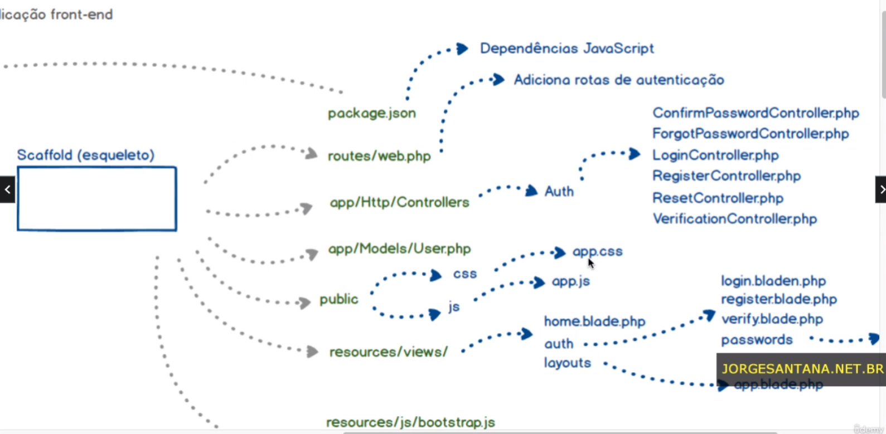

```
$ php artisan ui bootstrap --auth
Bootstrap scaffolding installed successfully.
Please run "npm install && npm run dev" to compile your fresh scaffolding.
Authentication scaffolding generated successfully.

$npm install
$npm run dev
```

- 206 Configurando a conexão com o banco de dados e executando as migrations padrões

```
$ php artisan migrate
Migration table created successfully.
Migrating: 2014_10_12_000000_create_users_table
Migrated:  2014_10_12_000000_create_users_table (31.06ms)
Migrating: 2014_10_12_100000_create_password_resets_table
Migrated:  2014_10_12_100000_create_password_resets_table (25.64ms)
Migrating: 2019_08_19_000000_create_failed_jobs_table
Migrated:  2019_08_19_000000_create_failed_jobs_table (26.97ms)

```

- 207 Registrando novos usuários e efetuando o login na aplicação

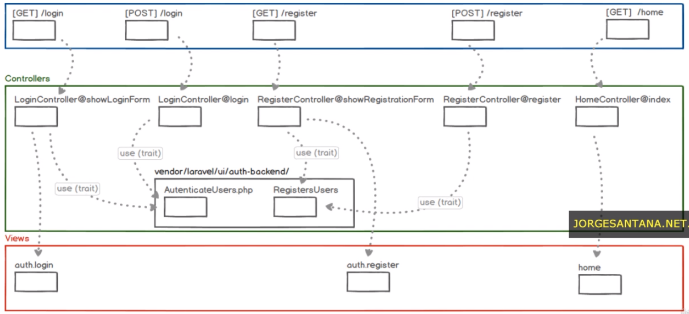

- 208 Validando campos de confirmação (confirmed) e mudando regras de senhas

```php
class RegisterController extends Controller
{
    protected function validator(array $data)
    {
        return Validator::make($data, [
            'name' => ['required', 'string', 'max:255'],
            'email' => ['required', 'string', 'email', 'max:255', 'unique:users'],
            'password' => ['required', 'string', 'min:4', 'confirmed'], // password_confirmation
        ]);
    }
```

```php
<input id="password-confirm" type="password" class="form-control" name="password_confirmation" required autocomplete="new-password">
```

- 209 Entendendo como a rota Home está protegida

```php
class HomeController extends Controller
{
    public function __construct()
    {
        $this->middleware('auth');
    }
```

- 210 Criando o Model e o Controller para Tarefa

```
$ php artisan make:controller --resource TarefaController --model=Tarefa

 A App\Models\Tarefa model does not exist. Do you want to generate it? (yes/no) [yes]:
 > yes

Model created successfully.
Controller created successfully.

```

- 211 Implementando o middleware auth

```php
Route::get('/tarefa', [App\Http\Controllers\TarefaController::class, 'index'])->name('tarefa');
```

```php
class TarefaController extends Controller
{
    public function __construct()
    {
        $this->middleware('auth');
    }

    public function index()
    {
        return 'Chegou na tarefa';
    }
```

```php
// ou passando na rota
Route::get('/tarefa', [App\Http\Controllers\TarefaController::class, 'index'])
    ->name('tarefa')
    ->middleware('auth');
```

- 212 Verificando se o usuário está logado dentro dos métodos do Controller

```php
    public function index()
    {
        /*if (auth()->check()) {
            $id = auth()->user()->id;
            $name = auth()->user()->name;
            $email = auth()->user()->email;
            return "LOGADO NO SISTEMA - ID: $id - NOME: $name - EMail: $email";
        } else {
            return 'NÃO LOGADO NO SISTEMA';
        }*/
        // OU ...
        if (Auth::check()) {
            $id = Auth::user()->id;
            $name = Auth::user()->name;
            $email = Auth::user()->email;
            return "LOGADO NO SISTEMA - ID: $id - NOME: $name - EMail: $email";
        } else {
            return 'NÃO LOGADO NO SISTEMA';
        }
    }
```

[Voltar ao Índice](#indice)

---


## <a name="parte14">14 - Implementando o envio de e-mails e a exportação de arquivos XLSX, CSV e PDF</a>

- 213 Configurando o envio de e-mails (Reset Password) - Parte 1

```
Resolvi esse problema com um método de configuração de senha do google, siga esses passos o passo 3 só funciona se fizer o passo 2, ao gerar senha use-a na .env:

*1-Faça login nas configurações da conta do Gmail.

*2-Ative a verificação em duas etapas.

*3-Gere a senha do aplicativo 'https://support.google.com/accounts/answer/185833?hl=en'.

*4-Use a nova senha gerada no lugar de sua senha real do Gmail.

*---Não se esqueça de limpar o cache:

php artisan config:cache.
php artisan config:clear.
```

- 214 Criando um template de e-mail com Markdown Mailables

```
$ php artisan make:mail MensagemTesteMail --markdown email.mensagem-teste
Mail created successfully.

```

```php
// TESTE para ver a mensagem

Route::get('/mensagem-teste', function (){
    return new \App\Mail\MensagemTesteMail();
});

```

- 215 Enviando e-mails

```php
Route::get('/mensagem-teste', function (){
    // return new \App\Mail\MensagemTesteMail();

    Mail::to('contato@josemalcher.net')->send(new \App\Mail\MensagemTesteMail());
    return 'Email enviado com sucesso';
});
```

```
>>> use App\Mail\MensagemTesteMail;                                                                                                                                                                      
>>> Mail::to('contato@josemalcher.net')->send(new \App\Mail\MensagemTesteMail());                                                                                                                        
=> null

```

- 216 Publicando e customizando o template de e-mail

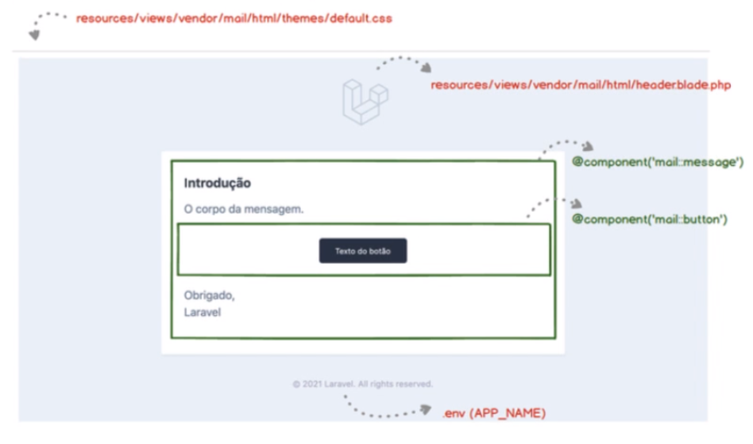

```
$ php artisan vendor:publish

 Which provider or tag's files would you like to publish?:
  [0 ] Publish files from all providers and tags listed below
  [1 ] Provider: Facade\Ignition\IgnitionServiceProvider
  [2 ] Provider: Fideloper\Proxy\TrustedProxyServiceProvider
  [3 ] Provider: Fruitcake\Cors\CorsServiceProvider
  [4 ] Provider: Illuminate\Foundation\Providers\FoundationServiceProvider
  [5 ] Provider: Illuminate\Mail\MailServiceProvider
  [6 ] Provider: Illuminate\Notifications\NotificationServiceProvider
  [7 ] Provider: Illuminate\Pagination\PaginationServiceProvider
  [8 ] Provider: Laravel\Sail\SailServiceProvider
  [9 ] Provider: Laravel\Tinker\TinkerServiceProvider
  [10] Tag: cors
  [11] Tag: flare-config
  [12] Tag: ignition-config
  [13] Tag: laravel-errors
  [14] Tag: laravel-mail
  [15] Tag: laravel-notifications
  [16] Tag: laravel-pagination
  [17] Tag: sail
  [18] Tag: sail-bin
  [19] Tag: sail-docker
 > 14
14

Copied Directory [\vendor\laravel\framework\src\Illuminate\Mail\resources\views] To [\resources\views\vendor\mail]
Publishing complete.


```

- 217 Configurando o envio de e-mails (Reset Password) - Parte 
 
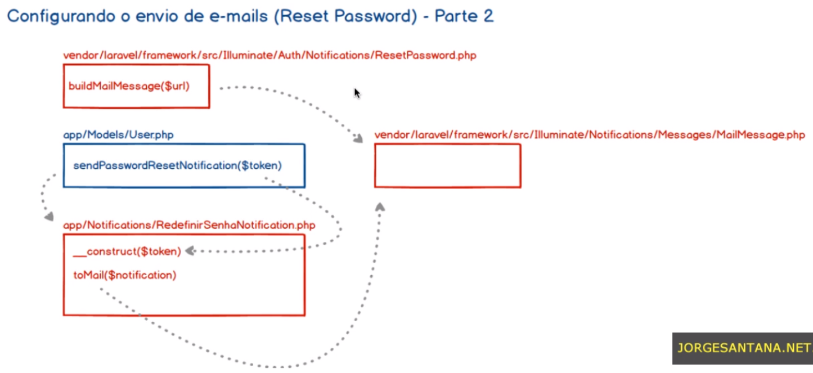

```php
namespace App\Models;
class User extends Authenticatable
{
    public function sendPasswordResetNotification($token)
    {
        // dd('Chegou no sendPasswordResetNotification');
        $this->notify(new RedefinirSenhaNotification($token, $this->email, $this->name));
    }
```

```
$ php artisan make:notification RedefinirSenhaNotification
Notification created successfully.
```

```
namespace App\Notifications;
class User extends Authenticatable
{
    public function sendPasswordResetNotification($token)
    {
        // dd('Chegou no sendPasswordResetNotification');
        $this->notify(new RedefinirSenhaNotification($token, $this->email, $this->name));
    }
```

```php
class RedefinirSenhaNotification extends Notification
{
    use Queueable;
    public $token;
    public $email;
    public $name;
    
    public function __construct($token, $email, $name)
    {
        $this->token = $token;
        $this->email = $email;
        $this->name = $name;
    }

    public function toMail($notifiable)
    {
        $url = 'http://localhost:8000/password/reset/'.$this->token.'?email='.$this->email;
        $minutos = config('auth.passwords.'.config('auth.defaults.passwords').'.expire');
        $saudacao = 'Olá '.$this->name;

        return (new MailMessage)
            ->subject('Atualização de senha')
            ->greeting($saudacao)
            ->line('Esqueceu a senha? Sem problemas, vamos resolver isso!!!')
            ->action('Clique aqui para modificar a senha', $url)
            ->line('O link acima expira em '.$minutos.' minutos')
            ->line('Caso você não tenha requisitado a alteração de senha, então nenhuma ação é necessária.')
            ->salutation('Até breve!');
    }
```
 
- 218 Ajustando as políticas de senha no reset

```php
class ResetPasswordController extends Controller
{
    use ResetsPasswords;

    protected function rules() // sobreescrita
    {
        return [
            'token' => 'required',
            'email' => 'required|email',
            'password' => ['required', 'confirmed', 'min:4'],
            // 'password' => ['required', 'confirmed', Rules\Password::defaults()],
        ];
    }
```

- 219 Verificação de e-mail (MystVerifyEmail)

```php

use Illuminate\Contracts\Auth\MustVerifyEmail;

class User extends Authenticatable implements MustVerifyEmail
{
```

```php
Auth::routes(['verify'=> true]);

Route::get('/home', [App\Http\Controllers\HomeController::class, 'index'])
    ->name('home')
    ->middleware('verified');
Route::get('/tarefa', [App\Http\Controllers\TarefaController::class, 'index'])
    ->name('tarefa')
    ->middleware('verified');

```

- 220 Customizando a view de verificação de e-mail

- [app_controle_tarefas/resources/views/auth/verify.blade.php](app_controle_tarefas/resources/views/auth/verify.blade.php)

- 221 Customizando a mensagem de verificação de e-mail

```
$ php artisan make:notification VerificareEmailNotification
Notification created successfully.

```

```php
namespace App\Models;

class User extends Authenticatable implements MustVerifyEmail
{
      public function sendEmailVerificationNotification()
    {
          $this->notify(new VerificareEmailNotification($this->name));
    }
```

```php
namespace App\Notifications;

class VerificarEmailNotification extends Notification
{
    public static $createUrlCallback;
    public $name;

    public static $toMailCallback;

    public function __construct($name) {
        $this->name = $name;
    }

    protected function buildMailMessage($url)
    {
        return (new MailMessage)
            ->subject('Confirmação de e-mail')
            ->greeting('Olá '.$this->name)
            ->line('Clique no botão abaixo para validar seu e-mail')
            ->action('Clique aqui para validar seu e-mail', $url)
            ->line('Caso você não tenha se cadastrado em nosso sistema, apenas desconsidere essa mensagem');
    }
```

- 222 Cadastrando novas tarefas

```php
//Route::get('/tarefa', [App\Http\Controllers\TarefaController::class, 'index'])
//    ->name('tarefa')
//    ->middleware('verified');

Route::resource('tarefa', 'App\Http\Controllers\TarefaController')
    ->middleware('verified');

```

```php
class TarefaController extends Controller
{
    public function create()
    {
        return view('tarefa.create');
    }

  public function store(Request $request)
    {
        // dd($request->all());
        $tarefa = Tarefa::create($request->all());
        return redirect()->route('tarefa.show', ['tarefa'=>$tarefa->id]);
    }

    public function show(Tarefa $tarefa)
    {
        dd($tarefa->getAttributes());
        /*
         array:5 [▼
                "id" => 3
                "created_at" => "2022-07-29 14:32:48"
                "updated_at" => "2022-07-29 14:32:48"
                "tarefa" => "Tarefa 3"
                "data_limite_conclusao" => "2022-08-04"
              ]
         * */
    }
```

```
$ php artisan make:migration create_tarefas_table
Created Migration: 2022_07_29_140051_create_tarefas_table

```


- 223 Enviando um e-mail de cadastro de nova tarefa e exibindo os dados da tarefa

```
$ php artisan make:mail NovaTarefaMail --markdown emails.nova-tarefa
Mail created successfully.

```

```php
class NovaTarefaMail extends Mailable
{
    use Queueable, SerializesModels;

    public $tarefa;
    public $data_limite_conclusao;
    public $url;

    public function __construct(Tarefa $tarefa)
    {
        $this->tarefa = $tarefa->tarefa;
        $this->data_limite_conclusao = date('d/m/Y', strtotime($tarefa->data_limite_conclusao));
        $this->url = 'http://127.0.0.1:8000/tarefa/' . $tarefa->id;
    }
    public function build()
    {
        return $this->markdown('emails.nova-tarefa')
            ->subject('Nova Tarefa Criada');
    }
}
```

```php
class TarefaController extends Controller
{
    public function __construct()
    {
        // $this->middleware('auth');
    }
    public function store(Request $request)
    {
        // dd($request->all());
        $tarefa = Tarefa::create($request->all());

        $destinatario = auth()->user()->email; // email do usuário logado (autenticado)
        Mail::to($destinatario)->send(new NovaTarefaMail($tarefa));

        return redirect()->route('tarefa.show', ['tarefa'=>$tarefa->id]);
    }

    public function show(Tarefa $tarefa)
    {
        //dd($tarefa->getAttributes());
        return view('tarefa.show', ['tarefa'=> $tarefa]);
    }
```

```php
@component('mail::message')
# {{ $tarefa }}

Data Limite de conclusão: {{ $data_limite_conclusao }}

@component('mail::button', ['url' => $url])
Click aqui para ver a tarefa
@endcomponent

Att,<br>
{{ config('app.name') }}
@endcomponent

```

```php
@extends('layouts.app')

@section('content')
    <div class="container">
        <div class="row justify-content-center">
            <div class="col-md-8">
                <div class="card">
                    <div class="card-header">{{ $tarefa->tarefa }}</div>
                    <fieldset disabled>
                        <div class="card-body">

                            <div class="mb-3">
                                <label class="form-label">Data limite conclusão</label>
                                <input type="date" class="form-control" value="{{ $tarefa->data_limite_conclusao }}">
                            </div>

                        </div>
                    </fieldset>
                    <a href="{{ url()->previous() }}" class="btn btn-primary">Voltar</a>
                </div>
            </div>
        </div>
    </div>
@endsection
```

- 224 Associando o usuário a tarefa

```
$ php artisan make:migration alter_table_tarefas_relacionamento_users
Created Migration: 2022_07_29_185744_alter_table_tarefas_relacionamento_users

```

```php
    public function store(Request $request)
    {
        // dd($request->all());

        $dados = $request->all('tarefa', 'data_limite_conclusao');
        $dados['user_id'] = auth()->user()->id; //     protected $fillable = ['tarefa', 'data_limite_conclusao', 'user_id'];

        // dd($dados);

        $tarefa = Tarefa::create($dados);

        $destinatario = auth()->user()->email; // email do usuário logado (autenticado)
        Mail::to($destinatario)->send(new NovaTarefaMail($tarefa));

        return redirect()->route('tarefa.show', ['tarefa'=>$tarefa->id]);
    }
```

- 225 Listando as tarefas cadastradas

```php
class TarefaController extends Controller
{
    public function index()
    {
        $user_id = auth()->user()->id;
        $tarefas = Tarefa::where('user_id', $user_id)->get();
        return view('tarefa.index', ['tarefas'=>$tarefas]);
    }
```

```php
@foreach($tarefas as $key => $t)
    <tr>
        <th scope="row">{{ $t['id'] }}</th>
        <td>{{ $t['tarefa'] }}</td>
        <td>{{ date('d/m/Y', strtotime($t['data_limite_conclusao'])) }}</td>
    </tr>
@endforeach
```

- 226 Implementando a paginação de registros de tarefas

```php
 public function index()
    {
        $user_id = auth()->user()->id;

        $tarefas = Tarefa::where('user_id', $user_id)->paginate(1);

        return view('tarefa.index', ['tarefas'=>$tarefas]);
    }
```

```php
 <nav>
    <ul class="pagination">
        <li class="page-item"><a class="page-link" href="{{ $tarefas->previousPageUrl() }}">Voltar</a></li>

        @for($i = 1; $i <= $tarefas->lastPage(); $i++)
            <li class="page-item {{ $tarefas->currentPage() == $i ? 'active' : '' }}">
                <a class="page-link" href="{{ $tarefas->url($i) }}">{{ $i }}</a>
            </li>
        @endfor

        <li class="page-item"><a class="page-link" href="{{ $tarefas->nextPageUrl() }}">Avançar</a></li>
    </ul>
</nav>
```


- 227 Modificando a rota home da aplicação (redirectTo)

[app_controle_tarefas/app/Providers/RouteServiceProvider.php](app_controle_tarefas/app/Providers/RouteServiceProvider.php)

```php
class RouteServiceProvider extends ServiceProvider
{
    /**
     * The path to the "home" route for your application.
     *
     * This is used by Laravel authentication to redirect users after login.
     *
     * @var string
     */
    public const HOME = '/tarefa';

```

```php
/*Route::get('/home', [App\Http\Controllers\HomeController::class, 'index'])
    ->name('home')
    ->middleware('verified');*/
```

- 228 Atualizando registros de tarefas

```php
class TarefaController extends Controller
{
    public function edit(Tarefa $tarefa)
    {
        return view('tarefa.edit', ['tarefa' => $tarefa]);
    }
    public function update(Request $request, Tarefa $tarefa)
    {
        // sem validação!
        $tarefa->update($request->all());
        return redirect()->route('tarefa.show', ['tarefa' => $tarefa->id]);
    }

```

```php
  <form method="post" action="{{ route('tarefa.update', ['tarefa' => $tarefa->id]) }}">
      @csrf
      @method('PUT')
      <div class="mb-3">
          <label class="form-label">Tarefa</label>
          <input type="text" class="form-control" name="tarefa" value="{{$tarefa->tarefa}}">
      </div>
      <div class="mb-3">
          <label class="form-label">Data limite conclusão</label>
          <input type="date" class="form-control" name="data_limite_conclusao" value="{{$tarefa->data_limite_conclusao}}">
      </div>
      <button type="submit" class="btn btn-primary">Atualizar</button>
  </form>
```

- 229 Validando se a tarefa pertence ao usuário antes de habilitar a edição

```php
public function edit(Tarefa $tarefa)
    {

        $user_id = auth()->user()->id;

        if ($tarefa->user_id == $user_id) {
            return view('tarefa.edit', ['tarefa' => $tarefa]);
        }

        return view('acesso-negado');

    }
    public function update(Request $request, Tarefa $tarefa)
    {
        if (!$tarefa->user_id == auth()->user()->id) {
            return view('acesso-negado');
        }
        $tarefa->update($request->all());
        return redirect()->route('tarefa.show', ['tarefa' => $tarefa->id]);
    }
```

- 230 Removendo registros de tarefas

```
class TarefaController extends Controller
{
    public function destroy(Tarefa $tarefa)
    {
        if (!$tarefa->user_id == auth()->user()->id) {
            return view('acesso-negado');
        }

        $tarefa->delete();
        return redirect()->route('tarefa.index');
    }
```

```php
    <tbody>
    @foreach($tarefas as $key => $t)
        <tr>
            <th scope="row">{{ $t['id'] }}</th>
            <td>{{ $t['tarefa'] }}</td>
            <td>{{ date('d/m/Y', strtotime($t['data_limite_conclusao'])) }}</td>
            <td><a href="{{ route('tarefa.edit', $t['id']) }}">Editar</a></td>
            <td>
                <form id="form_{{$t['id']}}"
                      method="post"
                      action="{{ route('tarefa.destroy', ['tarefa'=> $t['id']]) }}">
                    @csrf
                    @method('DELETE')
                </form>
                <a href="#" onclick="document.getElementById('form_{{$t['id']}}').submit()">Excluir</a>

            </td>
        </tr>
    @endforeach
    </tbody>
```

- 231 Melhorando a navegação
- 232 Verificando na View se o usuário está ou não logado

```php
Site da aplicação

@auth
    <h1>Usuário autenticado</h1>
    <p>{{ Auth::user()->id }}</p>
    <p>{{ Auth::user()->name }}</p>
    <p>{{ Auth::user()->email }}</p>
@endauth

@guest
    <p>Olá visitante, tudo ok?</p>
@endguest

```

- 233 Instalando o pacote Laravel Excel

[https://docs.laravel-excel.com/3.1/getting-started/installation.html](https://docs.laravel-excel.com/3.1/getting-started/installation.html)

```
$ composer require maatwebsite/excel=^3.1.0

```

- 234 Exportando um arquivo no formato XLSX com a relação de tarefas

[https://docs.laravel-excel.com/3.1/exports/](https://docs.laravel-excel.com/3.1/exports/)

```
$ php artisan make:export TarefasExport --model=Tarefa
Export created successfully.

```

```php
Route::get('tarefa/exportacao', 'App\Http\Controllers\TarefaController@exportacao')->name('tarefa.exportacao');
Route::resource('tarefa', 'App\Http\Controllers\TarefaController');

```

```php
<?php
use App\Exports\TarefasExport;
use Maatwebsite\Excel\Facades\Excel;

class TarefaController extends Controller
{
    public function exportacao()
    {
        return Excel::download(new TarefasExport, 'tarefas.xlsx');
    }
}

```

- 235 Refactoring do relacionamento entre Users e Tarefas

```php
class User extends Authenticatable implements MustVerifyEmail
{
    public function tarefas()
    {
        //hasmany - tem muitos
        return $this->hasMany('App\Models\Tarefa');
    }
```

```php
class Tarefa extends Model
{
    public function user()
    {
        // belongTo (pertence a)
        return $this->belongsTo('App\Models\User');
    }
}
```

```php
class TarefasExport implements FromCollection
{
    public function collection()
    {
        // return Tarefa::all();
        // dd(auth()->user()->tarefas()->get());
        return auth()->user()->tarefas()->get();
    }
}
```

- 236 Exportando um arquivo no formato CSV com a relação de tarefas

```php
Route::get('tarefa/exportacao/{extensao}', 'App\Http\Controllers\TarefaController@exportacao')
->name('tarefa.exportacao');
```

```php
public function exportacao($extensao)
    {
        $nomeDoArquivo = 'lista_de_tarefas';

        if ($extensao == 'xlsx') {
            $nomeDoArquivo .= '.' . $extensao;
        } else if($extensao == 'csv') {
            $nomeDoArquivo .= '.' . $extensao;
        }else{
            return redirect()->route('tarefa.index');
        }

        return Excel::download(new TarefasExport, $nomeDoArquivo);
    }
```

```php
<a href="{{ route('tarefa.exportacao', ['extensao'=> 'xlsx']) }}" class="float-right">XLSX</a> |
<a href="{{ route('tarefa.exportacao', ['extensao'=> 'csv']) }}" class="float-right">CSV</a>
```

- 237 Exportando um arquivo no formato PDF com a relação de tarefas

```
$ composer require mpdf/mpdf=^8.0.10

```

[app_controle_tarefas/config/excel.php](app_controle_tarefas/config/excel.php)

```php
  /*
        |--------------------------------------------------------------------------
        | PDF Extension
        |--------------------------------------------------------------------------
        |
        | Configure here which Pdf driver should be used by default.
        | Available options: Excel::MPDF | Excel::TCPDF | Excel::DOMPDF
        |
        */
        'pdf'      => Excel::MPDF,
    ],
```

```php
class TarefaController extends Controller
{
    public function exportacao($extensao)
    {
        if(in_array($extensao, ['xlxs', 'csv', 'pdf'])){
            return Excel::download(new TarefasExport, "lista_de_tarefas.". $extensao);
        }
        return redirect()->route('tarefa.index');
    }
```

- 238 Definindo títulos na exportação

```php
class TarefasExport implements FromCollection, WithHeadings
{
    public function headings(): array
    {
        return [
            'ID da Tarefa',
            'ID Usuário',
            'Data Criação',
            'Atualizado em',
            'Tarefa',
            'Data Limite',
        ];
    }
```

- 239 Corrigindo caracteres especiais em exportações CSV

[app_controle_tarefas/config/excel.php](app_controle_tarefas/config/excel.php)

```php
        'csv'                    => [
            'delimiter'              => ',',
            'enclosure'              => '"',
            'line_ending'            => PHP_EOL,
            'use_bom'                => true,
```

- 240 Manipulando os dados exportados linha por linha e formatando datas

```php
class TarefasExport implements FromCollection, WithHeadings, WithMapping
{
    public function headings(): array
    {
        return [
            'ID da Tarefa',
            'Tarefa',
            'Data Limite',
        ];
    }

    public function map($linha): array
    {
        return [
            $linha->id,
            $linha->tarefa,
            date('d/m/Y', strtotime($linha->data_limite_conclusao)),
            'xyz'
        ];
    }
}
```

- 241 Instalando o pacote DOMPDF

[https://github.com/barryvdh/laravel-dompdf/tree/v0.9.0](https://github.com/barryvdh/laravel-dompdf/tree/v0.9.0)

```
$ composer require barryvdh/laravel-dompdf=^0.9.0
```

- 242 Exportando um arquivo no formato PDF com o DOMPDF parte 1

```php
Route::get('tarefa/exportacao/{extensao}', 'App\Http\Controllers\TarefaController@exportacao')
->name('tarefa.exportacao');

Route::get('tarefa/exportacao', 'App\Http\Controllers\TarefaController@exportar')
    ->name('tarefa.exportacao');
```

```php
<?php

use PDF;

class TarefaController extends Controller
{
    public function exportar()
    {
        $pdf = PDF::loadView('tarefa.pdf', []);
        return $pdf->download('lista_de_tarafas.pdf');
    }
}

```

[app_controle_tarefas/resources/views/tarefa/pdf.blade.php](app_controle_tarefas/resources/views/tarefa/pdf.blade.php)

```php
<a href="{{ route('tarefa.exportacao')}}" class="float-right">PDF v2</a>
```


- 243 Exportando um arquivo no formato PDF com o DOMPDF parte 2

```php
<?php

use PDF;

class TarefaController extends Controller
{
    public function exportar()
    {
        $tarefas = auth()->user()->tarefas()->get();

        $pdf = PDF::loadView('tarefa.pdf', ['tarefas'=>$tarefas]);
        return $pdf->download('lista_de_tarafas.pdf');
    }
}

```

[app_controle_tarefas/resources/views/tarefa/pdf.blade.php](app_controle_tarefas/resources/views/tarefa/pdf.blade.php)

```php
<h2>Lista de tarefas</h2>

<table>
    <thead>
    <tr>
        <th>ID</th>
        <th>Tarefa</th>
        <th>Data limite conclusão</th>
    </tr>
    </thead>

    <tbody>
    @foreach($tarefas as $key => $tarefa)
        <tr>
            <td>{{ $tarefa->id }}</td>
            <td>{{ $tarefa->tarefa }}</td>
            <td>{{ date('d/m/Y', strtotime($tarefa->data_limite_conclusao)) }}</td>
        </tr>
    @endforeach
    </tbody>
</table>

```

- 244 Adicionando suporte UTF-8, estilos CSS e quebras de páginas nas Views de PDF

```php
<html>
<head>
    <meta http-equiv="Content-Type" content="text/html; charset=utf-8"/>

    <style>
        .page-break {
            page-break-after: always;
        }

        .titulo {
            border:1px;
            background-color:#c2c2c2;
            text-align:center;
            width:100%;
            text-transform:uppercase;
            font-weight:bold;
            margin-bottom:25px;
        }

        table th {
            text-align:left;
        }
    </style>
</head>

<body>

<div class="titulo">Lista de tarefas</div>

<table style="width:100%">
    <thead>
    <tr>
        <th>ID</th>
        <th>Tarefa</th>
        <th>Data limite conclusão</th>
    </tr>
    </thead>

    <tbody>
    @foreach($tarefas as $key => $tarefa)
        <tr>
            <td>{{ $tarefa->id }}</td>
            <td>{{ $tarefa->tarefa }}</td>
            <td>{{ date('d/m/Y', strtotime($tarefa->data_limite_conclusao)) }}</td>
        </tr>
    @endforeach
    </tbody>
</table>

<div class="page-break"></div>
<h2>Página 2</h2>

<div class="page-break"></div>
<h2>Página 3</h2>

<div class="page-break"></div>
<h2>Página 3</h2>
</body>
</html>

```

- 245 Laravel DOMPDF - Download vs Stream

```php
    public function exportar()
    {
        $tarefas = auth()->user()->tarefas()->get();

        $pdf = PDF::loadView('tarefa.pdf', ['tarefas'=>$tarefas]);
        // return $pdf->download('lista_de_tarafas.pdf');
        return $pdf->stream('lista_de_tarafas.pdf');
    }
```

```php
<a href="{{ route('tarefa.exportacao')}}" class="float-right" target="_blank">PDF v2</a>
```

- 246 Laravel DOMPDF - Definindo o tipo de papel e a orientação da impressão

```php
    public function exportar()
    {
        $tarefas = auth()->user()->tarefas()->get();

        $pdf = PDF::loadView('tarefa.pdf', ['tarefas'=>$tarefas]);

        $pdf->setPaper('a4', 'landscape');
        // tipo de papel: a4, letter
        // orientação: landscape (paisagem), portrait( retrato)
        

        // return $pdf->download('lista_de_tarafas.pdf');
        return $pdf->stream('lista_de_tarafas.pdf');
    }
```


[Voltar ao Índice](#indice)

---


## <a name="parte15">15 - Adaptação para o próximo nível no domínio do Framework Laravel</a>

- 247 [IMPORTANTE] - Entendendo os próximos passos da nossa jornada

[Voltar ao Índice](#indice)

---


## <a name="parte16">16 - Vue.JS para iniciantes</a>

- 248 Introdução ao Vue.JS
- 249 Instalando as ferramentas de desenvolvimento
- 250 Iniciando o nosso primeiro front-end com Vue

[vuejs](vuejs)

- 251 Primeiro App em Vue (instância de Vue e o double mustache)

```html
<!DOCTYPE html>
<html lang="en">
<head>
    <meta charset="UTF-8">
    <meta http-equiv="X-UA-Compatible" content="IE=edge">
    <meta name="viewport" content="width=device-width, initial-scale=1.0">
    <script src="./vue.js"></script>
    <title>Document</title>
</head>
<body>
<div id="app">
    {{ mensagem }}
</div>

<script>

    const vm = new Vue({
        el: '#app',
        data: {
            mensagem: 'Primeiro template controlado pelo Vue'
        }
    })

</script>
</body>
</html>
```

- 252 Explorando um pouco mais a propriedade data
- 253 Methods - Adicionando os nossos primeiros métodos a instância Vue

```html
<div id="app">
    {{ mensagem }}<br>
    Valor total: {{ valorTotal }}<br>
    Logado: {{ logado }}<br>
    Hobbie: {{ hobbies[3] }}<br>
    Perfil: {{ perfil.site }}, {{ perfil.cursos[0].nome }}
</div>

<script>

    const vm = new Vue({
        el: '#app',
        data: {
            mensagem: 'Primeiro template controlado pelo Vue', //string
            valorTotal: 150.47, //número
            logado: false, //booleano
            hobbies: [
                'Dormir',
                'Colecionar vídeo games antigos',
                'Correr',
                'Trilhas'
            ],
            perfil: {
                nome: 'Jorge Sant Ana',
                site: 'jorgesantana.net.br',
                idade: 32,
                cursos: [
                    {
                        nome: 'Laravel',
                        cargaHoraria: '50 horas'
                    },
                    {
                        nome: 'Bancos de Dados Relacionais',
                        cargaHoraria: '40 horas'
                    }
                ]
            }
        }
    })

</script>
```

- 254 Methods - Recuperando atributos do data

```html
<div id="app">
    {{ somar() }}<br>
    {{ subtrair() }}<br>
    {{ multiplicar() }}<br>
    {{ dividir() }}<br>
    {{ numeroAleatorio() }}<br>
</div>

<script>

    const vm = new Vue({
        el: '#app',
        data: {},
        methods: {
            somar: function somar() { // convencional
                return 4 + 2;
            },
            subtrair: function() { // anônima
                return 4 - 2;
            },
            multiplicar: () => { // arrow function
                return 4 * 2;
            },
            dividir() { // forma enxuta de definir os pares de chave/valor
                return 4 / 2;
            },
            numeroAleatorio: function numeroAleatorio() {
                return Math.random();
            }
        }
    })

</script>
```

- 255 Methods - O contexto léxico das arrow functions e o conflito de nomes

```html
<div id="app">
    {{ somar() }}<br>
    {{ subtrair() }}<br>
    {{ multiplicar() }}<br>
    {{ dividir() }}<br>
</div>

<script>

    const vm = new Vue({
        el: '#app',
        data: {
            n1: 10,
            n2: 5
        },
        methods: {
            somar: function somar() { //convencional
                return this.n1 + this.n2;
            },
            subtrair: function() { //anônima
                return this.n1 - this.n2;
            },
            multiplicar: () => { //arrow function
                return this.n1 * this.n2; //contexto léxico
            },
            dividir() { //forma enxuta de definir os pares de chave/valor
                return this.n1 / this.n2;
            }
        }
    })

</script>
```

- 256 Diretiva V-Bind - Realizando o bind de atributos de tags HTML
- 257 Diretiva V-Bind - Sintaxe sugar e a sobreposição/encadeamento de valores

```html
<div id="app">
    <a v-bind:href="site">Site</a>
    <p v-bind:class="cor">Entendendo a diretiva v-bind</p>
    <input type="text" v-bind:placeholder="instrucaoDePreenchimento" v-bind:value="valor">
    <input type="checkbox" v-bind:checked="check">
</div>

<script>

    const vm = new Vue({
        el: '#app',
        data: {
            site: 'https://jorgesantana.net.br',
            cor: 'verde',
            instrucaoDePreenchimento: 'Placeholder - Diretiva v-bind',
            valor: 'Entendendo a diretiva v-bind',
            check: true
        },
        methods: {}
    })

</script>
```

- 258 Utilizando expressões no data binding

```html
    <style>
        .verde {
            color:green
        }

        .negrito {
            font-weight: bold;
        }
    </style>
</head>
<body>
<div id="app">
    <a :href="site">Site</a>
    <p class="negrito" :class="cor">Entendendo a diretiva v-bind</p>
    <input type="text" :placeholder="instrucaoDePreenchimento" :value="valor">
    <input type="checkbox" :checked="check">
</div>

<script>
    const vm = new Vue({
        el: '#app',
        data: {
            site: 'https://jorgesantana.net.br',
            cor: 'verde',
            instrucaoDePreenchimento: 'Placeholder - Diretiva v-bind',
            valor: 'Entendendo a diretiva v-bind',
            check: true
        },
        methods: {}
    })
</script>
```

- 259 Diretiva V-On - Manipulando eventos

```html
<style>
        .verde {
            background-color:green
        }

        .azul {
            background-color:blue
        }

    </style>
</head>
<body>
<div id="app">
    {{ 2 + 2 }}
    <input :value="2 + 2" :class="teste ? 'verde' : estilo">
</div>

<script>

    const vm = new Vue({
        el: '#app',
        data: {
            mensagem: 'Expressão',
            estilo: 'azul',
            teste: true
        },
        methods: {}
    })

</script>

```

- 260 Methods - Passando parâmetros para os métodos

[img/260-diagrama01.png](img/260-diagrama01.png)

```html
    <style>
        .verde {
            background-color:green
        }

        .azul {
            background-color:blue
        }

    </style>
</head>
<body>
<div id="app">
    <input type="text" @keyup="imprimirTexto()">
    <button @click="mensagemAlerta()">Botão</button>
</div>

<script>

    const vm = new Vue({
        el: '#app',
        data: {},
        methods: {
            imprimirTexto() {
                console.log('Teste')
            },
            mensagemAlerta() {
                alert('Mensagem de alerta')
            }
        }
    })

</script>
```


- 261 Diretiva V-On - Capturando os dados do evento ($event)

```html
<div id="app">
    <input type="text" @keyup="imprimirTexto('Enviando parâmetro', 5)">
    <button @click="mensagemAlerta()">Botão</button>
</div>

<script>

    const vm = new Vue({
        el: '#app',
        data: {
            xyz: true
        },
        methods: {
            imprimirTexto(t, n) {
                console.log(t)
                console.log(n)
                console.log(this.xyz)
            },
            mensagemAlerta() {
                alert('Mensagem de alerta')
            }
        }
    })

</script>
```

- 262 Hands on - Praticando com data, methods, template string, v-bind e v-on

```html
<div id="app">
    <input type="text" @keyup="imprimirTexto('Enviando parâmetro', 5)">
    <button @click="mensagemAlerta('texto', $event, 100)">Botão</button>
</div>

<script>

    const vm = new Vue({
        el: '#app',
        data: {
            xyz: true
        },
        methods: {
            imprimirTexto(t, n) {
                console.log(t)
                console.log(n)
                console.log(this.xyz)
            },
            mensagemAlerta(p1, evento, p2) {
                console.log(evento, p1, p2)
            }
        }
    })

</script>
```

- 263 Diretiva V-On - Implementando modificadores

```html
<style>
        .verde {
            background-color:green
        }
        .branco {
            background-color:white
        }

        .azul {
            background-color:blue
        }

        .vermelho {
            background-color:red
        }

        .borda {
            border:1px solid
        }

        .div-principal {
            width:200px;
            height:200px
        }

        .div-comum {
            width:50px;
            height:50px;
            display: inline-block;
        }

    </style>
</head>
<body>
<div id="app">
    <div class="borda div-principal" :class="cor">
        Cor: {{ cor }}
        <br>
        Posição X do Mouse: {{ posicaoX }}
        Posição Y do Mouse: {{ posicaoY }}
    </div>
    <hr>
    <div @click="mudarCor('verde')" class="borda div-comum"></div>
    <div
            class="borda div-comum"
            @mouseover="mudarCor('azul')"
            @mouseout="mudarCor('vermelho')">
    </div>
    <div class="borda div-comum" @mousemove="coordenadas($event)"></div>
</div>

<script>

    const vm = new Vue({
        el: '#app',
        data: {
            cor: 'branco',
            posicaoX: 0,
            posicaoY: 0
        },
        methods: {
            mudarCor(c) {
                this.cor = c
            },
            coordenadas(e) {
                this.posicaoX = e.clientX
                this.posicaoY = e.clientY
            }
        }
    })

</script>
```

- 264 Selecionando elementos HTML e suas propriedades por ID

```html
<div id="app">
    <a href="https://jorgesantana.net.br"
       target="_blank"
       @click.prevent="prevenirComportamentoPadrao()"
    >
        Link
    </a>
    <br>
    Mensagem: {{ msg }}
    <hr>
    <button @click.once="executarUmaVez()">Botão</button>
    <p>Cliques: {{ cliques }} </p>
    <hr>
    <form @submit.prevent.once="prevenirUmaVez()">
        <button type="submit">Enviar</button>
    </form>
    <p>Formulário: {{ formulario }}</p>
    <hr>
    <input type="text" @keyup.Shift.Enter="capturandoTeclas($event)">
    <p>Teclas: {{ teclas }}</p>
</div>

<script>

    const vm = new Vue({
        el: '#app',
        data: {
            msg: '',
            cliques: 0,
            formulario: '',
            teclas: ''
        },
        methods: {
            prevenirComportamentoPadrao() {
                this.msg = 'Comportamento padrão ativado'
            },
            executarUmaVez() {
                this.cliques++
            },
            prevenirUmaVez() {
                this.formulario = 'Prevenindo o comportamento padrão'
            },
            capturandoTeclas(event) {
                this.teclas = 'Modificadores encadeados com sucesso!'
            }
        }
    })

</script>
```

- 265 Diretiva V-If - Renderização condicional de elementos HTML

```html
<div id="app">
    <input type="text" id="inputTexto">
    <br>
    <select id="opcoes">
        <option value="A">Opção 1</option>
        <option value="B">Opção 2</option>
        <option value="C">Opção 3</option>
    </select>
    <br>
    <p id="paragrafo" style="color:green">Parágrafo</p>
    <div id="bloco">Conteúdo interno da div</div>
    <br>
    <button @click="selecionarElementoFilho()">Botão</button>
</div>

<script>

    const vm = new Vue({
        el: '#app',
        data: {},
        methods: {
            selecionarElementoFilho() {
                //console.log(inputTexto.value)
                //console.log(opcoes.value)
                //console.log(paragrafo.style.color)
                console.log(bloco.innerHTML)
            }
        }
    })

</script>
```

- 266 Diretiva V-Show - Exibição condicional de elementos HTML

```html
<div id="app">
    <!-- v-if simples -->
    <button @click="exibirSaldo = !exibirSaldo">
        <span v-if="!exibirSaldo">Exibir Saldo</span>
        <span v-if="exibirSaldo">Ocultar Saldo</span>
    </button> <!-- toggle -->
    <p>Saldo: <span v-if="exibirSaldo">R$ {{ saldo }}</span></p>
    <hr>

    <!-- v-if e v-else -->
    Idade: <input type="text" id="inputIdade" @blur="setIdade()">
    <p v-if="idade < 18">Menor de idade <a><span></span></a></p>
    <p v-else>Maior de idade</p>
    <hr>

    <!-- v-if, v-else-if e v-else -->
    Nota: <input type="text" id="inputNota" @blur="setNota()">
    <p v-if="nota == ''">Digite a nota do aluno</p>
    <p v-else-if="nota >= 7 && nota <= 10">Aluno aprovado</p>
    <p v-else-if="nota >= 5 && nota < 7">Aluno em recuperação</p>
    <p v-else-if="nota >= 0 && nota < 5">Aluno reprovado</p>
    <p v-else>A nota informada é inválida</p>
</div>

<script>

    const vm = new Vue({
        el: '#app',
        data: {
            saldo: 4570.17,
            exibirSaldo: false,
            idade: 0,
            nota: 0
        },
        methods: {
            setIdade() {
                this.idade = inputIdade.value
            },
            setNota() {
                this.nota = inputNota.value
                console.log(this.nota)
            }
        }
    })

</script>
```

- 267 Diretiva V-HTML - Injetando elementos HTML

```html
<div id="app">
    <p @mouseover="exibirTextoAjuda = true" @mouseout="exibirTextoAjuda = false">Exemplo tooltip</p>
    <div v-show="exibirTextoAjuda">
        <h3>Título texto ajuda</h3>
        <p>Contendo texto ajuda</p>
    </div>
</div>

<script>

    const vm = new Vue({
        el: '#app',
        data: {
            exibirTextoAjuda: false
        },
        methods: {}
    })

</script>
```

- 268 Diretiva V-Text - Injetando textos

```html
<div id="app">
    <div v-html="elementosHTML">Texto de <b>exemplo</b></div>
</div>

<script>

    const vm = new Vue({
        el: '#app',
        data: {
            elementosHTML: '<p><b>Site</b></p><a href="https://jorgesantana.net.br">Jorge Sant Ana</a>'
        },
        methods: {}
    })

</script>
```

- 269 Diretiva V-Text - Injetando textos

```html
<div id="app">
    <div v-html="elementosHTML">Texto de <b>exemplo</b></div>
    <div v-text="elementosHTML">Texto de exemplo</div>
</div>

<script>

    const vm = new Vue({
        el: '#app',
        data: {
            elementosHTML: '<p><b>Site</b></p><a href="https://jorgesantana.net.br">Jorge Sant Ana</a>'
        },
        methods: {}
    })

</script>
```

- 270 Diretiva V-Once - Evitando que elementos HTML sejam renderizados novamente

```html
<div id="app">
    <p v-once>Saldo inicial: {{ saldo }}</p>
    <p>Saldo atualizado: {{ saldo }}</p>
    <input type="text" id="valor">
    <button @click="creditar()">Creditar</button>
    <button @click="debitar()">Debitar</button>
</div>

<script>

    const vm = new Vue({
        el: '#app',
        data: {
            saldo: 1100
        },
        methods: {
            creditar() {
                this.saldo += parseFloat(valor.value)
            },
            debitar() {
                this.saldo -= parseFloat(valor.value)
            }
        }
    })

</script>
```

- 271 Diretiva V-For - Implementando laços de repetição parte 1

```html
<div id="app">
    <ul>
        <li v-for="(curso, chave) in cursos" v-text="chave +' - '+ curso"></li>
    </ul>
</div>

<script>

    const vm = new Vue({
        el: '#app',
        data: {
            cursos: ['Laravel', 'Web Completo', 'Banco de Dados', 'Solid', 'Angular']
        },
        methods: {}
    })

</script>
```

- 272 Diretiva V-For - Implementando laços de repetição parte 2

```html
<div id="app">
    <ul>
        <li v-for="(curso, chave) in cursos" v-text="chave +' - '+ curso"></li>
    </ul>
    <hr>
    <table border="1">
        <thead>
        <tr>
            <th>ID</th>
            <th>Título</th>
            <th>Descrição</th>
        </tr>
        </thead>
        <tbody>
        <tr v-for="({titulo, descricao}, chave) in cursos2"> <!-- destructuring assignment -->
            <td>{{chave}}</td>
            <td>{{titulo}}</td>
            <td>{{descricao}}</td>
        </tr>
        </tbody>
    </table>
</div>

<script>

    const vm = new Vue({
        el: '#app',
        data: {
            cursos: ['Laravel', 'Web Completo', 'Banco de Dados', 'Solid', 'Angular'],
            cursos2: {
                1000: {
                    titulo: 'Laravel',
                    descricao: 'Domine o framework PHP mais poderoso do mundo'
                },
                1001: {
                    titulo: 'Banco de Dados',
                    descricao: 'Aprenda os principais BDs relacionais do mercado'
                }
            }
        },
        methods: {}
    })

</script>
```

- 273 Renderização de listas com o atributo Key

```html
<div id="app">
    <ul>
        <li v-for="(curso, chave) in cursos" v-text="chave +' - '+ curso"></li>
    </ul>
    <hr>
    <table border="1">
        <thead>
        <tr>
            <th>ID</th>
            <th>Título</th>
            <th>Descrição</th>
        </tr>
        </thead>
        <tbody>
        <tr v-for="({titulo, descricao}, chave) in cursos2"> <!-- destructuring assignment -->
            <td>{{chave}}</td>
            <td>{{titulo}}</td>
            <td>{{descricao}}</td>
        </tr>
        </tbody>
    </table>
    <hr>
    <ul>
        <li v-for="p in publicacoes" style="border: solid 1px; margin-bottom:10px" :key="p.id">
            <div>
                {{ p.publicacao }}
                <hr>
                <input type="text">
            </div>
        </li>
    </ul>
    <button @click="misturarArray()">Misturar publicações</button>
</div>

<script>

    const vm = new Vue({
        el: '#app',
        data: {
            cursos: ['Laravel', 'Web Completo', 'Banco de Dados', 'Solid', 'Angular'],
            cursos2: {
                1000: {
                    titulo: 'Laravel',
                    descricao: 'Domine o framework PHP mais poderoso do mundo'
                },
                1001: {
                    titulo: 'Banco de Dados',
                    descricao: 'Aprenda os principais BDs relacionais do mercado'
                }
            },
            publicacoes: [
                { id: 1, publicacao: 'Publicações 1' },
                { id: 2, publicacao: 'Publicações 2' },
                { id: 3, publicacao: 'Publicações 3' },
            ]
        },
        methods: {
            misturarArray() {
                let misturado = []

                misturado[0] = this.publicacoes[2]
                misturado[1] = this.publicacoes[0]
                misturado[2] = this.publicacoes[1]

                this.publicacoes = misturado
            }
        }
    })

</script>
```

- 274 Diretiva V-For - Implementando laços de repetição parte 3

```html
<div id="app">
    <ul>
        <li v-for="n in numero">{{n}}</li>
    </ul>
```

- 275 Diretiva V-For - Implementando laços de repetição parte 4

```html
<div id="app">
    <ul>
        <li v-for="c in comentarios">{{c.id}} - {{c.comentario}}</li>
    </ul>
    <button @click="adicionarElemento()">Adicionar</button>
    <button @click="removerElemento()">Remover</button>
    <button @click="modificarElemento()">Atualizar</button>
    <hr>

    <ul>
        <li v-for="n in numero">{{n}}</li>
    </ul>
    <ul>
        <li v-for="(curso, chave) in cursos" v-text="chave +' - '+ curso"></li>
    </ul>
    <hr>
    <table border="1">
        <thead>
        <tr>
            <th>ID</th>
            <th>Título</th>
            <th>Descrição</th>
        </tr>
        </thead>
        <tbody>
        <tr v-for="({titulo, descricao}, chave) in cursos2"> <!-- destructuring assignment -->
            <td>{{chave}}</td>
            <td>{{titulo}}</td>
            <td>{{descricao}}</td>
        </tr>
        </tbody>
    </table>
    <hr>
    <ul>
        <li v-for="p in publicacoes" style="border: solid 1px; margin-bottom:10px" :key="p.id">
            <div>
                {{ p.publicacao }}
                <hr>
                <input type="text">
            </div>
        </li>
    </ul>
    <button @click="misturarArray()">Misturar publicações</button>
</div>

<script>

    const vm = new Vue({
        el: '#app',
        data: {
            comentarios: [
                { id: 1, comentario: 'Comentário 1' },
                { id: 2, comentario: 'Comentário 2' },
                { id: 3, comentario: 'Comentário 3' },
            ],
            numero: 5,
            cursos: ['Laravel', 'Web Completo', 'Banco de Dados', 'Solid', 'Angular'],
            cursos2: {
                1000: {
                    titulo: 'Laravel',
                    descricao: 'Domine o framework PHP mais poderoso do mundo'
                },
                1001: {
                    titulo: 'Banco de Dados',
                    descricao: 'Aprenda os principais BDs relacionais do mercado'
                }
            },
            publicacoes: [
                { id: 1, publicacao: 'Publicações 1' },
                { id: 2, publicacao: 'Publicações 2' },
                { id: 3, publicacao: 'Publicações 3' },
            ]
        },
        methods: {
            misturarArray() {
                let misturado = []

                misturado[0] = this.publicacoes[2]
                misturado[1] = this.publicacoes[0]
                misturado[2] = this.publicacoes[1]

                this.publicacoes = misturado
            },
            adicionarElemento() {
                //this.comentarios[3] = { id: 4, comentario: 'Novo comentário'}
                //console.log(this.comentarios)
                this.comentarios.push({ id: 4, comentario: 'Novo comentário'})
            },
            removerElemento() {
                this.comentarios.pop()
            },
            modificarElemento() {
                //this.comentarios[1] = { id: 2, comentario: 'Comentário 2 atualizado' }
                //console.log(this.comentarios)
                this.$set(
                    this.comentarios,
                    1,
                    { id: 2, comentario: 'Comentário 2 atualizado' }
                )
            }
        }
    })

</script>
```

- 276 Trabalhando com a tag Template para renderização condicional e listas

```html
<div id="app">
    <template v-if="saudacao"> <!-- renderização condicional -->
        <h1>Boas-vindas</h1>
        <p>Conteúdo da tag <strong>template</strong></p>
    </template>

    <template v-for="n in 10">
        <p>2 x {{n}} = {{ 2*n }}</p>
    </template>
</div>

<script>

    const vm = new Vue({
        el: '#app',
        data: {
            saudacao: true
        },
        methods: {}
    })

</script>
```

- 277 Trabalhando com propriedades computadas (computed) parte 1

```html
<div id="app">
    <h4>Adicionar pacientes</h4>
    <span>Nome: </span><input type="text" id="inputNome"><br>
    <span>Idade: </span><input type="text" id="inputIdade"><br>
    <span>Plano: </span><input type="text" id="inputPlano"><br>
    <button @click="adicionarPaciente()">Adicionar</button>
    <hr>
    <h4>Último paciente cadastrado</h4>
    <p v-if="pacientes.length > 0">
        Paciente {{ pacientes[pacientes.length - 1].nome }},
        idade {{ pacientes[pacientes.length - 1].idade }},
        plano {{ pacientes[pacientes.length - 1].plano }}
    </p>
    <hr>
    <h4>Pacientes do plano Ouro</h4>
    <p v-for="p in pacientes">{{ p.plano == 'Ouro' ? p.nome : '' }}</p>
    <hr>

    <h4>Pacientes cadastrados</h4>
    <p v-for="p in pacientes">{{p.nome}}</p>
</div>

<script>

    const vm = new Vue({
        el: '#app',
        data: {
            pacientes: []
        },
        methods: {
            adicionarPaciente() {
                this.pacientes.push({
                    nome: inputNome.value,
                    idade: inputIdade.value,
                    plano: inputPlano.value
                })
            }
        }
    })

</script>
```

- 278 Trabalhando com propriedades computadas (computed) parte 2

```html
<div id="app">
    <h4>Adicionar pacientes</h4>
    <span>Nome: </span><input type="text" id="inputNome"><br>
    <span>Idade: </span><input type="text" id="inputIdade"><br>
    <span>Plano: </span><input type="text" id="inputPlano"><br>
    <button @click="adicionarPaciente()">Adicionar</button>
    <hr>
    <h4>Último paciente cadastrado</h4>
    <p v-if="pacientes.length > 0">
        {{ ultimoPaciente }}
    </p>
    <hr>
    <h4>Pacientes do plano Ouro</h4>
    <p v-for="p in pacientesPlanoOuro">{{ p.nome }}</p>
    <hr>

    <h4>Pacientes cadastrados</h4>
    <p v-for="p in pacientes">{{p.nome}}</p>
</div>

<script>

    const vm = new Vue({
        el: '#app',
        data: {
            pacientes: []
        },
        methods: {
            adicionarPaciente() {
                this.pacientes.push({
                    nome: inputNome.value,
                    idade: inputIdade.value,
                    plano: inputPlano.value
                })
            }
        },
        computed: {
            ultimoPaciente() {
                let key = this.pacientes.length - 1
                let txt = ''

                txt += 'Paciente ' + this.pacientes[key].nome
                txt += ', idade ' + this.pacientes[key].idade
                txt += ', plano ' + this.pacientes[key].plano

                return txt.toUpperCase()
            },
            pacientesPlanoOuro() {
                return this.pacientes.filter(item => item.plano == 'Ouro')
            }
        }
    })

</script>
```

- 279 Diretiva V-Model - Sincronizando inputs com atributos (two-way-data binding)

```html
<div id="app">
    {{ paciente }}<br>
    <!--<input type="text" :value="paciente" @keyup="paciente = $event.target.value">-->
    <input type="text" v-model="paciente">
</div>

<script>

    const vm = new Vue({
        el: '#app',
        data: {
            paciente: 'João da Silva'
        },
        methods: {},
        computed: {}
    })

</script>
```

- 280 Diretiva V-Model - Praticando um pouco mais o two-way-data binding

```html
<div id="app">
    {{ paciente }}<br>
    <!--<input type="text" :value="paciente" @keyup="paciente = $event.target.value">-->
    <input type="text" v-model="paciente">
    <hr>
    <input type="radio" value="f" v-model="sexo">Feminino
    <input type="radio" value="m" v-model="sexo">Masculino
    <br> {{ sexo }}
    <hr>
    <select v-model="plano">
        <option value="" disabled>Selecione um plano</option>
        <option value="1">Básico 1</option>
        <option value="2">Básico 2</option>
        <option value="3">Master</option>
    </select>
    <br> {{ plano }}
    <hr>
    <input type="checkbox" value="100" v-model="doencas">Asma
    <input type="checkbox" value="101" v-model="doencas">Diabetes tipo 1
    <input type="checkbox" value="102" v-model="doencas">Rinite
    <br> {{ doencas }}
    <hr>
    <textarea v-model="diagnostico"></textarea>
    <br> {{ diagnostico }}
</div>

<script>

    const vm = new Vue({
        el: '#app',
        data: {
            paciente: 'João da Silva',
            sexo: '',
            plano: '',
            doencas: [],
            diagnostico: ''
        },
        methods: {},
        computed: {}
    })

</script>
```

- 281 Trabalhando com propriedades observadoras (watch)

```html
<div id="app">
    <span>Paciente: </span><input type="text" v-model="paciente">
    <br>
    <ul>
        <li v-for="p in lista">{{p.nome}}, {{p.idade}}</li>
    </ul>
</div>

<script>

    const vm = new Vue({
        el: '#app',
        data: {
            paciente: '',
            pacientes: [
                { nome: 'Jorge Sant Ana', idade: 32 },
                { nome: 'João Santos', idade: 45},
                { nome: 'José Auguto', idade: 18 },
                { nome: 'Júnior Silva', idade: 20 },
                { nome: 'Julho Nogueira', idade: 50},
            ],
            lista: []
        },
        methods: {},
        computed: {},
        watch: {
            paciente(valorNovo) {
                console.log(valorNovo)
                this.lista = this.pacientes.filter(p => p.nome.match(valorNovo))
            }
        }
    })

</script>
```

[Voltar ao Índice](#indice)

---


## <a name="parte17">17 - APIs, WebServices e Rest</a>

- 282 O que é uma API?
- 283 Entendendo os princípios do REST
- 284 [WINDOWS, LINUX e OSX] Instalando o Postman
- 285 Iniciando o projeto Locadora de Carros

[app_locadora_carros](app_locadora_carros)

- 286 Criando os models, controllers e migrations

```
$ php artisan make:model --migration --controller --resource Marca
Model created successfully.
Created Migration: 2022_08_09_230833_create_marcas_table
Controller created successfully.
```

```
$ php artisan make:model -mcr Modelo
Model created successfully.
Created Migration: 2022_08_09_231056_create_modelos_table
Controller created successfully.
```

```
$ php artisan make:model --all Carro
Model created successfully.
Factory created successfully.
Created Migration: 2022_08_09_231214_create_carros_table
Seeder created successfully.
Request created successfully.
Request created successfully.
Controller created successfully.
Policy created successfully.
```

```
$ php artisan make:model -a Cliente
Model created successfully.
Factory created successfully.
Created Migration: 2022_08_09_231334_create_clientes_table
Seeder created successfully.
Request created successfully.
Request created successfully.
Controller created successfully.
Policy created successfully.
```

```
$ php artisan make:model -a Locacao
Model created successfully.
Factory created successfully.
Created Migration: 2022_08_09_231419_create_locacaos_table
Seeder created successfully.
Request created successfully.
Request created successfully.
Controller created successfully.
Policy created successfully.
```

- 287 Configurando a conexão com o banco de dados e implementando as migrations


- 288 Entendendo o grupo de rotas Web e API e a importância do Content-Type

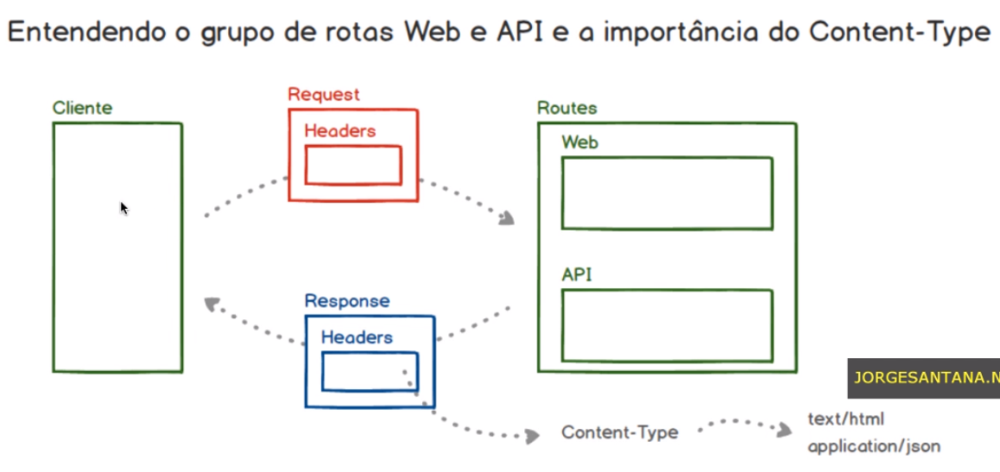

- 289 Rotas e a diferença entre Route::resource e Route::apiResource

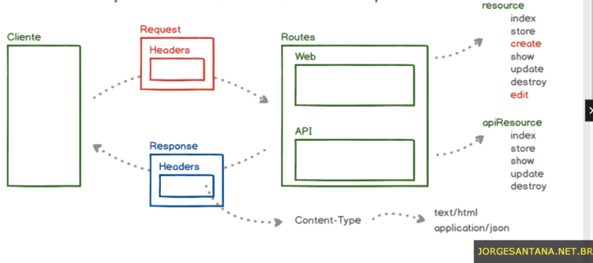

```php
Route::resource('cliente', 'App\Http\Controllers\ClienteController');
```

```
$ php artisan route:list
+--------+-----------+----------------------------+-----------------+------------------------------------------------+------------+
| Domain | Method    | URI                        | Name            | Action                                         | Middleware |
+--------+-----------+----------------------------+-----------------+------------------------------------------------+------------+
|        | GET|HEAD  | /                          |                 | Closure                                        | web        |
|        | GET|HEAD  | api/cliente                | cliente.index   | App\Http\Controllers\ClienteController@index   | api        |
|        | POST      | api/cliente                | cliente.store   | App\Http\Controllers\ClienteController@store   | api        |
|        | GET|HEAD  | api/cliente/create         | cliente.create  | App\Http\Controllers\ClienteController@create  | api        |
|        | GET|HEAD  | api/cliente/{cliente}      | cliente.show    | App\Http\Controllers\ClienteController@show    | api        |
|        | PUT|PATCH | api/cliente/{cliente}      | cliente.update  | App\Http\Controllers\ClienteController@update  | api        |
|        | DELETE    | api/cliente/{cliente}      | cliente.destroy | App\Http\Controllers\ClienteController@destroy | api        |
|        | GET|HEAD  | api/cliente/{cliente}/edit | cliente.edit    | App\Http\Controllers\ClienteController@edit    | api        |
|        | GET|HEAD  | api/user                   |                 | Closure                                        | api        |
|        |           |                            |                 |                                                | auth:api   |
+--------+-----------+----------------------------+-----------------+------------------------------------------------+------------+

```

```php
Route::apiResource('cliente', 'App\Http\Controllers\ClienteController');
```

```
$ php artisan route:list
+--------+-----------+-----------------------+-----------------+------------------------------------------------+------------+
| Domain | Method    | URI                   | Name            | Action                                         | Middleware |
+--------+-----------+-----------------------+-----------------+------------------------------------------------+------------+
|        | GET|HEAD  | /                     |                 | Closure                                        | web        |
|        | GET|HEAD  | api/cliente           | cliente.index   | App\Http\Controllers\ClienteController@index   | api        |
|        | POST      | api/cliente           | cliente.store   | App\Http\Controllers\ClienteController@store   | api        |
|        | GET|HEAD  | api/cliente/{cliente} | cliente.show    | App\Http\Controllers\ClienteController@show    | api        |
|        | PUT|PATCH | api/cliente/{cliente} | cliente.update  | App\Http\Controllers\ClienteController@update  | api        |
|        | DELETE    | api/cliente/{cliente} | cliente.destroy | App\Http\Controllers\ClienteController@destroy | api        |
|        | GET|HEAD  | api/user              |                 | Closure                                        | api        |
|        |           |                       |                 |                                                | auth:api   |
+--------+-----------+-----------------------+-----------------+------------------------------------------------+------------+

```

```php
Route::apiResource('cliente', 'App\Http\Controllers\ClienteController');
Route::apiResource('carro', 'App\Http\Controllers\CarroController');
Route::apiResource('locacao', 'App\Http\Controllers\LocacaoController');
Route::apiResource('marca', 'App\Http\Controllers\MarcaController');
Route::apiResource('modelo', 'App\Http\Controllers\ModeloController');
```

```
$ php artisan route:list
+--------+-----------+-----------------------+-----------------+------------------------------------------------+------------+
| Domain | Method    | URI                   | Name            | Action                                         | Middleware |
+--------+-----------+-----------------------+-----------------+------------------------------------------------+------------+
|        | GET|HEAD  | /                     |                 | Closure                                        | web        |
|        | GET|HEAD  | api/carro             | carro.index     | App\Http\Controllers\CarroController@index     | api        |
|        | PUT|PATCH | api/locacao/{locacao} | locacao.update  | App\Http\Controllers\LocacaoController@update  | api        |
|        | DELETE    | api/locacao/{locacao} | locacao.destroy | App\Http\Controllers\LocacaoController@destroy | api        |
|        | GET|HEAD  | api/marca             | marca.index     | App\Http\Controllers\MarcaController@index     | api        |
|        | POST      | api/marca             | marca.store     | App\Http\Controllers\MarcaController@store     | api        |
|        | GET|HEAD  | api/marca/{marca}     | marca.show      | App\Http\Controllers\MarcaController@show      | api        |
|        | PUT|PATCH | api/marca/{marca}     | marca.update    | App\Http\Controllers\MarcaController@update    | api        |
|        | DELETE    | api/marca/{marca}     | marca.destroy   | App\Http\Controllers\MarcaController@destroy   | api        |
|        | GET|HEAD  | api/modelo            | modelo.index    | App\Http\Controllers\ModeloController@index    | api        |
|        | POST      | api/modelo            | modelo.store    | App\Http\Controllers\ModeloController@store    | api        |
|        | GET|HEAD  | api/modelo/{modelo}   | modelo.show     | App\Http\Controllers\ModeloController@show     | api        |
|        | PUT|PATCH | api/modelo/{modelo}   | modelo.update   | App\Http\Controllers\ModeloController@update   | api        |
|        | DELETE    | api/modelo/{modelo}   | modelo.destroy  | App\Http\Controllers\ModeloController@destroy  | api        |
|        | GET|HEAD  | api/user              |                 | Closure                                        | api        |
|        |           |                       |                 |                                                | auth:api   |
+--------+-----------+-----------------------+-----------------+------------------------------------------------+------------+

```

- 290 Extra (fix da aula anterior) - Atributo $namespace de RouteServiceProvide

```php
class RouteServiceProvider extends ServiceProvider
{
    /**
     * The controller namespace for the application.
     *
     * When present, controller route declarations will automatically be prefixed with this namespace.
     *
     * @var string|null
     */
    protected $namespace = 'App\\Http\\Controllers';

```

```php
Route::apiResource('cliente', 'ClienteController');
Route::apiResource('carro', 'CarroController');
Route::apiResource('locacao', 'LocacaoController');
Route::apiResource('marca', 'MarcaController');
Route::apiResource('modelo', 'ModeloController');

```

- 291 Criando registros via POST

```php
class MarcaController extends Controller
{
    public function store(Request $request)
    {
        $marca = Marca::create($request->all());
        //dd($request->all());
        // dd($marca);
        return $marca;
    }
```

- 292 Selecionando registros via GET
- 293 Atualizando registros via PUT e PATCH
- 294 Removendo registros via DELETE
- 295 Extra - Entendendo o conceito de endpoint (URL, URN e URI)

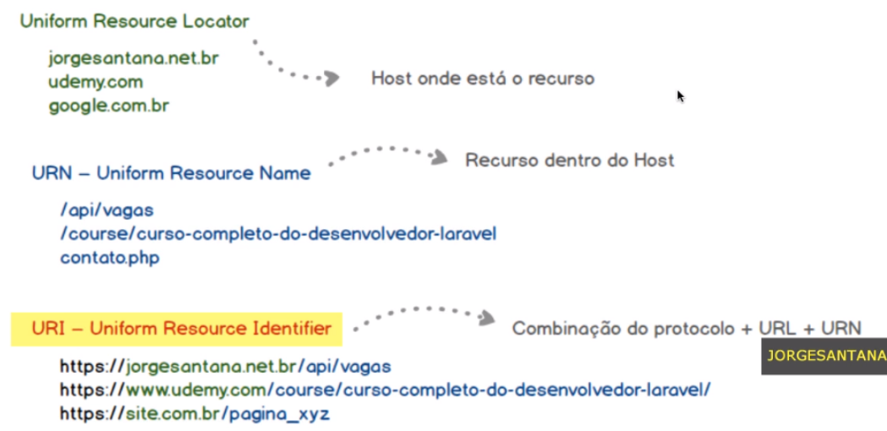

- 296 Injetando a instância do Model no Controller e como lidar com o Type Hinting

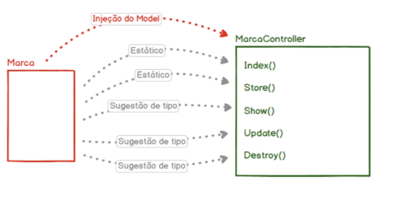

```php
class MarcaController extends Controller
{
    public function __construct(Marca $marca)
    {
        $this->marca = $marca;
    }

    public function index()
    {
        // $marcas = Marca::all();
        $marcas = $this->marca->all();
        return $marcas;
    }

    public function store(Request $request)
    {
        // $marca = Marca::create($request->all());
        //dd($request->all());
        // dd($marca);
        $marca = $this->marca->create($request->all());
        return $marca;
    }

    public function show($id)
    {
        $marca = $this->marca->find($id);
        return $marca;
    }

    public function update(Request $request, $id)
    {
//        print_r($request->all()); // dados atualizados
//        echo '<hr>';
//        print_r($marca->getAttributes()); // dados antigos

        // $marca->update($request->all());
        $marca = $this->marca->find($id);
        $marca->update($request->all());
        return $marca;
    }

    public function destroy($id)
    {
        //$marca->delete();
        $marca = $this->marca->find($id);
        $marca->delete();
        return ['msg', 'Marca removida com sucesso'];
    }
```

- 297 Validações parte 1 - Controle de fluxos

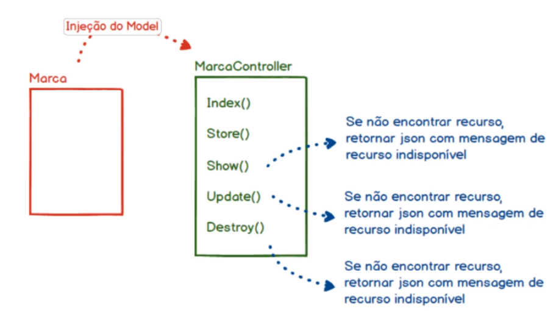


- 298 Validações parte 2 - Status Code HTTP

[https://developer.mozilla.org/pt-BR/docs/Web/HTTP/Status](https://developer.mozilla.org/pt-BR/docs/Web/HTTP/Status)

```php
class MarcaController extends Controller
{
    public function index()
    {
        // $marcas = Marca::all();
        $marcas = $this->marca->all();
        return response()->json($marcas, 200);
    }

    public function store(Request $request)
    {
        // $marca = Marca::create($request->all());
        //dd($request->all());
        // dd($marca);
        $marca = $this->marca->create($request->all());
        return response()->json($marca, 201);
    }

    public function show($id)
    {
        $marca = $this->marca->find($id);

        if ($marca === null) {
            return response()->json(['error' => 'Recurso Não Existe'], 404);
        }

        return response()->json($marca, 200);
    }

    public function update(Request $request, $id)
    {
//        print_r($request->all()); // dados atualizados
//        echo '<hr>';
//        print_r($marca->getAttributes()); // dados antigos

        // $marca->update($request->all());
        $marca = $this->marca->find($id);

        if ($marca === null) {

            return response()->json(['error' => 'Recurso Não Existe para ser Atualizado!'], 404);
        }

        $marca->update($request->all());
        return response()->json($marca, 200);;
    }

    public function destroy($id)
    {
        //$marca->delete();
        $marca = $this->marca->find($id);

        if ($marca === null) {
            return response()->json(['error' => 'Recurso Não Existe para ser DELETADO!'], 404);
        }

        $marca->delete();
        return response()->json(['msg'=> 'Marca removida com sucesso'], 200);
    }
```

- 299 Validações parte 3 - Validando parâmetros e a importância do Accept


```php
class MarcaController extends Controller
{
    public function store(Request $request)
    {
        $regras = [
            'nome' => 'required|unique:marcas',
            'imagem' => 'required'
        ];

        $feedback = [
            'required' => 'O campo :attribute é obrigatório',
            'nome.unique' => 'O nome da marca já existe'
        ];

        $request->validate($regras, $feedback);
        //stateless

        $marca = $this->marca->create($request->all());
        return response()->json($marca, 201);
    }
```

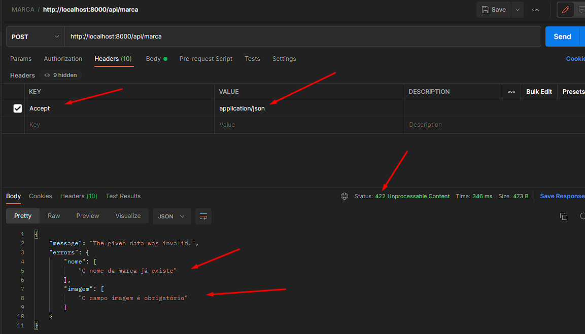


- 300 Implementando as regras de validação (Rules) no Model

```php
class Marca extends Model
{
    public function rules()
    {
           return [
               'nome' => 'required|unique:marcas|min:3',
               'imagem' => 'required'
           ];
    }

    public function feedback()
    {
        return [
            'required' => 'O campo :attribute é obrigatório',
            'nome.unique' => 'O nome da marca já existe',
            'nome.min' => 'O nome deve ter no mínimo 3 caracteres'
        ];
    }
```

```php
class MarcaController extends Controller
{
    public function store(Request $request)
    {
        $request->validate($this->marca->rules(), $this->marca->feedback());

        $marca = $this->marca->create($request->all());
        return response()->json($marca, 201);
    }
```

- 301 Validações parte 4 - Regras de validação no Update - Lidando com o Unique

```php
class Marca extends Model
{
    public function rules()
    {
           return [
               'nome' => 'required|unique:marcas,nome, '.$this->id.'|min:3',
               'imagem' => 'required'
           ];
           /*
           unique:marcas,nome, '.$this->id.'
           1) tabela
           2) nome da coluna que será pesqusada na tabela
           3) id do registro que será desconsiderado na pesquisa
            */
    }
```

```php
public function update(Request $request, $id)
    {
        $marca = $this->marca->find($id);

        if ($marca === null) {
            return response()->json(['error' => 'Recurso Não Existe para ser Atualizado!'], 404);
        }

        $request->validate($marca->rules(), $marca->feedback());

        $marca->update($request->all());
        return response()->json($marca, 200);;
    }
```

- 302 Validações parte 5 - Regras de validação no Update - Lidando com o PUT/PATCH

```php
public function update(Request $request, $id)
    {
        $marca = $this->marca->find($id);

        if ($marca === null) {
            return response()->json(['error' => 'Recurso Não Existe para ser Atualizado!'], 404);
        }

        if($request->method() === 'PATCH') {

            $regrasDinamicas = array();

            //percorrendo todas as regras definidas no Model
            foreach($marca->rules() as $input => $regra) {

                //coletar apenas as regras aplicáveis aos parâmetros parciais da requisição PATCH
                if(array_key_exists($input, $request->all())) {
                    $regrasDinamicas[$input] = $regra;
                }
            }

            $request->validate($regrasDinamicas, $marca->feedback());

        } else {
            $request->validate($marca->rules(), $marca->feedback());
        }

        $marca->update($request->all());
        return response()->json($marca, 200);;
    }
```

- 303 Upload de arquivos - Implementando o upload de imagens parte 1

```php
public function store(Request $request)
    {
        //$marca = Marca::create($request->all());
        //nome
        //imagem
        $request->validate($this->marca->rules(), $this->marca->feedback());
        //stateless

        //dd($request->nome);
        //dd($request->get('nome'));
        //dd($request->input('nome'));

        //dd($request->imagem);
        dd($request->file('imagem'));

        //$marca = $this->marca->create($request->all());
        return response()->json($marca, 201);
    }
```

- 304 Upload de arquivos - Implementando o upload de imagens parte 2

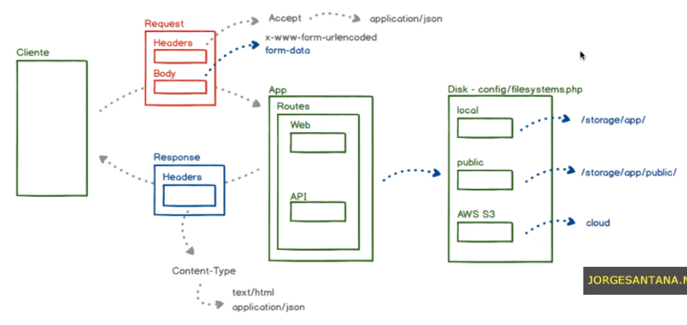

```php
    public function store(Request $request)
    {
        $request->validate($this->marca->rules(), $this->marca->feedback());
        $image = $request->file('imagem');
        // $image->store('imagens/x/y/z', 'public');
        $image->store('imagens', 'public');
       
        // app_locadora_carros/storage/app/public/imagens/ru40QWOxB4jH59MEP0gtGBSaPYAAOr1IOc42Vz7B.png
```


- 305 Upload de arquivos - Implementando o upload de imagens parte 3

```php
public function store(Request $request)
    {
       $request->validate($this->marca->rules(), $this->marca->feedback());

        $image = $request->file('imagem');
        $image_uri = $image->store('imagens', 'public');
        // dd($image_uri); // "imagens/8UM1FA1QVjkp9BGHqx2Tr87rrqTqYcfkvm6QHGLJ.png"


//        $marca->nome = $request->nome;
//        $marca->imagem = $image_uri;
//        $marca->save();
        $marca = $this->marca->create([
            'nome'   => $request->nome,
            'imagem' => $image_uri
        ]);

        //$marca = $this->marca->create($request->all());
        return response()->json($marca, 201);
    }
```

```php
class Marca extends Model
{
    use HasFactory;

    protected $fillable = ['nome', 'imagem'];

    public function rules()
    {
           return [
               'nome'   => 'required|unique:marcas,nome, '.$this->id.'|min:3',
               'imagem' => 'required|file|mimes:png,jpg'
           ];
           /*
           unique:marcas,nome, '.$this->id.'
           1) tabela
           2) nome da coluna que será pesqusada na tabela
           3) id do registro que será desconsiderado na pesquisa
            */

    }
```

- 306 Upload de arquivos - Criando um link simbólico para o disco public

```
$ php artisan storage:link
The [C:\Users\josem\Documents\workspaces\DesenvolvimentoWebAvancado2022comPHPLaravelVueJS\app_locadora_carros\public\storage] link has been connected to [C:\Users\josem\Documents\workspaces\DesenvolvimentoWebAvancado2022comPHPLaravelVueJS\app_locadora_carros\storage\app/public].
The links have been created.

```


- 307 [IMPORTANTE] - Correção do link simbólico do projeto
- 308 Upload de arquivos - Atualizando imagens

```php
public function update(Request $request, $id)
    {
        $marca = $this->marca->find($id);
        if ($marca === null) {
            return response()->json(['error' => 'Recurso Não Existe para ser Atualizado!'], 404);
        }

        if($request->method() === 'PATCH') {
            $regrasDinamicas = array();

            //percorrendo todas as regras definidas no Model
            foreach($marca->rules() as $input => $regra) {

                //coletar apenas as regras aplicáveis aos parâmetros parciais da requisição PATCH
                if(array_key_exists($input, $request->all())) {
                    $regrasDinamicas[$input] = $regra;
                }
            }
            $request->validate($regrasDinamicas, $marca->feedback());

        } else {
            $request->validate($marca->rules(), $marca->feedback());
        }

        $image = $request->file('imagem');
        $image_uri = $image->store('imagens', 'public');

        $marca->update([
            'nome'   => $request->nome,
            'imagem' => $image_uri
        ]);
        return response()->json($marca, 200);;
    }
```

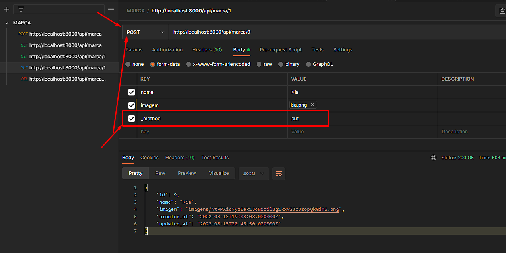


- 309 Upload de arquivos - Removendo imagens

```php
public function update(Request $request, $id)
    {
        // (...)
        // REMOVE o arquivo antigo caso um novo arquivo tenha sido
        // enviado no REQUEST
        if ($request->file('imagem')) {
            Storage::disk('public')->delete($marca->imagem);
        }
```

```php
public function destroy($id)
    {
        // (...)
        // REMOVE o arquivo antigo 
        Storage::disk('public')->delete($marca->imagem);
    }
```

- 310 API WebService Rest para o Resource Modelo
- 311 Testando os endpoints de modelo
- 312 Adicionando o relacionamento entre modelos e marcas

```php
class Modelo extends Model
{
    public function marca()
    {
        return $this->belongsTo('App\Models\Marca');
    }
}
```

```php
class Marca extends Model
{
    public function modelo()
    {
        return $this->hasMany('App\Models\Modelo');
    }
}
```

```php
class ModeloController extends Controller
{
    public function index()
    {
        return response()->json($this->modelo->with('marca')->get(), 200);

        // all() -> criando um objeto de consulta + get()  =  collection
        // get() -> modificar a consulta -> collection

    }
    public function show($id)
    {
        $modelo = $this->modelo->with('marca')->find($id);
        if($modelo === null) {
            return response()->json(['erro' => 'Recurso pesquisado não existe'], 404) ;
        }
        return response()->json($modelo, 200);
    }
```

```php
class MarcaController extends Controller
{
    public function index()
    {
        // $marcas = Marca::all();
        $marcas = $this->marca->with('modelo')->get();
        return response()->json($marcas, 200);
    }
    public function show($id)
    {
        $marca = $this->marca->with('modelo')->find($id);

        if ($marca === null) {
            return response()->json(['error' => 'Recurso Não Existe'], 404);
        }
        return response()->json($marca, 200);
    }
```

- 313 Refactoring do endpoint update de marca e modelo

```php
class MarcaController extends Controller
{
    public function update(Request $request, $id)
    {
        $marca = $this->marca->with('modelo')->find($id);
        if ($marca === null) {
            return response()->json(['error' => 'Recurso Não Existe para ser Atualizado!'], 404);
        }

        if ($request->method() === 'PATCH') {
            $regrasDinamicas = array();
            //percorrendo todas as regras definidas no Model
            foreach ($marca->rules() as $input => $regra) {
                //coletar apenas as regras aplicáveis aos parâmetros parciais da requisição PATCH
                if (array_key_exists($input, $request->all())) {
                    $regrasDinamicas[$input] = $regra;
                }
            }
            $request->validate($regrasDinamicas, $marca->feedback());
        } else {
            $request->validate($marca->rules(), $marca->feedback());
        }

        // REMOVE o arquivo antigo caso um novo arquivo tenha sido
        // enviado no REQUEST
        if ($request->file('imagem')) {
            Storage::disk('public')->delete($marca->imagem);
        }

        $image = $request->file('imagem');
        $image_uri = $image->store('imagens', 'public');

        //preencher o objeto $marca com os dados do request
        $marca->fill($request->all());
        $marca->imagem = $image_uri;
        $marca->save();
        return response()->json($marca, 200);;
    }
```

```php
class ModeloController extends Controller
{
    public function update(Request $request, $id)
    {
        $modelo = $this->modelo->find($id);
        if($modelo === null) {
            return response()->json(['erro' => 'Impossível realizar a atualização. O recurso solicitado não existe'], 404);
        }
        if($request->method() === 'PATCH') {
            $regrasDinamicas = array();

            //percorrendo todas as regras definidas no Model
            foreach($modelo->rules() as $input => $regra) {
                //coletar apenas as regras aplicáveis aos parâmetros parciais da requisição PATCH
                if(array_key_exists($input, $request->all())) {
                    $regrasDinamicas[$input] = $regra;
                }
            }
            $request->validate($regrasDinamicas);
        } else {
            $request->validate($modelo->rules());
        }

        //remove o arquivo antigo caso um novo arquivo tenha sido enviado no request
        if($request->file('imagem')) {
            Storage::disk('public')->delete($modelo->imagem);
        }

        $imagem = $request->file('imagem');
        $imagem_urn = $imagem->store('imagens/modelos', 'public');

        $modelo->fill($request->all());
        $modelo->imagem = $imagem_urn;
        $modelo->save();

        /*$modelo->update([
            'marca_id' => $request->marca_id,
            'nome' => $request->nome,
            'imagem' => $imagem_urn,
            'numero_portas' => $request->numero_portas,
            'lugares' => $request->lugares,
            'air_bag' => $request->air_bag,
            'abs' => $request->abs
        ]);*/

        return response()->json($modelo, 200);
    }
```

- 314 Filtros - Selecionando os atributos de retorno

```php
class ModeloController extends Controller
{
    public function index(Request $request)
    {
        $modelos = array();

        if ($request->has('atributos')) {
            // dd($request->atributos); // "id,nome,imagem"
            $atributos = $request->atributos;

            $modelos = $this->modelo->selectRaw($atributos)->with('marca')->get();
            // http://localhost:8000/api/modelo?atributos=id,nome,imagem,marca_id
        } else {
            $modelos = $this->modelo->with('marca')->get();
        }
        return response()->json($modelos, 200);
    }
```

- 315 Filtros - Obtendo colunas específicas com a instrução with()

```php
class ModeloController extends Controller
{
    public function index(Request $request)
    {
        $modelos = array();

        if ($request->has('atributos_marca')) {
            $atributos_marca = $request->atributos_marca;
            $modelos = $this->modelo->with('marca:id,'.$atributos_marca);
        }else{
            $modelos = $this->modelo->with('marca');
        }

        if ($request->has('atributos')) {
            $atributos = $request->atributos;
            $modelos = $modelos->selectRaw($atributos)->get();
        } else {
            //$modelos = $this->modelo->with('marca')->get();
            $modelos = $modelos->get();
        }

        return response()->json($modelos, 200);
    }
```

- 316 Filtros - Aplicando condições nas pesquisas parte 1
- 317 Filtros - Aplicando condições nas pesquisas parte 2
- 318 Filtros - Aplicando os filtros ao resource Marca
- 319 Repository Design Pattern - Introdução
- 320 Repository Design Pattern - Implementando um Repository para Marca
- 321 Repository Design Pattern - Implementando um Repository para Modelo
- 322 Repository Design Pattern - Implementando um Abstract Repository
- 323 API WebService Rest para o Resource Carro
- 324 API WebService Rest para o Resource Cliente
- 325 API WebService Rest para o Resource Locacoes

[Voltar ao Índice](#indice)

---


## <a name="parte18">18 - Autenticação API - Autorização JWT (JSON Web Token)</a>


[Voltar ao Índice](#indice)

---


## <a name="parte19">19 - Aplicação Full Stack Back-end API Laravel com Front-end Vue.JS</a>


[Voltar ao Índice](#indice)

---


## <a name="parte20">20 - Armazenamento em memória com Redis (Laravel Cache)</a>

- 392 O que é o Redis?

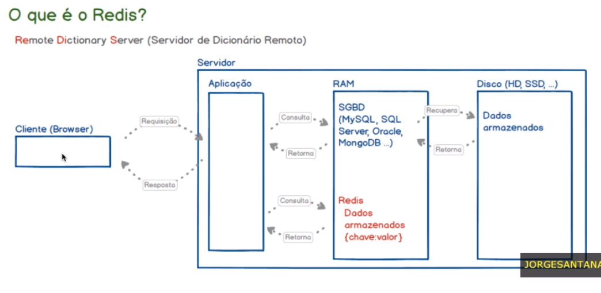

- 393 [WINDOWS] - Instalando o Redis
- 394 [LINUX] - Instalando o Redis
- 395 [OSX] - Instalando o Redis
- 396 Extra - Atualizando o Composer
- 397 Iniciando o projeto Portal de Notícias
- 398 Iniciando o banco de dados e as migrations
- 399 Implementando a Factory e a Seeder para popular a tabela de notícias
- 400 Implementando a consulta e a visualização das notícias
- 401 Instalando o pacote Debugbar para monitorar o tempo de execução das querys
- 402 Instalando e configurando o pacote Predis para conectar o Laravel com o Redis
- 403 Armazenando consultas em cache parte 1
- 404 Armazenando consultas em cache parte 2
- 405 Cache remember

[Voltar ao Índice](#indice)

---

